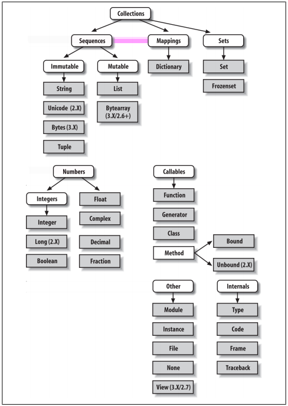

# 第2部分 类型和运算
## 第4章 介绍Python对象类型

Python程序可以分解为模块，语句，表达式，对象：
1. 程序由模块构成。
2. 模块包含语句。
3. 语句包含表达式。
4. 表达式建立并处理对象。

### 4.1 为什么使用内置类型

Python内置了强大的对象类型作为语言的组成部分，除非你有内置类型无法提供的特殊对象要处理，才需要自己手动实现。

注意，最好总是使用内置对象而不是使用自己的实现！原因如下：

- 内置对象使程序更容易编写
- 即便自己动手实现对象，建议在内置类型的基础之上进行扩展
- 内置对象往往比自实现的数据结构更有效率
- 内置对象是语言标准的一部分

#### 4.1.1 Python的核心数据类型

- 数字：1234, 3.1415, 3+4j, Decimal, Fraction
- 字符串：'spam', b'a\xolc'
- 列表
- 字典
- 元组
- 文件
- 集合
- 其他类型：类型、None、布尔型
- 编程单元类型：函数、模块、类
- 与实现相关的类型：编译的代码堆栈跟踪
- .....

> **Python中处理的所有东西都是对象！**

Python是动态类型的（它自动地跟踪你的类型而不是要求事先进行声明），但它也是强类型语言（你只能对一个对象进行适合该类型的有效的操作）。例如，字符串只能使用字符串类型的方法，列表只能使用列表类型的方法。


### 4.2 数字
Python的核心对象包括常规的数字类型：
- 整数
- 浮点数
- 有虚部的复数
- 固定精度的十进制数
- 带分子和分母的有理分数
- 集合
- 布尔值
- 第三方开源扩展甚至包含 矩阵 和 向量


### 4.3 字符串
**字符串**用来记录文本信息。字符串是包含一个或多个字符的序列。
**序列**是包含其他对象的有序集合。序列中的元素具有从左向右的顺序，其他类型的序列还包括列表和元组。

#### 4.3.1 序列的操作
Python中的变量不需要提前声明，当给一个变量赋值的时候就创建了它。
在使用变量之前必须对其进行赋值。

##### 索引
作为序列，字符串中的元素也具有位置顺序。在Python中，索引是按照从左到右的顺序从0开始编码的。第一个元素的索引为0，第二个元素的索引为1，依此递增。
```python
>>> S = 'spam'
>>> S
'spam'
>>> len(S)
4
>>> S[0]
's'
>>> S[1]
'p'
>>> S[:]
'spam'
```

Python中支持序列的反向索引，即最后一个元素开始向前索引。
```python
>>> S[-1]
'm'
>>> S[-2]
'a'
>>> S[::-1]
'maps'
```

负的索引号会简单地与字符串的长度相加，因此以下两个操作是等效的：
```python
>>> S[-1]
'm'
>>> S[len(S)-1]
'm'
```

##### 分片
除了简单地从元素位置进行索引，序列还支持分片（slice）操作。这是一种能够一次性地提取序列中的部分元素或全部元素的操作。
```python
>>> S[0:2]
'sp'
>>> S[:2]
'sp'
>>> S[1:3]
'pa'
>>> S[:-1]
'spa'
>>> S[1:-1]
'pa'
>>> S[:]
'spam'
```

利用负值的步进参数，Python还支持反向分片操作：
```python
>>> S[::-1]
'maps'
```

##### 加号进行序列拼接，星号（乘号）进行重复
```python
>>> S
'spam'
>>> S+'xyz'
'spamxyz'
>>> S
'spam'
>>> S*8
'spamspamspamspamspamspamspamspam'
```

#### 4.3.2 不可变性
字符串具有不可变性，即在创建之后不能就地改变。要改变一个字符串的值，只能重新生成的一个新的字符串。
也就是说，不能通过对字符串中某一位置的元素进行赋值来改变字符串，但可以通过重新创建一个新的字符串并以同一个变量名对其进行赋值。例如：
```python
>>> S
'spam'
>>> S[0] = 'z'
Traceback (most recent call last):
  File "<stdin>", line 1, in <module>
TypeError: 'str' object does not support item assignment
>>> S = 'z' + S[1:]
>>> S
'zpam'
```

> **注意：在Python中的每个对象都分为** ***不可变***  **或者** ***可变***。
> **在核心类型中，数字、字符串和元组是不可变的；列表和字典不是这样（它们可以完全自由地改变）。**


#### 4.3.3 类型特定的方法
除了一般的序列操作，字符串还有一些独有的操作作为方法存在。
> 注意：尽管序列操作是通用的，但方法不通用（虽然某些类型具有相同的方法名，字符串的方法只能用于字符串）。
> 可作用域多种类型的通用操作都是以内置函数或表达式的形式出现的，例如，`len(X)`， `X[0]`，但类型特定的操作是以方法调用的形式出现的，例如，`aString.upper()`。

#### 4.3.4 需求帮助

对于某种类型的更多细节，你可以调用内置的`dir`函数查看，它将返回一个包含了对象的所有属性的列表。

```python
>>> dir(S)
['__add__', '__class__', '__contains__', '__delattr__', '__dir__', '__doc__', '__eq__', '__format__', '__ge__', '__getattribute__', '__getitem__', '__getnewargs__', '__gt__', '__hash__', '__init__', '__iter__', '__le__', '__len__', '__lt__', '__mod__', '__mul__', '__ne__', '__new__', '__reduce__', '__reduce_ex__', '__repr__', '__rmod__', '__rmul__', '__setattr__', '__sizeof__', '__str__', '__subclasshook__', 'capitalize', 'casefold', 'center', 'count', 'encode', 'endswith', 'expandtabs', 'find', 'format', 'format_map', 'index', 'isalnum', 'isalpha', 'isdecimal', 'isdigit', 'isidentifier', 'islower', 'isnumeric', 'isprintable', 'isspace', 'istitle', 'isupper', 'join', 'ljust', 'lower', 'lstrip', 'maketrans', 'partition', 'replace', 'rfind', 'rindex', 'rjust', 'rpartition', 'rsplit', 'rstrip', 'split', 'splitlines', 'startswith', 'strip', 'swapcase', 'title', 'translate', 'upper', 'zfill']
```

使用内置的`help`函数查询特定对象或类型是做什么的。

```python
>>> help(S.replace)
Help on built-in function replace:

replace(...) method of builtins.str instance
    S.replace(old, new[, count]) -> str

    Return a copy of S with all occurrences of substring
    old replaced by new.  If the optional argument count is
    given, only the first count occurrences are replaced.
(END)
```


#### 4.3.5 编写字符串的其他方法

Python允许字符串包括在单引号或双引号中。

Python还允许在三个引号（单引号或双引号）中包括多行字符串常量。当采用这种形式时，所有行都合并在一起，并在每一行的末尾增加换行符。

在 Python 3 中，`str`字符串类型都支持`Unicode`，并且`bytes`类型表示原始字节字符串。

在 Python 2.6 中，`Unicode`是一种单独的类型，`str`类型处理8位字符串和二进制数据。


### 4.4 列表
列表是一个由一个或多个任意类型的对象组成的有序集合，它没有固定大小。

列表是可变的。

#### 4.4.1 序列操作

由于列表是序列的一种，列表支持所有的序列操作，包括：

- 索引
- 分片

```python
>>> L = [123, 'spam', 1.23]
>>> len(L)
3
>>> L[0]
123
>>> L[:-1]
[123, 'spam']
>>> L + [4, 5, 6]
[123, 'spam', 1.23, 4, 5, 6]
>>> L
[123, 'spam', 1.23]
>>> L*2
[123, 'spam', 1.23, 123, 'spam', 1.23]
```

#### 4.4.2 类型的特定操作

列表是可变的，大多数列表的方法都会就地改变列表对象，而不是创建一个新的列表：

```python
>>> M = ['aa', 'bb', 'cc']
>>> M.sort()
>>> M
['aa', 'bb', 'cc']
>>> M.reverse()
>>> M
['cc', 'bb', 'aa']
```

#### 4.4.3 边界检查

Python不允许引用不存在的元素，超出列表索引范围会导致错误：

```python
>>> M
['cc', 'bb', 'aa']
>>> M[4]
Traceback (most recent call last):
  File "<stdin>", line 1, in <module>
IndexError: list index out of range
>>> M[4] = 1
Traceback (most recent call last):
  File "<stdin>", line 1, in <module>
IndexError: list assignment index out of range
>>>
```

#### 4.4.4 嵌套

Python核心数据类型支持以任意组合进行嵌套（一个列表、元组或者字典可以包含多个不同类型的对象），并可以进行多个层级的嵌套。这一特性可用于实现矩阵。

```python
>>> M = [[1,2,3],[4,5,6],[7,8,9]]
>>> M
[[1, 2, 3], [4, 5, 6], [7, 8, 9]]
>>> M[1][0]
4
>>> M[0][0]
1
>>>
```

#### 4.4.5 列表解析表达式（list comprehensive expression）

列表解析表达式（list comprehensive expression）是一种通过对序列中的每一项运行一个表达式来创建一个新列表的方法。

```python
>>> li = [row[1] for row in M]
>>> li
[2, 5, 8]
>>> li = [row[1]+1 for row in M]
>>> li
[3, 6, 9]
>>> li = [row[1] for row in M if row[1] % 2 == 0]
>>> li
[2, 8]
>>> li = [M[i][i] for i in [0,1,2]]
>>> li
[1, 5, 9]
>>> li = [i for i in range(10)]
>>> li
[0, 1, 2, 3, 4, 5, 6, 7, 8, 9]
```


### 4.5 字典

Python中的字典是一种映射。
映射是一种通过键而不是相对位置（如序列）来存储对象的集合。
映射中的元素不存在可靠的从左至右的位置顺序关系。
字典具有可变性，可以就地改变。
作为映射，字典只支持通过键获取元素。

#### 4.5.1 映射操作

字典编写在大括号中，并包含一系列的“键:值”对。

```python
>>> D = {'food':'Spam', 'quantity':4, 'color':'pink'}
>>> D
{'food': 'Spam', 'quantity': 4, 'color': 'pink'}
>>> D['food']
'Spam'
>>> D['quantity'] + 1
5
>>> D['quantity'] = 6
>>> D['quantity']
6
>>>
```


#### 4.5.2 嵌套

字典同样支持元素的嵌套：

```python
>>> rec = {'name':{'first':'Peter', 'last':'Parker'}, 'job':['dev','mgr'],'age':40.5}
>>> rec['name']
{'first': 'Peter', 'last': 'Parker'}
>>> rec['name']['first']
'Peter'
>>> rec['job']
['dev', 'mgr']
>>> rec['job'].append('ceo')
>>> rec
{'name': {'first': 'Peter', 'last': 'Parker'}, 'job': ['dev', 'mgr', 'ceo'], 'age': 40.5}
>>>
```


#### 4.5.3 键的排序：for循环

字典作为映射，其中的元素不存在可靠的从左至右的位置顺序关系。但如果需要强调某种顺序，可以提取一个字典键的列表，对其中的键进行排序，然后依次输出字典中的值：

```python
>>> D = {'a':1, 'b':2, 'c':3}
>>> Ks = list(D.keys())
>>> Ks.sort()
>>> Ks
['a', 'b', 'c']
>>> for key in Ks:
...     print(key, '->', D[key])
...
a -> 1
b -> 2
c -> 3
```

在较新的Python版本中，也可以使用内置函数`sorted`直接对字典的键进行排序：
```python
>>> for key in sorted(D):
...     print(key, '->', D[key])
...
a -> 1
b -> 2
c -> 3
```


### 4.6 元组

元组类型基本上就像是一个不可变的列表。

从语法上讲，它们编写在圆括号中，它支持任意类型、任意嵌套以及常见的序列操作：

```python
>>> T = (1, 2, 3, 4)
>>> len(T)
4
>>> T + (5, 6)
(1, 2, 3, 4, 5, 6)
>>> T[0]
1
>>>
```


#### 4.6.1 为什么要用元组

如果在程序中以列表的形式传递一个对象的集合，它可能在任何地方改变；如果使用元组，则不能。也就是说，元组提供了一种完整性的约束。


### 4.7 文件

文件对象是Python代码对电脑上外部文件的主要接口。

虽然文件是核心类型，但没有常量（literal，也有翻译为“字面量”）语法来创建文件对象。需要使用`open`函数来创建。

> 字面量（iteral）在本书中被翻译为常量，但其他书中也有翻译为字面量的，个人觉得“字面量”更贴切，也不容易与其他语言中使用关键字`const`进行声明的量混淆。

```python
>>> f = open('test.py', 'r')
>>> f.read()
"a = 'dead'\nb = 'parrot'\nc = 'sketch'\nprint(a, b, c)\n"
```


#### 4.7.1 其他文件类工具

`open`函数能够实现在Python中的大多数文件处理场景。但对于更高级的任务，Python还提供了额外的类文件工具：

- 管道
- FIFO队列
- 套接字
- 通过键访问文件
- 对象持久
- 基于描述符的文件（Descriptor file）
- 关系数据库接口
- 面向对象数据库接口


### 4.8 其他核心类型

#### 4.8.1 集合
集合是不可变的对象的无序集合，它有点像是没有值的字典的键。
集合可以通过调用内置`set`函数创建，或者使用Python 3.0中新的集合常量（literal，也有翻译为“字面量”）语法和表达式创建。
集合支持一般的数学集合操作（交集、并集、补集）。

> 字面量（iteral）在本书中被翻译为常量，但其他书中也有翻译为字面量的，个人觉得“字面量”更贴切，也不容易与其他语言中使用关键字`const`进行声明的量混淆。

```python
>>> X = set('spam')
>>> Y = {'h', 'a', 'm'}
>>> X
{'s', 'a', 'p', 'm'}
>>> Y
{'a', 'm', 'h'}
>>> X,Y
({'s', 'a', 'p', 'm'}, {'a', 'm', 'h'})
>>> X & Y        # X和Y的交集
{'a', 'm'}
>>> X | Y        # X和Y的并集
{'s', 'a', 'p', 'm', 'h'}
>>> X - Y        # Y在X中的补集
{'s', 'p'}
>>> {x ** 2 for x in [1, 2, 3, 4]}      # 列表推导式创建集合
{16, 1, 9, 4}
>>>
```

####  4.8.2 `Decimal` 十进制数（固定精度浮点数）
`Decimal`对象用来表示十进制数，也称为固定精度浮点数。
```python
>>> 1 / 3    # 浮点数
0.3333333333333333
>>> (2/3) + (1/2)
1.1666666666666665
>>>
>>> import decimal
>>> d = decimal.Decimal('3.1415926')     # 固定精度浮点数
>>> d
Decimal('3.1415926')
>>> d + 1
Decimal('4.1415926')
```

####  4.8.3 `Fraction` 分数（有一个分子和一个分母的有理数）
```python
>>> from fractions import Fraction
>>> f = Fraction(2, 3)
>>> f
Fraction(2, 3)
>>> f + 1
Fraction(5, 3)
>>> f + Fraction(1, 2)
Fraction(7, 6)
>>>
```

#### 4.8.4 布尔值
布尔值是预定义的True和False对象，实际上是定制后以逻辑结果显示的整数1和0。
```python
>>> 1 > 2
False
>>> 1 < 2
True
>>> 1 > 2, 1 < 2
(False, True)
>>> bool('Spam')
True
>>> X = None
>>> bool(X)
False
>>> L = [None] * 100
>>> bool(L)
True
>>>
```

#### 4.8.5 如何破坏代码灵活性
内置函数`type`返回对象的类型（类）。
```python
>>> type(L)
<class 'list'>
>>> type(type(L))
<class 'type'>
```

内置函数`type`允许编写代码来检查它所处理的对象类型（类）。
```python
>>> type(L) == type([])
True
>>> type(L) == list
True
```

类似的还可以使用`isinstance`函数来判断某个对象是否是某个类的实例：
```python
>>> isinstance(L, list)
True
>>>
```

> Python 3.0中类型已经完全和类结合起来了。

#### 4.8.6 用户定义的类
假如你希望有一个对象类型能对职员进行建模，尽管Python没有内置这样的核心类型（类），用户也可以定义符合自己需求的类。

---


## 第5章 数字

### 5.1 Python的数字类型

Python数字类型的完整工具包括：
- 整数和浮点数
- 复数
- 固定精度的十进制数
- 有理分数
- 集合
- 布尔类型
- 无穷的整数精度
- 各种数字内置函数和模块

    

#### 5.1.1 数字常量（literal，字面量）

在基本类型中，Python提供了：整数和浮点数。
Python允许我们使用十六进制、八进制和二进制字面量来表示整数。
Python还提供一个复数类型。
Python允许整数具有无穷的精度（只要内存空间允许，它可以增长成任意位数的数字）。

> 字面量（iteral）在本书中被翻译为常量，但其他书中也有翻译为字面量的，个人觉得“字面量”更贴切，也不容易与其他语言中使用关键字`const`进行声明的量混淆。

关于数字类型：
- 整数和浮点数字面量
  - 整数不带小数点。
  - 浮点数带一个小数点，也可以加上一个科学计数标志`e`或者`E`。
- 在Python 3.0中，整数和长整数已经合二为一，只有整数这一种。
- 整数可以编写为十进制、十六进制、八进制、二进制形式。
- 复数：Python的复数常量写成实部+虚部的写法，虚部以`j`或者`J`结尾。也可以通过内置函数`complex`来创建复数。

#### 5.1.2 内置数学工具和扩展
Python提供了一系列处理数字对象的工具：
- 表达式操作符：+、-、*、/ 、>> 、\*\*、&等。
- 内置数学函数：`pow`、`abs`、`round`、`int`、`hex`、`bin`等。
- 公用模块：`random`、`math`等。


#### 5.1.3 Python表达式操作符
表达式是处理数字的最基本工具。当一个数字（或其他对象）与操作符相结合时，Python执行时将计算得到一个值。

##### 混合操作时将遵循操作符的优先级

##### 混合类型自动提升
在混合类型的表达式中，Python将被操作的对象转换成其中最复杂的操作对象的类型，然后再对相同类型的操作对象进行数学运算。

在Python中，整数比浮点数简单，浮点数比复数简单。所以当整数与浮点数运算时，整数将被自动转换为浮点数，以此类推。
```python
>>> type(4)
<class 'int'>
>>> type(3.14)
<class 'float'>
>>> type(4 + 3.14)
<class 'float'>
```

可以通过手动调用内置函数来强制类型转换：
```python
>>> int(3.1415)
3
>>> float(3)
3.0
```

在Python 3.0中，非数字混合类型是不允许的，会引发异常。
```python
>>> 'string' + 3
Traceback (most recent call last):
  File "<stdin>", line 1, in <module>
TypeError: Can't convert 'int' object to str implicitly
```

##### 运算符重载
Python的操作符可以通过Python的类或C扩展类型被重载（即实现），让它也能工作与你所创建的对象中。例如，用户自定义的类也可以使用`+`表达式进行加法或连接等。

其次，Python也会自动重载某些操作符，能够根据所处理的内置对象的类型而执行不同的操作。例如，`+`操作符应用于数字时是在做加法，而应用于字符串是连接字符串。


### 5.2 数字的实际应用
#### 5.2.1 变量和基本的表达式
在Python中：
- 变量在它第一次赋值时创建。
- 变量在表达式中使用前必须已被赋值。
- 变量像对象一样不需要在一开始进行声明。
- 在表达式中使用变量，表达式的值将变为变量操作结果的值。

#### 5.2.2 数字显示格式


#### 5.2.3 比较：一般的和连续的
```python
>>> 1 < 2
True
>>> 1 < 2 < 3
True
>>> 1 < 2 and 2 < 3
True
>>>
```

#### 5.2.3 除法：传统除法、Floor除法和真除法
Python 3.0中有2种类型的除法，有2种不同的除法操作符。
- 传统除法和真除法： `X / Y`，不管操作数的类型，都返回包含任何余数的一个浮点数结果。
- Floor除法：`X // Y`，总会截断余数并向下取整，相当于对结果调用了`math.floor`函数。如果有任何一个操作数是浮点类型，则返回一个浮点数，否则，结果是一个整数。

```python
>>> 5 / 2
2.5
>>> 5 / -2
-2.5
>>> 5 // 2
2
>>> 5 // -2
-3
>>>
```

如果想要单纯的截断丢弃小数部分，可以总是通过`math.trunc`来得到一个浮点除法结果。
```python
>>> import math
>>> 5 / -2
-2.5
>>> 5 // -2
-3
>>> math.trunc(5/-2)
-2
>>>
```

#### 5.2.4 整数精度
Python 3.0整数支持无穷的大小（取决于计算机内存）。

#### 5.2.5 复数
复数是Python中的另一个核心对象类型。
Python中，用两个浮点数分别表示一个复数的实部和虚部，并在虚部增加`j`或`J`的后缀。
```python
>>> 2 + -3j
(2-3j)
>>> 1j*1J
(-1+0j)
>>> 2+1j*3
(2+3j)
>>> (2+1j)*3
(6+3j)
```


#### 5.2.6 十六进制、八进制和二进制记数
Python中的整数可以用十六进制、八进制和二进制来表示。
```python
>>> 0o1, 0o20
(1, 16)
>>> 0o1, 0o20, 0o377
(1, 16, 255)
>>> 0x01, 0x10, 0xff, 0xFF
(1, 16, 255, 255)
>>> 0b1, 0b10000, 0b11111111
(1, 16, 255)
>>>
```
Python还提供了内置函数`oct`、`hex`、`bin`，允许我们把整数转换为其他进制的数字字符串：
```python
>>> oct(64), hex(64), bin(64)
('0o100', '0x40', '0b1000000')
```

同时，内置的`int`函数会将一个数字的字符串转换为一个整数，并通过第二个参数来指定转换后的数字的进制：
```python
>>> int('64'), int('100', 8), int('40', 16), int('1000000', 2)
(64, 64, 64, 64)
```

可以使用字符串格式化方法调用和表达式将一个整数转换成八进制和十六进制字符串：
```python
>>> '{0:o}, {1:x}, {2:b}'.format(64, 64, 64)
'100, 40, 1000000'
>>> '%o, %x, %X' % (64, 255, 255)
'100, ff, FF'
```

#### 5.2.7 位操作
Python支持把整数当作二进制位串进行操作。
```python
>>> x = 1    # 0001
>>> x << 2   # shift left 2 bits:0100
4
>>> x | 2    # Bitwise OR:0011
3
>>> x & 1    # Bitwise AND:0001
1
>>> x ^ 1    # Bitwise XOR
0
>>> x ^ 2    # Bitwise XOR
3
```

#### 5.2.8 其他的内置数学工具
除了核心对象类型以外，Python还支持用于数字处理的内置函数和内置模块。
```python
>>> import math
>>> math.pi, math.e
(3.141592653589793, 2.718281828459045)
>>> math.sin(2 * math.pi / 180)
0.03489949670250097
>>> math.sqrt(4), math.sqrt(9)
(2.0, 3.0)
>>> pow(2, 4), 2**4
(16, 16)
>>> abs(-42.0), sum((1,2,3,4))
(42.0, 10)
>>> min(3,1,2,4), max(3,1,2,4)
(1, 4)
```

在Python 3.0中，内置函数不需要像模块那样先导入再使用，内置函数位于一个隐性的命名空间中，Python自动搜索内置函数。这个命名空间对应于Python 3.0中的`builtins`模块。
```python
>>> import builtins
>>> dir(builtins)
['ArithmeticError', 'AssertionError', 'AttributeError', 'BaseException', 'BlockingIOError', 'BrokenPipeError', 'BufferError', 'BytesWarning', 'ChildProcessError', 'ConnectionAbortedError', 'ConnectionError', 'ConnectionRefusedError', 'ConnectionResetError', 'DeprecationWarning', 'EOFError', 'Ellipsis', 'EnvironmentError', 'Exception', 'False', 'FileExistsError', 'FileNotFoundError', 'FloatingPointError', 'FutureWarning', 'GeneratorExit', 'IOError', 'ImportError', 'ImportWarning', 'IndentationError', 'IndexError', 'InterruptedError', 'IsADirectoryError', 'KeyError', 'KeyboardInterrupt', 'LookupError', 'MemoryError', 'NameError', 'None', 'NotADirectoryError', 'NotImplemented', 'NotImplementedError', 'OSError', 'OverflowError', 'PendingDeprecationWarning', 'PermissionError', 'ProcessLookupError', 'RecursionError', 'ReferenceError', 'ResourceWarning', 'RuntimeError', 'RuntimeWarning', 'StopAsyncIteration', 'StopIteration', 'SyntaxError', 'SyntaxWarning', 'SystemError', 'SystemExit', 'TabError', 'TimeoutError', 'True', 'TypeError', 'UnboundLocalError', 'UnicodeDecodeError', 'UnicodeEncodeError', 'UnicodeError', 'UnicodeTranslateError', 'UnicodeWarning', 'UserWarning', 'ValueError', 'Warning', 'ZeroDivisionError', '_', '__build_class__', '__debug__', '__doc__', '__import__', '__loader__', '__name__', '__package__', '__spec__', 'abs', 'all', 'any', 'ascii', 'bin', 'bool', 'bytearray', 'bytes', 'callable', 'chr', 'classmethod', 'compile', 'complex', 'copyright', 'credits', 'delattr', 'dict', 'dir', 'divmod', 'enumerate', 'eval', 'exec', 'exit', 'filter', 'float', 'format', 'frozenset', 'getattr', 'globals', 'hasattr', 'hash', 'help', 'hex', 'id', 'input', 'int', 'isinstance', 'issubclass', 'iter', 'len', 'license', 'list', 'locals', 'map', 'max', 'memoryview', 'min', 'next', 'object', 'oct', 'open', 'ord', 'pow', 'print', 'property', 'quit', 'range', 'repr', 'reversed', 'round', 'set', 'setattr', 'slice', 'sorted', 'staticmethod', 'str', 'sum', 'super', 'tuple', 'type', 'vars', 'zip']
```

### 5.3 其他数字类型

#### 5.3.1 小数数字

小数对象是有固定精度的浮点数。小数对象允许我们定义如何省略和截断额外的小数数字。尽管它对平常的浮点数类型来说带来了微小的性能损失，但小数对象对表现固定精度的特性（例如，钱的总和）以及对实现更好的数字精度是一个理想的工具。

```python
>>> 0.1+0.1+0.1-0.3
5.551115123125783e-17
>>> from decimal import Decimal
>>> Decimal('0.1') + Decimal('0.1') + Decimal('0.1') - Decimal('0.3')
Decimal('0.0')
>>>
```
##### 设置全局精度
`decimal`模块中的其他工具可以用来设置所有小数数值的精度、设置错误处理等。
例如，这个模块中的上下文对象允许指定精度（小数位数）和舍入模式（舍去、进位等）。
```python
>>> import decimal
>>> decimal.Decimal(1) / decimal.Decimal(7)
Decimal('0.1428571428571428571428571429')
>>> decimal.getcontext().prec = 4
>>> decimal.Decimal(1) / decimal.Decimal(7)
Decimal('0.1429')
>>>
```
这一功能对于处理货币的应用程序特别有用。

##### 小数上下文管理器
可使用上下文管理器语句来重新设置临时精度。在语句退出后，精度又重新设置为初始值：
```python
>>> import decimal
>>> decimal.Decimal('1.00') / decimal.Decimal('3.00')
Decimal('0.3333333333333333333333333333')
>>> with decimal.localcontext() as ctx:
...     ctx.prec = 2
...     decimal.Decimal('1.00') / decimal.Decimal('3.00')
...
Decimal('0.33')
>>> decimal.Decimal('1.00') / decimal.Decimal('3.00')
Decimal('0.3333333333333333333333333333')
>>>
```

#### 5.3.2 分数类型
分数对象是一个实现的有理数对象。它明确地保留一个分子和一个分母，从而避免了浮点数学的某些不精确性和局限性。

分数对象存在于`fractions`模块中，调用其构造函数`Fraction`，并传递一个分子和一个分母就创建一个分数实例。
```python
>>> from fractions import Fraction
>>> x = Fraction(1,3)
>>> x
Fraction(1, 3)
>>> y = Fraction(4,6)
>>> y
Fraction(2, 3)
>>> print(x)
1/3
>>> print(y)
2/3
>>> x + y
Fraction(1, 1)
>>> x - y
Fraction(-1, 3)
>>> x * y
Fraction(2, 9)
>>>
```

分数和小数都提供了得到精确结果的方式，虽然要付出一些速度的代价。例如，下面例子中，浮点数没有得到预期的正确答案0，但是分数和小数做到了：
```python
>>> 0.1 + 0.1 + 0.1 - 0.3
5.551115123125783e-17
>>> Fraction(1,10) + Fraction(1,10) + Fraction(1,10) - Fraction(3,10)
Fraction(0, 1)
>>> from decimal import Decimal
>>> Decimal('0.1') + Decimal('0.1') + Decimal('0.1') - Decimal('0.3')
Decimal('0.0')
>>>
```

#### 5.3.3 集合
集合（set）是一些唯一的、不可变的对象的无序集合（Collection），这些对象支持与数学集合理论相对应的操作。

要创建一个集合对象有2种方法，
1. 向内置的`set`函数传递一个序列或其他的可迭代的对象：
```python
>>> x = set('abcde')
>>> y = set('bdxyz')
>>> x
{'c', 'b', 'a', 'd', 'e'}
>>> y
{'y', 'b', 'd', 'x', 'z'}
```

2. 使用Python 3.0的集合字面量语法：
```python
>>> s = {1,2,3,4}
>>> s
{1, 2, 3, 4}
```


集合通过表达式操作符支持一般的数学集合运算：
```python
>>> 'e' in x
True
>>> 'e' in y
False
>>> x - y
{'c', 'a', 'e'}
>>> x | y
{'a', 'c', 'e', 'x', 'y', 'b', 'd', 'z'}
>>> x & y
{'b', 'd'}
>>> x ^ y
{'a', 'c', 'x', 'e', 'y', 'z'}
>>> x > y, x < y
(False, False)
>>>
```

##### 集合不可变限制和冻结集合
集合只能包含不可变的对象类型，因此，列表和字典不能嵌入到集合中。
如果需要存储复合值的话，元组可以嵌入集合中。
```python
>>> s.add([5,6,7])
Traceback (most recent call last):
  File "<stdin>", line 1, in <module>
TypeError: unhashable type: 'list'
>>> s.add({'a':1})
Traceback (most recent call last):
  File "<stdin>", line 1, in <module>
TypeError: unhashable type: 'dict'
>>> s.add((5,6,7))
>>> s
{1, 2, 3, 4, (5, 6, 7)}
```

集合本身也不能嵌入到其他集合中：
```python
>>> s.add({5,6,7})
Traceback (most recent call last):
  File "<stdin>", line 1, in <module>
TypeError: unhashable type: 'set'
```

如果需要将一个集合包含在另一个集合中，可以使用`frozenset`对象，`frozenset`对象可以被嵌入到集合中：
```python
>>> frozenset([5,6,7])
frozenset({5, 6, 7})
>>> fs = frozenset([5,6,7])
>>> s.add(fs)
>>> s
{1, 2, 3, 4, (5, 6, 7), frozenset({5, 6, 7})}
```

##### 集合解析
除了字面量表达式，Python 3.0中还引入了集合解析构造，类似于列表解析或列表推导式。
```python
>>> { x**2 for x in [1,2,3,4] }
{16, 1, 4, 9}
>>> { x for x in 'abcde' }
{'c', 'b', 'e', 'd', 'a'}
>>> { x*4 for x in 'abcde' }
{'eeee', 'dddd', 'bbbb', 'aaaa', 'cccc'}
```


#### 5.3.4 布尔型
布尔数据类型，叫做`bool`，其值为`True`和`False`，而且其值`True`和`False`是预定义的内置变量名。在内部，新的变量名`True`和`False`是bool的实例。布尔对象实际上是内置的整数类型`int`的子类。True和False的行为和整数1和0是一样的。
```python
>>> type(True)
<class 'bool'>
>>> isinstance(True, int)
True
>>> True == 1
True
>>> True is 1
False
>>> True or False
True
>>> True + 4
5
>>>
```


### 5.4 数学扩展
尽管Python的核心数字类型提供的功能对于大多数应用程序已经够用了，还是有大量的第三方开源扩展可以用来解决更加专门的需求。

NumPy提供了高级的数学编程工具，例如矩阵数据类型、向量处理和高级的计算库。

---


## 第6章 动态类型简介
### 6.1 缺少类型声明语句的情况
在Python中，类型是运行过程中自动决定的，而不是通过代码声明。

#### 6.1.1 变量、对象和引用
- **变量创建**：当代码第一次给它赋值时就创建了它。之后赋值将会改变已创建的变量名的值。
- **变量类型**：变量永远不会和任何的和它关联的类型信息或约束。类型的概念是存在于对象中，而不是变量名中。变量是通用的，它只是一个特定的时间点，简单地引用了一个特定的对象而已。
- **变量使用**：当变量出现在表达式中时，它会马上被当前引用的对象所代替，无论这对象是什么类型。所有变量必须在其使用前明确地赋值，使用未赋值的变量会产生错误。

以下步骤反映了Python语言中所有赋值的操作：
1. 创建一个对象来代表值3；
2. 创建一个变量a，如果它还没有创建的话；
3. 将变量与新的对象3相连接。

在Python中从变量到对象的连接称作**引用**。也就是说，引用是一种关系，以内存中的指针的形式实现。

变量，对象和引用之间的关系：

- **变量**是一个系统表的元素，拥有指向对象的连接的空间。
- **对象**是分配的一块内存，有足够的空间去表示它们所代表的值。
- **引用**是自动形成的从变量到对象的指针。


每个对象都有2个标准的头部信息：
- 1个类型标志符去标识这个对象的类型
- 1个引用计数器，用来决定是不是可以回收这个对象


#### 6.1.2 类型属于对象，而不是变量
变量名没有类型。类型属于对象，而不是变量名。所以，实际上一个Python变量可以引用不同类型的对象，但在特定的时间只能引用一个特定的对象。
```python
>>> a = 'ttt'
>>> a = 3
>>> a = 1.23
>>>
```


#### 6.1.3 对象的垃圾收集
在Python中，每当一个变量名被赋予一个新的对象，之前的那个对象（如果这个对象没有被其他的变量名或对象所引用的话）占用的内存空间就会被回收。这种自动回收对象内存空间的技术叫做垃圾回收。

Python内置函数`id`返回一个对象的内存地址。可以看到当变量`a`引用不同对象时，其内存地址的改变。
```python
>>> help(id)
Help on built-in function id in module builtins:

id(obj, /)
    Return the identity of an object.

    This is guaranteed to be unique among simultaneously existing objects.
    (CPython uses the object's memory address.)

>>> a = 'ttt'
>>> id(a)
1976413711024
>>> a = 3
>>> id(a)
140713156013888
>>> c = 1.23
>>> id(a)
140713156013888
>>> a = []
>>> id(a)
1976415361736
>>> a = (),
>>> id(a)
1976410280792
>>> a = {}
>>> id(a)
1976381785216
>>>
```

在内部，Python是这样来实现这一功能的：它在每个对象中保持一个计数器，该计数器记录了当前指向该对象的的引用的数目。当这个计数器被设置为0，这个对象的内存空间就会自动回收。

### 6.2 共享引用

如下所示，以下代码的实际效果是`a`和`b`都引用了相同的对象（指向了相同的内存空间）。这在Python中叫做共享引用——多个变量引用同一个对象。

```python
>>> a = 3
>>> b = a
>>> id(a)
140713156013888
>>> id(b)
140713156013888
>>> a is b
True
>>>
```

在下面的代码中，先给`a`赋值3，这样`a`就引用了3，然后`b`也引用3，然后再改变`a`的引用，此时，仍然有`b`在引用3，所以3仍然不会被垃圾回收：

```python
>>> a = 3
>>> id(a)
140713156013888
>>> b = a
>>> id(b)    # b和a同时引用3
140713156013888
>>> a = 'ttt'  # 改变b的引用
>>> id(a)
1976413709848
>>> id(b)    # 仍然引用3
140713156013888
```

**在Python中，变量总是一个指向对象的指针，而不是可改变的内存区域的标签：给一个变量赋一个新的值，并不是替换了原始的对象，而是让这个变量去引用完全不同的另一个对象。实际的效果就是对一个变量赋值，仅仅会影响那个被赋值的变量。**

```python
>>> a = 3
>>> id(a)
140713156013888
>>> b = a
>>> id(b)         # a和b同时引用了3
140713156013888
>>> a = a + 2
>>> id(a)         # a实际上引用了一个全新的对象
140713156013952
>>> a
5
>>> id(b)         # b的引用不变
140713156013888
>>> b             # b的值不变
3
```


#### 6.2.1 共享引用和在原处修改

有一些对象和操作确实会在原处改变对象。例如，在一个列表中对一个索引值进行重新赋值确实会改变这个列表对象，而不是生成一个新的列表对象。对于支持这种在原处进行修改的对象，共享引用要加倍小心！由于有多个变量同时引用同一个对象，所以对一个变量（准确的说是，变量引用的对象）的修改会影响其他变量。

```python
>>> L1 = [1,2,3]
>>> id(L1)
1976415379720
>>> L2 = L1
>>> id(L2)       # L1和L2同时引用同一个列表对象
1976415379720
>>> L1[0] =  4   # 对L1索引0的值进行重新赋值
>>> L2           # 由于L1和L2同时引用了同一个列表对象，而列表对象支持原地修改，所以对L1的修改影响到了L2
[4, 2, 3]
>>> id(L1)       # 可以看到虽然列表的值改变了，但L1和L2的引用没有改变，依然是之前的那个列表对象。
1976415379720
>>> id(L2)
1976415379720
>>> L1 is L2
True
>>>
```

如果不希望这种现象发生，需要Python拷贝此对象，而不是让另一个变量也引用此对象。

```python
>>> L1  = [1,2,3]
>>> id(L1)
1976415361736
>>> L2 = L1[:]   # 通过分片拷贝L1的值并将值赋给L2
>>> id(L2)       # L2并没有和L1引用同一个列表对象，而是引用了一个值相同的全新列表对象
1976415377096
>>> L1[0] = 4    # 修改L1的值
>>> L1
[4, 2, 3]
>>> L2           # L2没有受到影响
[1, 2, 3]
>>> id(L1)
1976415361736
>>> id(L2)
1976415377096
```

由于这种分片技术不会应用在其他的可变的核心类型（字典和集合，因为它们不是序列）上，复制一个字典或集合应用使用`X.copy（）`方法；或者是使用标准库中的`copy`模块，其中有一个通用的赋值任意类型对象的调用（浅拷贝），还有一个拷贝嵌套对象结果（例如，嵌套了列表的一个字典）的调用（深拷贝）。

> 注意：在Python中，列表、字典以及一些通过`class`语句定义的对象可以在原处改变。


#### 6.2.2 共享引用和相等
Python会缓存并复用小的整数和小的字符串。因为不能改变（原处改变）数字和字符串，所以无论同一个数字和字符串有多少个引用都没有关系。

可以看到，下面代码中，虽然`x`和`y`是分别创建的，但他们都先后引用了相同的整数和字符串对象：
```python
>>> x = 42
>>> y = 42
>>> id(x)
140713156015136
>>> id(y)
140713156015136
>>> x = "test"
>>> y = "test"
>>> id(x)
1976413720960
>>> id(y)
1976413720960
>>> x == y   # 操作符==测试两个被引用的对象是否有相同的值
True
>>> x is y   # 操作符is测试两个变量所引用的对象是否是同一个对象
True
```

操作符`==`测试两个被引用的对象是否有相同的值，操作符`is`测试两个变量所引用的对象是否是同一个对象。
```python
>>> L = [1,2,3]
>>> M = [1,2,3]
>>> L == M     # L和M的值相同
True
>>> L is M     # L和M引用的不是同一个对象
False
```

`sys`模块中的`getrefcount`函数会返回对象的引用次数。
我们可以查看一下，当前系统中有多少变量引用了整数对象`1`：
```python
>>> import sys
>>> sys.getrefcount(1)   # 可以看到有377个变量复用了整数对象1
377
```

---

## 第7章 字符串

Python中的字符串是不可变的序列，意味着这些字符串所包含的字符存在从左至右的位置顺序，并且它们不可以在原处修改。

在Python 3.0中，有3种字符串类型：
- `str`用于Unicode文本（ASCII或其他）
- `bytes`用于二进制数据（包括编码的文本）
- `bytearray`是`bytes`的一种可变的变体。

下表是常见的字符串字面量和操作：

| Operation | Interpretation |
| --------- | -------------- |
| `S = ''`      |      Empty string  |
| `S = "spam's"`    |      Double quotes, same as single  |
| `S = 's\np\ta\x00m'`    |      Escape sequences  |
| `S = """...multiline..."""`    |      Triple-quoted block strings  |
| `S = r'\temp\spam'`    |      Raw strings (no escapes)  |
| `B = b'sp\xc4m'`    |      Byte strings in 2.6, 2.7, and 3.X (Chapter 4, Chapter 37)  |
| `U = u'sp\u00c4m'`    |      Unicode strings in 2.X and 3.3+ (Chapter 4, Chapter 37)  |
| `S1 + S2`    |      Concatenate  |
| `S * 3`    |      repeat  |
| `S[i]`    |     Index  |
| `S[i:j]`    |     slice  |
| `len(S)`    |     length  |
| `"a %s parrot" % kind`    |     String formatting expression  |
| `"a {0} parrot".format(kind)`    |     String formatting method in 2.6, 2.7, and 3.X  |
| `S.find('pa')`    |    String methods (see ahead for all 43): search  |
| `S.rstrip()`    |    remove whitespace  |
| `S.replace('pa', 'xx')`    |    replacement  |
| `S.split(',')`    |    split on delimiter  |
| `S.isdigit()`    |    content test  |
| `S.lower()`    |    case conversion  |
| `S.endswith('spam')`    |    end test  |
| `'spam'.join(strlist)`    |    delimiter join  |
| `S.encode('latin-1')`    |    Unicode encoding  |
| `B.decode('utf8')`    |    Unicode decoding, etc. (see Table 7-3)  |
| `for x in S: print(x)`    |    Iteration  |
| `'spam' in S`    |    membership  |
| `[c * 2 for c in S]`    |       |
| `map(ord, S)`    |       |
| `re.match('sp(.*)am', line)`    |     Pattern matching: library module  |


### 7.1 字符串字面量

#### 7.1.1 单双引号字符串是一样的
在Python中，单双引号字符串是可以互换的。也就是说，字符串常量表达式可以用一对单引号或一对双引号来表示——两种形式同样有效并返回相同类型的对象。

如下代码中，两个字符串是等效的：
```python
>>> 'shrubbery', "shrubbery"
('shrubbery', 'shrubbery')
```

> 注意：在这些字符串中增加逗号`,`会创建一个包含多个字符串的元组，而不是一个字符串。

可以在一对双引号字符串中嵌入单引号字符串，反之亦然：
```python
>>> "Peter's name", "She said 'I Luv U'"
("Peter's name", "She said 'I Luv U'")
>>> 'Peter"s name', 'She said "I Luv U"'
('Peter"s name', 'She said "I Luv U"')
```

Python自动在任意的表示中合并相邻的字符串字面量，尽管可以简单地在它们之间增加`+`操作符来明确地表示这是一个合并操作：
```python
>>> title = "Meaning " 'of' " Life"
>>> title
'Meaning of Life'
>>> title = "Meaning " + 'of' + " Life"
>>> title
'Meaning of Life'
```
> 除非字符串中嵌入了双引号，否则Python的打印语句默认以单引号输出。

你可以通过反斜杠字符转义嵌入的引号：
```python
>>> 'knight\'s', "knight\"s"
("knight's", 'knight"s')
```

#### 7.1.2 用转义序列代表特殊字节
反斜杠`\`用来引入特殊的字节编码，是转义序列。转义序列让我们能够在字符串中嵌入不容易通过键盘输入的字节。
```python
>>> s = 'a\nb\tc'
>>> print(s)
a
b       c
>>> len(s)
5
```

字符串反斜杠转义字符：

| Escape    |    Meaning |
| :--- | :--- |
| \newline |    Ignored (continuation line) |
| \\  |    Backslash (stores one \) |
| \'  |    Single quote (stores ') |
| \"  |    Double quote (stores ") |
| \a  |    Bell |
| \b  |    Backspace |
| \f  |    Formfeed |
| \n  |    Newline (linefeed) |
| \r  |    Carriage return |
| \t  |    Horizontal tab |
| \v  |    Vertical tab |
| \xhh  |    Character with hex value hh (exactly 2 digits) |
| \ooo  |    Character with octal value ooo (up to 3 digits) |
| \0  |    Null: binary 0 character (doesn’t end string) |
| \N{ id }  |    Unicode database ID |
| \uhhhh  |    Unicode character with 16-bit hex value |
| \Uhhhhhhhh  |   Unicode character with 32-bit hex value |
| \other  |    Not an escape (keeps both \ and other) |

> `\Uhhhh...`转义序列带有八个十六进制数字（h）；
> `\u`和`\U`只能使用于Unicode常量之中。


注意：Python以十六进制显示非打印字符，不管如何指定它们。如下：
```python
>>> s = '\001\002\x03'
>>> s
'\x01\x02\x03'
>>> len(s)
3
```

如果Python没有作为一个合法的转义编码识别出在反斜杠后的字符，她就直接在最终字符串中保留反斜杠。如下：

```python
>>> x = "C:\py\code"
>>> x
'C:\\py\\code'
>>> len(x)
10
```


#### 7.1.3 raw字符串抑制转义

如果字母`r`或`R`出现在字符串的第一个引号的前面，它将会关闭转义机制。这使得Python将反斜杠作为字面量来保持，就像输入的那样。

```python
>>> s = r'C:\new\text.data'
>>> s
'C:\\new\\text.data'
>>> len(s)
16
```

使用raw字符串抑制转义来保留反斜杠，和使用两个反斜杠来转义反斜杠，两者的效果是相同的。

除了在Windows下的文件夹路径，raw字符串也用在正则表达式中。

> 注意：Python脚本会自动在Windows和UNIX的路径中使用斜杠表示路径字符串，因为Python试图以可移植的方法解释路径（例如，打开文件的时候，`C:/new/text.dat`也有效）。

> **注意：一个raw字符串仍然不能以单个的反斜杠结尾。因为反斜杠会转义后续的字符，所以仍然必须转义外围引号字符。也就是说，`r"...\"`不是一个有效的字符串字面量，一个raw字符串不能以奇数个反斜杠结束。如果需要用单个反斜杠结尾，可以手动在结尾使用双反斜杠`r'1\nb\tc' + '\\'`。**


#### 7.1.4 三重引号编写多行字符串块
Python还有一种三重引号字符串字面量格式，有时候称作块字符串，这是一种对编写多行文本数据来说很便捷的语法。
这种形式以三重引号开始（三重单引号和三重双引号都可以），以一个与开始的三重引号匹配成对的三重引号结束，其中可以包含任意行数的文本。

```python
>>> mantra = """Always look
... on the bright
... side of life."""
>>> mantra
'Always look\non the bright\nside of life.'
>>> print(mantra)
Always look
on the bright
side of life.
>>>
```

三重引号字符串还常用于文档字符串，当它出现在源文件的特定位置时，被当做注释一样的字符串常量。

也可以使用三重引号字符串来将源文件中的多行代码注释掉。


### 7.2 实际应用中的字符串
#### 7.2.1 基本操作
字符串可以通过`+`操作符进行拼接：
```python
>>> 'abc' + 'def'
'abcdef'
```

字符串可以通过`*`操作符进行重复：

```python
>>> "abc" * 4
'abcabcabcabc'
```

内置函数`len`返回任意对象的长度，所以也可以返回字符串的长度：

```python
>>> len('abc')
3
```

可以使用`for`语句对一个字符串进行循环迭代：
```python
>>> for i in 'abcdef': print(i)
...
a
b
c
d
e
f
>>>
```

可以使用`in`表达式操作符对字符和字符串进行成员关系测试：
```python
>>> 'a' in 'abcd'
True
>>> 'e' in 'abcd'
False
>>> 'cd' in 'abcd'
True
```


#### 7.2.2 索引和分片
因为字符串是字符的有序集合，所以我们可以通过其位置获得他们的元素。

##### 索引
在Python中，字符串中的字符是通过索引提取的。通过索引，你将获得在特定位置上的一个字符的字符串。
Python中索引的偏移量是从0开始的，并比字符串的长度小1。
Python还支持使用负偏移量按反向从序列中获取元素。

```python
>>> s = 'spam'
>>> s[0], s[-2]
('s', 'a')
```

##### 分片
Python还支持使用两个偏移量来取出序列的一部分，这在Python中称为分片。

**分片的运作原理：当使用一对以冒号分隔的偏移来索引字符串这样的序列对象时，Python将返回一个新的对象，其中包含了以这个偏移所标识的连续的内容。**

左边的索引作为左边界，而右边的索引作为右边界（右边界不包含在内提取结果内）。Python将提取从左边界到右边界的前一个元素所组成的所有元素，并返回一个包含所获取的所有元素的新对象。

如果被省略，上、下边界的默认值分别对应0和被分片的对象的长度。

**使用分片可以实现一个完全的顶层的序列对象的拷贝，即一个有相同值，但是不同的对象。**

```python
>>> s = 'spam'
>>> s[1:3], s[1:], s[:-1]
('pa', 'pam', 'spa')
```

分片还支持步进参数，来指定分片时的元素提取间隔：
```python
>>> s = 'abcdefg'
>>> s[::1]
'abcdefg'
>>> s[::2]
'aceg'
>>> s[::3]
'adg'
>>> s[::-1]
'gfedcba'
>>> s[::-2]
'geca'
>>> s[::-3]
'gda'
```

分片实际上等同于用一个`slice`分片对象进行索引：

```python
>>> 'spam'[1:3]
'pa'
>>> 'spam'[slice(1,3)]
'pa'
>>> 'spam'[:-1]
'spa'
>>> 'spam'[slice(None, None, -1)]
'maps'
```


#### 7.2.3 字符串转换工具

`int`函数将字符串转换为数字；

```python
>>> int("42")
42
>>> type(int("42"))
<class 'int'>
```

`str`函数将数字转换为字符串表达形式；

```python
>>> str(42)
'42'
```

`repr`函数将一个对象转为字符串形式，然而这些返回的对象将作为代码的字符串，可以重新创建对象。

```python
>>> repr(42)
'42'
>>> print((repr('spam'), str('spam')))
("'spam'", 'spam')
```


##### 单个字符的字符串编码转换
单个字符可通过内置函数`ord`转换为其对应的ASCII码。`ord`函数实际上返回的是这个字符在内存中对应的字符的二进制值。
```python
>>> ord('s')
115
```

内置函数`chr`将会执行与`ord`相反的操作，获取ASCII码并将其转换为对应的字符：
```python
>>> chr(115)
's'
```

#### 7.2.4 修改字符串
字符串是不可变的，不能在原地修改一个字符串。
```python
>>> s = 'spam'
>>> s[0] = 'x'
Traceback (most recent call last):
  File "<stdin>", line 1, in <module>
TypeError: 'str' object does not support item assignment
>>>
```

若要改变一个字符串，需要利用合并、分片这样的工具来建立并赋值一个新的字符串。如果有必要，可以将这个结果重新赋值给最初的变量名。
```python
>>> s = s + 'SPAM!'
>>> s
'spamSPAM!'
>>> s = s[:4] + 'Burger' + s[-1]
>>> s
'spamBurger!'
>>>
```

### 7.3 字符串方法


### 7.4 字符串格式化表达式
Python中的字符串格式化主要有2种形式实现：
- 字符串格式化表达式：这是基于C语言的`printf`模型，并且在大多数现有的代码中使用。
- 字符串格式话方法调用：这是Python 2.6和Python 3.0新增的技术。

格式化字符串：
1. 在`%`操作符的左侧放置一个需要进行格式化的字符串，这个字符串带有一个或多个嵌入的转换目标，都以`%`开头（例如，`%d`）。
2. 在`%`操作符右侧防止一个（或多个，嵌入到元组中）对象，这些对象将会插入到左侧想让Python进行格式化字符串的一个（或多个）转换目标的位置上去。

例如：
```python
>>> 'That is %d %s bird!' % (1, 'dead')
'That is 1 dead bird!'
>>> "The knights who say %s!" % exclamation
'The knights who say Ni!'
>>>
```
由于对象的每个类型都可以转换为字符串，每个与`%s`一同参与操作的对象类型都可以转换代码。所以，除非你要做特殊的格式化，否则一般只需要记得用`%s`来格式化就行了。

> 注意：请记住格式化总是会返回新的字符串作为结果而不是对左侧的字符串进行修改。


#### 7.4.1  更高级的字符串格式化表达式
Python字符串格式化支持C语言所有常规的`printf`格式的代码：

| Code    |    Meaning  |
| ---- | ---- |
|  s      |      String (or any object’s str(X) string)  |
|  r      |      Same as s, but uses repr, not str  |
|  c      |      Character (int or str)  |
|  d      |      Decimal (base-10 integer)  |
|  i      |      Integer  |
|  u      |      Same as d (obsolete: no longer unsigned)  |
|  o      |      Octal integer (base 8)  |
|  x      |      Hex integer (base 16)  |
|  X      |      Same as x, but with uppercase letters  |
|  e      |      Floating point with exponent, lowercase  |
|  E      |      Same as e, but uses uppercase letters  |
|  f      |      Floating-point decimal  |
|  F      |      Same as f, but uses uppercase letters  |
|  g      |      Floating-point e or f  |
|  G      |      Floating-point E or F  |
|  %      |      Literal % (coded as %%)  |

事实上，在格式化字符串中，表达式左侧的转换目标支持多种转换操作，这些操作自有一套相当严谨的语法。转换目标的通用结构是这样的：`%[(name)][flags][width][.precision]typecode`。


#### 7.4.2 基于字典的字符串格式化
字符串格式化允许左边的转换目标引用右边字典中的键来提取对应的值。
```python
>>> '%(qty)d more %(food)s' % {'qty': 1, 'food': 'spam'}
'1 more spam'
```

这样的小技巧也常与内置函数`vars`配合使用，该函数在没有接受任何参数时等同于内置函数`locals`，返回一个包含当前作用域下所有本地变量的字典。
```python
>>> help(vars)
Help on built-in function vars in module builtins:

vars(...)
    vars([object]) -> dictionary

    Without arguments, equivalent to locals().
    With an argument, equivalent to object.__dict__.

>>> help(locals)
Help on built-in function locals in module builtins:

locals()
    Return a dictionary containing the current scope's local variables.

    NOTE: Whether or not updates to this dictionary will affect name lookups in
    the local scope and vice-versa is *implementation dependent* and not
    covered by any backwards compatibility guarantees.

>>>
>>> food = 'spam'
>>> age = 40
>>> vars()
{'__name__': '__main__', '__doc__': None, '__package__': None, '__loader__': <class '_frozen_importlib.BuiltinImporter'>, '__spec__': None, '__annotations__': {}, '__builtins__': <module 'builtins' (built-in)>, 'food': 'spam', 'age': 40}
>>> "%(age)d %(food)s" % vars()
'40 spam'
```

### 7.5 字符串格式化调用方法
#### 7.5.1 基础知识
Python 2.6和Python 3.0（及其以后版本）中的新的字符串对象的`format`方法使用主体字符串作为模板，并接受任意多个表示将要根据模板替换的值的参数。
在主体字符串中，花括号通过位置（例如，`{1}`）或者关键字（例如，`{food}`）提出替换目标及将要插入的参数。

通过位置来指定：
```python
>>> template = '{0}, {1} and {2}'
>>> template.format('spam', 'ham', 'eggs')
'spam, ham and eggs'
>>>
```

通过关键字来指定：
```python
>>> template = '{motto}, {pork} and {food}.'
>>> template.format(motto='spam', pork='ham', food='eggs')
'spam, ham and eggs.'
```

同时通过两者来指定：
```python
>>> template = '{motto}, {0} and {food}.'
>>> template.format('ham', motto='spam', food='eggs')
'spam, ham and eggs.'
```
`format`方法创建并返回一个新的字符串对象，它可以立即打印或保存起来方便以后使用。


#### 7.5.2 添加键、属性和偏移量
格式化字调用支持更多高级用途。例如，格式化字符串可以指定对象属性和字典键。
```python
>>> '{arg[0]}, {arg[1]} and {arg[2]}'.format(arg=['a', 'b', 'c'])
'a, b and c'
>>>
>>> import sys
>>> 'My {1[spam]} runs {0.platform}'.format(sys, {'spam':'laptop'})
'My laptop runs win32'
>>> 'My {config[spam]} runs {sys.platform}'.format(sys=sys, config={'spam':'laptop'})
'My laptop runs win32'
```


#### 7.5.3 添加具体格式化
另一种与`%`表达式类似的是，可以在格式化字符串中添加额外的语法来实现更具体的层级。对于格式化方法，我们可以替换目标的标识之后使用一个冒号，后面跟着可以指定字段大小、对齐方式和一个特定类型编码的格式化声明。

##### 内置`format`函数
Python 2.6和Python 3.0还提供了一种新的内置`format`函数，它可以用来格式化一个单独的项。它是字符串格式化方法的一种更简洁的替代方法，并且大致类似于用`%`格式化表达式来格式化一个单独的项：
```python
>>> '{0:.2f}'.format(1.2345)
'1.23'
>>> format(1.2345, '.2f')
'1.23'
>>> '%.2f' % 1.2345
'1.23'
```

#### 7.5.4 与%格式化表达式比较
详见本书原文。

#### 7.5.5 为什么使用新的格式化方法
详见本书原文。

### 7.6 通常意义下的类型分类
对于内置类型，对于相同分类的类型有很多操作是相同的。

#### 7.6.1 同样分类的类型共享其操作集合
在Python中有3个主要类型（以及操作）的分类：
- 数字（整数、浮点数、二进制、分数等）：支持加法和乘法等操作。
- 序列（字符串、列表、元组）：支持索引、分片和合并等操作。
- 映射（字典）：支持通过键的索引等操作。

#### 7.6.2 可变类型能够在原处修改
Python中的主要核心类型划分为如下2类：
- 不可变类型（数字、字符串、元组、不可变集合）
- 可变类型（列表、字典、可变集合）


---


## 第8章 列表与字典
###  8.1 列表
列表具有以下特点：
- 任意对象的有序集合：列表包含的每一项都保持了从左到右的位置顺序，也就是说，列表是序列。
- 通过偏移读取：可以通过列表对象的偏移对其进行索引与分片，从而读取对象的某一个部分。
- 可变长度、异构以及任意嵌套
- 属于可变序列的分类：支持在原处修改。
- 对象引用数组：从技术上来讲，Python列表包含了零个或多个其他对象的引用。这有点类似于C语言中的指针数组。实际上，在标准Python解释器内部，列表就是C数组，而不是其他链接结构。


以下是常见的列表对象操作：

| Operation  |   Interpretation |
| ---- | ---- |
| `L = []` |  An empty list |
| `L = [123, 'abc', 1.23, {}]`     |      Four items: indexes 0..3 |
| `L = ['Bob', 40.0, ['dev', 'mgr']]`     |     Nested sublists |
| `L = list('spam')`     |    List of an iterable’s items |
| `L = list(range(-4, 4))`  |   list of successive integers  |
| `L[i]`    |   Index |
| `L[i][j]`   |  index of index |
| `L[i:j]` |   slice |
| `len(L)` |   length |
| `L1 + L2` |   Concatenate |
| `L * 3` |   repeat |
| `for x in L: print(x)`  |   Iteration |
| `3 in L`  |   membership |
| `L.append(4)`  |   Methods: growing |
| `L.extend([5,6,7])`  |       |
| `L.insert(i, X)`  |       |
| `L.index(X)`  |  Methods: searching     |
| `L.count(X)`  |        |
| `L.sort()` |  Methods: sorting     |
| `L.reverse()` |   Methods: reversing     |
| `L.copy()` |   copying (3.3+)     |
| `L.clear()` |   clearing (3.3+)     |
| `L.pop(i)` |   Methods, statements: shrinking     |
| `L.remove(X)` |        |
| `del L[i]` |        |
| `del L[i:j]` |        |
| `L[i:j] = []` |        |
| `L[i] = 3` |   Index assignment     |
| `L[i:j] = [4,5,6]` |   slice assignment     |
| `L = [x**2 for x in range(5)]`   |   List comprehensions   |
| `list(map(ord, 'spam'))` |  maps (Chapter 4, Chapter 14, Chapter 20)  |


### 8.2 实际应用中的列表
#### 基本列表操作
```python
>>> len([1,2,3])
3
>>> [1,2,3] + [4,5,6]
[1, 2, 3, 4, 5, 6]
>>> ['Ni!'] * 4
['Ni!', 'Ni!', 'Ni!', 'Ni!']
>>> str([1,2]) + '34'
'[1, 2]34'
>>> [1,2] + list('34')
[1, 2, '3', '4']
```

#### 列表迭代和解析
```python
>>> 3 in [1,2,3]
True
>>> for i in [1,2,3]:print(i)
...
1
2
3
>>> L = [i for i in 'SPAM']
>>> L
['S', 'P', 'A', 'M']
>>> L = [i * 4 for i in 'SPAM']
>>> L
['SSSS', 'PPPP', 'AAAA', 'MMMM']
>>> list(map(str, [1,2,3,4]))
['1', '2', '3', '4']
>>> list(map(abs, [-2,-1,0,1,2]))
[2, 1, 0, 1, 2]
```

#### 索引、分片和矩阵
```python
>>> L = ['spam', 'Spam', 'SPAM!']
>>> L[2]
'SPAM!'
>>> L[-2]
'Spam'
>>> L[1:]
['Spam', 'SPAM!']
>>> L[::-1]
['SPAM!', 'Spam', 'spam']
```

```python
>>> matrix = [[1,2,3],[4,5,6],[7,8,9]]
>>> matrix[1]
[4, 5, 6]
>>> matrix[1][1]
5
>>> matrix[2][0]
7
>>>
```

#### 原处修改列表
由于列表是可变的，它们支持原处改变列表对象的操作。因为Python列表中的每个元素实际上是引用，所以可以通过修改每个元素（引用）就可以实现对列表变量的原处修改。

##### 索引与分片的赋值
可以修改特定项（索引）或特定片段（分片）的内容：
```python
>>> L = ['spam', 'Spam', 'SPAM!']
>>> id(L)
1838061160392
>>> L[1] = 'eggs'
>>> L
['spam', 'eggs', 'SPAM!']
>>> id(L)
1838061160392
>>> L[0:2] = ['eat', 'more']
>>> L
['eat', 'more', 'SPAM!']
>>> id(L)
1838061160392
```
可以看到索引和分片的赋值都是原地修改的，他们对列表进行直接修改，而不是生成一个新的列表作为结果。

实际上，被赋值的序列长度不一定要与被赋值的分片长度相匹配，所以分片赋值能够用来替换（覆盖）、增长（插入）、缩短（删除）主列表。
```python
>>> L1 = [1,2,3]
>>> L1[1:2]
[2]
>>> L1[1:2] = [4,5]
>>> L1
[1, 4, 5, 3]
>>> L2 = [1,2,3]
>>> L2[1:2]
[2]
>>> L2[1:2] = []
>>> L2
[1, 3]
```

##### 列表方法调用
Python列表对象也支持其自身的对象方法调用，其中很多调用可以在原处修改主体列表：
```python
>>> L
['eat', 'more', 'SPAM!']
>>> id(L)
1838061160392
>>> L.append('please')
>>> L
['eat', 'more', 'SPAM!', 'please']
>>> id(L)
1838061160392
>>> L.sort()
>>> L
['SPAM!', 'eat', 'more', 'please']
>>> id(L)
1838061160392

>>> L = ['abc', 'ABD', 'aBe']
>>> L.sort(key=str.lower)
>>> L
['abc', 'ABD', 'aBe']
>>> L.sort(key=str.lower, reverse=True)
>>> L
['aBe', 'ABD', 'abc']
>>>
```

```python
>>> L = [1, 2]
>>> L.extend([3,4,5])
>>> L
[1, 2, 3, 4, 5]
>>> L.pop()
5
>>> L
[1, 2, 3, 4]
>>> L.reverse()
>>> L
[4, 3, 2, 1]

```

`pop`方法也能够接受一个可选参数作为即将删除并返回的元素的偏移（默认值为最后一个元素）。
```python
>>> L
[4, 3, 2, 1]
>>> L.pop(1)
3
>>> L
[4, 2, 1]
```

##### 内置函数`sorted`
内置函数`sorted`可以排序任何集合（不只是列表），并且针对结果返回一个新的列表（而不是原处修改）：
```python
['aBe', 'ABD', 'abc']
>>> L = ['abc', 'ABD', 'aBe']
>>> sorted(L, key=str.lower, reverse=True)
['aBe', 'ABD', 'abc']
>>> sorted([x.lower() for x in L], reverse=True)
['abe', 'abd', 'abc']
```

##### 内置函数`reversed`
内置函数`reversed`执行和`reverse`方法类似的操作，但它必须包装在一个`list`调用中，因为它是一个迭代器：
```python
>>> reversed(L)
<list_reverseiterator object at 0x000001ABF4FBE6D8>
>>> list(reversed(L))
[1, 2, 3, 4]
```

##### 其他常见列表操作
由于列表是可变的，所以可以用`del`语句在原处删除某项或某片段：
```python
>>> L = ['SPAM!', 'eat', 'more', 'please']
>>> del L[0]
>>> L
['eat', 'more', 'please']
>>> del L[1:]
>>> L
['eat']
>>>
```

### 8.3 字典

字典具有以下主要特点：
- 通过键而不是偏移来读取
- 任意对象的无序集合
- 可变长、异构、任意嵌套：字典可以在原处增长或是缩短。可以包含任何类型的对象，而且它们支持任意深度的嵌套。
- 属于可变映射类型：字典是唯一内置的映射类型（键映射到值的对象）。
- 对象引用表（散列表）：和列表一样，字典存储的是对象引用（而不是拷贝）。如果说列表是支持位置读取的对象引用数组，那么字典就是支持键读取的无序对象引用表。从本质上讲，自电视作为散列表（支持快速检索的数据结构）来实现的。Python采用最优化的散列算法来寻找键。


下表中是常见的字典操作：

|   Operation   |   Interpretation   |
| ---- | ---- |
|  `D = {}`   |     Empty dictionary    |
|  `D = {'name': 'Bob', 'age': 40}`   |     Two-item dictionary    |
|  `E = {'cto': {'name': 'Bob', 'age': 40}}`   |     Nesting    |
|  `D = dict(name='Bob', age=40)`   |    Alternative construction techniques:keywords    |
|  `D = dict([('name', 'Bob'), ('age', 40)])`   |    key/value pairs    |
|  `D = dict(zip(keyslist, valueslist))`   |    zipped key/value pairs    |
|  `D = dict.fromkeys(['name', 'age'])`   |    key lists    |
|  `D['name']`   |    Indexing by key    |
|  `E['cto']['age']`   |         |
|  `'age' in D`   |     Membership: key present test    |
|  `D.keys()`   |    Methods: all keys,    |
|  `D.values()`   |    all values,    |
|  `D.items()`   |    all key+value tuples,    |
|  `D.copy()`   |    copy (top-level),    |
|  `D.clear()`   |    clear (remove all items),    |
|  `D.update(D2)`   |    merge by keys,    |
|  `D.get(key, default?)`   |    fetch by key, if absent default (or None),    |
|  `D.pop(key, default?)`   |    remove by key, if absent default (or error)    |
|  `D.setdefault(key, default?)`   |    fetch by key, if absent set default (or None),    |
|  `D.popitem()`   |    remove/return any (key, value) pair; etc.    |
|  `len(D)`   |     Length: number of stored entries    |
|  `D[key] = 42`   |     Adding/changing keys    |
|  `del D[key]`   |     Deleting entries by key    |
|  `list(D.keys())`   |    Dictionary views (Python 3.X)    |
|  `D1.keys() & D2.keys()`   |         |
|  `D.viewkeys(), D.viewvalues()`   |      Dictionary views (Python 2.7)    |
|  `D = {x: x*2 for x in range(10)}`   |     Dictionary comprehensions (Python 3.X, 2.7)    |


### 8.4 实际应用中的字典
#### 字典的基本操作

通常情况下，创建字典并且通过键来存储、访问其中的某项：

```python
>>> D = {'spam':2, 'ham':1, 'eggs':3}
>>> D['spam']
2
>>> D
{'spam': 2, 'ham': 1, 'eggs': 3}
```

内置函数`len`也可用于字典，它能够返回存储在字典里的元素的数目，或者说是其`keys`列表的长度：

```python
>>> len(D)
3
```

`in`成员关系操作符以及字典的`keys`方法能够测试指定键是否存在：

```python
>>> 'ham' in D
True
>>> D.keys()       # Python 3.0 中的keys方法返回一个迭代器
dict_keys(['spam', 'ham', 'eggs'])
>>> list(D.keys())
['spam', 'ham', 'eggs']
>>>
```

#### 原处修改字典

字典是可变的，可以在原处对字典进行修改、扩展以及缩短而不需要生新字典。
```python
>>> D
{'spam': 2, 'ham': 1, 'eggs': 3}
>>> D['ham'] = ['grill', 'bake', 'fry']
>>> D
{'spam': 2, 'ham': ['grill', 'bake', 'fry'], 'eggs': 3}
```

`del`语句可以删除索引键相关联的元素。
```python
>>> del D['eggs']
>>> D
{'spam': 2, 'ham': ['grill', 'bake', 'fry']}
```

与列表不同，每当对字典中不存在的键进行赋值，字典就会自动生成一个新元素。
```python
>>> D['brunch'] = 'Bacon'
>>> D
{'spam': 2, 'ham': ['grill', 'bake', 'fry'], 'brunch': 'Bacon'}
>>>
```

#### 其他字典方法
字典的`keys`方法返回字典的所有键的迭代器。
字典的`values`方法返回字典的所有值的迭代器。
字典的`items`方法返回字典的(key, value)对元组。
```python
>>> list(D.keys())
['spam', 'ham', 'eggs']
>>> list(D.values())
[2, 1, 3]
>>> list(D.items())
[('spam', 2), ('ham', 1), ('eggs', 3)]
>>>
```

通过字典的`get`方法获取指定键的值时，当键不存在则返回默认值（`None`或者用户自定义的默认值）。
```python
>>> D.get('ham')
1
>>> D.get('not_exists')    # 默认返回None
>>> D.get('not_exists', 'as U wish')
'as U wish'
>>>
```

字典的`update`方法把一个字典的键值合并到另一个字典中，并覆盖相同键的值。
```python
>>> D
{'spam': 2, 'ham': 1, 'eggs': 3}
>>> D2 = {'toast':4, 'muffin':5, 'ham':6}
>>> D.update(D2)
>>> D
{'spam': 2, 'ham': 6, 'eggs': 3, 'toast': 4, 'muffin': 5}
```

字典的`pop`方法能够从字典中删除一个键并返回它的值：
```python
>>> D
{'spam': 2, 'ham': 6, 'eggs': 3, 'toast': 4, 'muffin': 5}
>>> D.pop('spam')
2
>>> D
{'ham': 6, 'eggs': 3, 'toast': 4, 'muffin': 5}
```

`for`循环可以直接迭代字典的键：
```python
>>> D
{'ham': 6, 'eggs': 3, 'toast': 4, 'muffin': 5}
>>> for key in D:print(key, D[key])
...
ham 6
eggs 3
toast 4
muffin 5
```

#### 字典用法注意事项
在使用字典时，有几点需要注意：
- 字典不是序列，序列运算对字典无效。
- 对不存在的键赋值会创建新的项。
- 任何不可变的对象都可以作为字典的键。

##### 字典可用于实现稀疏矩阵
字典键常用于实现稀疏矩阵。例如，多维数组中只有少数位置上存储有值：
```python
>>> Matrix = {}
>>> Matrix[(2,3,4)] = 88
>>> Matrix[(7,8,9)] = 99
>>> X = 2; Y = 3; Z = 4
>>> Matrix[(X, Y, Z)]
88
>>> Matrix
{(2, 3, 4): 88, (7, 8, 9): 99}
```

#### 创建字典的其他方法
**创建字典的方法：**

- 如果可以事先拼出整个字典，此方法最方便：
```python
>>> {'name':'peter', 'age':45}
{'name': 'peter', 'age': 45}
```

- 如果要动态创建字典，此方法较合适：
```python
>>> D={}
>>> D['name']='peter'
>>> D['age']=45
```

- 以下方法代码量最少，但键必须是字符串：
```python
>>> dict(name='peter',age=45)
{'name': 'peter', 'age': 45}
```

- 如果需要在程序运行时把键和值逐步建成序列（例如使用`zip`函数），并以此序列创建字典，此方法教有用：
```python
>>> dict([('name','peter'),('age',45)])
{'name': 'peter', 'age': 45}
>>> list(zip(['a','b','c'],[1,2,3]))
[('a', 1), ('b', 2), ('c', 3)]
>>> D = dict(list(zip(['a','b','c'],[1,2,3])))
>>> D
{'a': 1, 'b': 2, 'c': 3}
>>>
```

- 如果键的值都相同（或者字典的键存在默认值），可以使用`dict.fromkeys`方法对字典进行初始化：
```python
>>> dict.fromkeys(['a','b','c','d'],0)
{'a': 0, 'b': 0, 'c': 0, 'd': 0}
```


#### Python 3.0 中的字典变化
##### 字典解析表达式
支持字典解析表达式：
```python
>>> D = {k: v for (k, v) in zip(['a','b','c'],[1, 2, 3])}
>>> D
{'a': 1, 'b': 2, 'c': 3}
>>>
>>> D = {x: x**2 for x in [1, 2, 3, 4]}
>>> D
{1: 1, 2: 4, 3: 9, 4: 16}
>>> D = {c: c*4 for c in 'SPAM'}
>>> D
{'S': 'SSSS', 'P': 'PPPP', 'A': 'AAAA', 'M': 'MMMM'}
>>>
>>> D = {c.lower(): c+'!' for c in ['SPAM', 'EGGS', 'HAM']}
>>> D
{'spam': 'SPAM!', 'eggs': 'EGGS!', 'ham': 'HAM!'}
>>>
```

字典解析对于从键列表来初始化字典也很有用，类似于使用`dict.fromkeys`方法来初始化字典：
```python
>>> dict.fromkeys(['a','b','c'],0)
{'a': 0, 'b': 0, 'c': 0}
>>> D = {k:0 for k in ['a', 'b', 'c']}
>>> D
{'a': 0, 'b': 0, 'c': 0}
>>>
>>> dict.fromkeys('spam')
{'s': None, 'p': None, 'a': None, 'm': None}
>>> D = {k: None for k in 'spam'}
>>> D
{'s': None, 'p': None, 'a': None, 'm': None}
```

##### 字典视图
在Python 3.0中，字典的`keys`、`values`、`items`方法都返回视图对象。
视图对象是可迭代的，这意味着对象每次产生一个结果项，而不是在内存中一次产生所有结果所组成的列表。
```python
>>> D = dict(a=1,b=2,c=3)
>>> D
{'a': 1, 'b': 2, 'c': 3}
>>> K = D.keys()
>>> K
dict_keys(['a', 'b', 'c'])
>>> list(K)
['a', 'b', 'c']
>>> V = D.values()
>>> V
dict_values([1, 2, 3])
>>> list(V)
[1, 2, 3]
>>> list(D.items())
[('a', 1), ('b', 2), ('c', 3)]
```

Python 3.X的字典视图并非创建后不能改变，它们可以动态地反映在视图对象创建之后对字典做出的修改：
```python
>>> D = dict(a=1,b=2,c=3)
>>> D
{'a': 1, 'b': 2, 'c': 3}
>>> K = D.keys()
>>> V = D.values()
>>> list(K)
['a', 'b', 'c']
>>> list(V)
[1, 2, 3]
>>> del D['a']
>>> D
{'b': 2, 'c': 3}
>>> list(K)
['b', 'c']
>>> list(V)
[2, 3]
```

##### 字典视图和集合
`keys`方法所返回的视图对象类似于集合，并且支持交集和并集等常见的集合操作。
`values`方法返回的视图则不是这样的，因为它们的值不是唯一的。
`items`方法返回的视图也类似于集合，如果（key, value）对是唯一的且可散列的话。

##### 排序字典键
要对字典键进行排序，可以使用内置函数`sorted`；也可以将视图进行强制类型转换为列表，然后使用`sort`方法进行排序：
```python
>>> D = dict(a=1,b=2,c=3)
>>> Ks = D.keys()
>>> Ks.sort()     # 视图没有sort方法
Traceback (most recent call last):
  File "<stdin>", line 1, in <module>
AttributeError: 'dict_keys' object has no attribute 'sort'
>>> Ks = list(Ks)    # 强制类型转换
>>> Ks.sort()        # 使用列表的sort方法
>>> for k in Ks:print(k, D[k])
...
a 1
b 2
c 3
>>> D
{'a': 1, 'b': 2, 'c': 3}
>>> Ks = D.keys()     # 提取视图
>>> for k in sorted(Ks):print(k, D[k])  # 使用内置函数sorted对视图排序并输出
...
a 1
b 2
c 3
>>> D
{'a': 1, 'b': 2, 'c': 3}
>>> for k in sorted(D):print(k, D[k])  # 直接使用sorted函数对字典的键进行排序并输出
...
a 1
b 2
c 3
>>>
```


---


## 第9章 元组、文件及其他

### 9.1 元组
元组具有以下特点：
- 任意对象的有序集合
- 通过偏移量存取
- 属于不可变序列类型
- 固定长度、异构、任意嵌套
- 对象引用的数组：元组和列表一样，存储指向其他对象的引用。


元组的常见操作如下表：

|  Operation     |     Interpretation   |
| ---- | ---- |
|      `()`      |      An empty tuple      |
|      `T = (0,)`      |      A one-item tuple (not an expression)      |
|      `T = (0, 'Ni', 1.2, 3)`      |      A four-item tuple      |
|      `T = 0, 'Ni', 1.2, 3`      |      Another four-item tuple (same as prior line)      |
|      `T = ('Bob', ('dev', 'mgr'))`      |      Nested tuples      |
|      `T = tuple('spam')`      |      Tuple of items in an iterable      |
|      `T[i]`      |     Index      |
|      `T[i][j]`      |     index of index      |
|      `T[i:j]`      |     slice      |
|      `len(T)`      |     length      |
|      `T1 + T2`      |     Concatenate      |
|      `T * 3`      |     repeat      |
|      `for x in T: print(x)`      |     Iteration      |
|      `'spam' in T`      |     membership      |
|      `[x ** 2 for x in T]`      |           |
|      `T.index('Ni')`      |     Methods in 2.6, 2.7, and 3.X: search, count      |
|      `T.count('Ni')`      |           |
|      `namedtuple('Emp', ['name', 'jobs'])`      |      Named tuple extension type      |


#### 为什么有了列表还要元组

元组的不可变性提供了某种完整性，可以确保元组在程序中不会被另一个引用修改。

元组也可以用在列表无法使用的地方，例如，作为字典的键。

### 9.2 文件

内置`open`函数会创建一个Python文件对象。在调用`open`函数后，你可以通过调用返回文件对象的方法来读写相关的外部文件。

多数文件方法都与执行外部文件相关的文件对象的输入输出有关，但其他方法可查找文件中的新位置、刷新输出缓存等。

下表中是常见的文件操作：

|    Operation      |      Interpretation     |
| ---- | ---- |
|  `output = open(r'C:\spam', 'w')`  |   Create output file ('w' means write) |
|      `input = open('data', 'r')`      |      Create input file ('r' means read)     |
|      `input = open('data')`      |      Same as prior line ('r' is the default)     |
|      `aString = input.read()`      |      Read entire file into a single string     |
|      `aString = input.read(N)`      |      Read up to next N characters (or bytes) into a string     |
|      `aString = input.readline()`      |      Read next line (including \n newline) into a string     |
|      `aList = input.readlines()`      |      Read entire file into list of line strings (with \n)     |
|      `output.write(aString)`      |      Write a string of characters (or bytes) into file     |
|      `output.writelines(aList)`      |      Write all line strings in a list into file     |
|      `output.close()`      |      Manual close (done for you when file is collected)     |
|      `output.flush()`      |      Flush output buffer to disk without closing     |
|      `anyFile.seek(N)`      |      Change file position to offset N for next operation     |
|      `for line in open('data'): use line`      |      File iterators read line by line     |
|      `open('f.txt', encoding='latin-1')`      |      Python 3.X Unicode text files (str strings)     |
|      `open('f.bin', 'rb')`      |      Python 3.X bytes files (bytes strings)     |
|      `codecs.open('f.txt', encoding='utf8')`      |      Python 2.X Unicode text files (unicode strings)     |
|      `open('f.bin', 'rb')`      |      Python 2.X bytes files (str strings)     |


#### 打开文件

为了打开一个文件，程序会调用内置`open`函数，并向其传递3个参数：

1. 外部文件名：外部文件名可以包含文件所在路径，没有路径时，程序假定文件在当前工作目录（程序运行的地方）。

2. 处理模式：
- `'r'`：代表以读取模式打开文件（默认值）。
- `'w'`：代表以写模式打开文件。
- `'a'`：代表在文件尾部追加内容而打开文件。
- `'b'`：在模式字符串尾部加上`b`表示进行二进制文件处理（行末转换和Python 3.X Unicode编码被关闭）。
- `'+'`：加上`+`代表可以同时对文件进行输入输出（也就是说，我们可以对相同文件进行读写，往往与对文件中的修改和查找操作配合使用）。

3. 输出缓存（可选）：传入`0`代表无输出缓存（写入方法调用时立即传给外部文件）。


#### 使用文件
文件对象基础用法如下：
- 用文件迭代器读取行是最好的
- 内容是字符串，不是对象
- 文件是可缓冲、可查找的：默认情况下，输出文件（写文件）总是缓冲的，这意味着写入的文本可能不会立即自动从内存存储到硬盘，除非关闭文件或者调用`flush`方法来迫使缓冲的数据被写入硬盘。
- `close`是通常选项：调用文件的`close`方法将会终止对外部文件的连接。关闭文件是很重要的，关闭释放了操作系统资源也清空了缓冲区。可以通过额外的`open`参数来避免缓存，但可能会影响性能。Python文件也支持在字节偏移的基础上进行随机访问。使用`seek`方法允许脚本跳转到指定的文件位置进行读写。

#### 实际应用中的文件
以写入模式打开文件：
```python
>>> f = open('file.txt','w')
>>> f.write('hello text file.\n')    # 向文件中写入字符串，Python3.X会返回写入的字符串长度
17
>>> f.write('goodbye text file.\n')    # 向文件中写入字符串，Python3.X会返回写入的字符串长度
19
>>> f.close()     # 关闭文件
```

以读取模式（默认）打开文件：
```python
>>> f = open('file.txt')
>>> f.readline()      # 读取一行文件中的字符串
'hello text file.\n'
>>> f.readline()      # 读取文件中的下一行字符串
'goodbye text file.\n'
>>> f.readline()
''
>>> f.close()      # 关闭文件
```

用文件对象的`read`方法把整个文件读入到一个字符串中，并打印它：
```python
>>> open('file.txt').read()
'hello text file.\ngoodbye text file.\n'
>>> print(open('file.txt').read())
hello text file.
goodbye text file.

>>>
```

如果要一行一行扫描一个文本文件，文件迭代器往往是最佳选择：
```python
>>> for line in open('file.txt'):
...     print(line, end='')
...
hello text file.
goodbye text file.
>>>
```

##### 文本文件和二进制文件
在Python 3.X和Python 2.X中，文件类型是由`open`的第二个参数决定，模式字符串包含一个`b`表示以二进制模式打开文件。
Python总是支持文本文件和二进制文件，但在Python 3.X中有2个明显的区别：
- 文本文件把内容表示为常规的`str`字符串，自动执行Unicode编码和解码，并且默认执行末行转换。
- 二进制文件把内容表示为一个特殊的`bytes`字符串类型，并且允许程序不修改地访问文件内容。

在Python 3.X中，所有字符串都是Unicode。

通常，必须使用`bytes`字符串处理二进制文件，用常规`str`字符串处理文本文件。

当使用二进制模式打开一个文件时，会得到一个`bytes`对象，即绝对字节值的较小整数的一个序列：
```python
>>> data = open('file.txt','rb').read()
>>> data
b'hello text file.\ngoodbye text file.\n'
>>> data[4:8]
b'o te'
>>> data[0]
104
>>> bin(data[0])
'0b1101000'
```

##### 通过类型转换的方式在文件中存储并解析Python对象
```python
>>> X, Y, Z = 43, 44, 45
>>> S = 'Spam'
>>> D = {'a':1, 'b':2}
>>> L = [1, 2, 3]
>>> F = open('datafile.txt', 'w')
>>> F.write(S+'\n')
5
>>> F.write('%s,%s,%s\n' % (X,Y,Z))
9
>>> F.write(str(L) + '$' + str(D) + '\n')
27
>>> F.close()
>>>
```

读取一下文件中内容：
```python
>>> chars = open('datafile.txt').read()
>>> chars
"Spam\n43,44,45\n[1, 2, 3]${'a': 1, 'b': 2}\n"
>>> print(chars)
Spam
43,44,45
[1, 2, 3]${'a': 1, 'b': 2}
>>>
```

现在我们不得不使用转换工具把文件中的字符串转换成真正的Python对象：
```python
>>> F = open('datafile.txt')
>>> line = F.readline()
>>> line
'Spam\n'
>>> line.strip()
'Spam'
>>> line = F.readline()
>>> line
'43,44,45\n'
>>> parts = line.split(',')
>>> parts
['43', '44', '45\n']
>>> numbers = [int(i) for i in parts]
>>> numbers
[43, 44, 45]
```

最后，使用`eval`函数把字符串当作可执行源代码进行执行：
```python
>>> line = F.readline()
>>> line
"[1, 2, 3]${'a': 1, 'b': 2}\n"
>>> parts = line.split('$')
>>> parts
['[1, 2, 3]', "{'a': 1, 'b': 2}\n"]
>>> eval(parts[0])
[1, 2, 3]
>>> objects = [eval(i) for i in parts]
>>> objects
[[1, 2, 3], {'a': 1, 'b': 2}]
>>>
```

##### 使用`pickle`存储Python原生对象
Python标准库的`pickle`模块是存储Python原生对象的理想选择。

`pickle`模块是能够让我们直接在文件中存储几乎任何Python对象的数据格式化和解析工具。

`pickle`模块执行所谓的对象序列化（Object Serialization），也就是对象和字节字符串之间的相互转换。

例如，可以直接使用`pickle`来存储字典对象：
```python
>>> D = dict(a=1,b=2)
>>> D
{'a': 1, 'b': 2}
>>> F = open('datafile.pkl','wb')
>>> import pickle
>>> pickle.dump(D, F)
>>> F.close()
```

取回存储在文件中的字典：
```python
>>> F = open('datafile.pkl','rb')
>>> D = pickle.load(F)
>>> D
{'a': 1, 'b': 2}
```

> **注意：我们以二进制模式打开用来存储`pickle`化的对象文件，因为`pickle`创建和使用一个`bytes`字符串对象，并且这些对象意味着二进制文件。**


##### 使用JSON格式存储Python对象
JSON是一种新兴的数据交换格式，它既是编程语言中立的，也被各种系统的支持。 例如，MongoDB将数据存储在JSON文档数据库中（使用二进制JSON格式）。 JSON不像`pickle`那样支持广泛的Python对象类型，但它的可移植性在某些上下文中是一个优势，它代表了序列化特定类别的Python对象以进行存储和传输的另一种方法。 此外，由于JSON和Python的字典与列表在语法上非常接近，因此Python对象的转换是微不足道的，并且由标准库模块`json`自动完成。

首先，我们创建一个字典：
```python
>>> name = dict(first='Bob', last='Smith')
>>> rec = dict(name=name, job=['dev', 'mgr'], age=40.5)
>>> rec
{'name': {'last': 'Smith', 'first': 'Bob'}, 'age': 40.5, 'job': ['dev', 'mgr']}
```

将创建的字典传递给`json.dumps`，然后`json.dumps`将内存中的Python对象转换为JSON序列化字符串的表现形式：
```python
>>> import json
>>> S = json.dumps(rec)
>>> S
'{"name": {"last": "Smith", "first": "Bob"}, "age": 40.5, "job": ["dev", "mgr"]}'
```

`json.loads`根据对象的JSON文本形式重新创建Python对象数据：
```python
>>> obj = json.loads(S)
>>> obj
{'name': {'last': 'Smith', 'first': 'Bob'}, 'age': 40.5, 'job': ['dev', 'mgr']}
>>> type(obj)
<class 'dict'>
>>> obj == rec
True
```

将Python对象与文件中的JSON数据字符串进行转换同样简单明了：
- 使用`json.dump`函数将Python对象以JSON文本字符串形式保存在文件中。
- 当使用`json.load`从文件加载JSON文本时，`json`模块将根据对象的JSON文本形式重新创建Python对象数据：
```python
>>> json.dump(rec, fp=open('testjson.txt', 'w'), indent=4)
>>> print(open('testjson.txt').read())
{
    "name": {
        "last": "Smith",
        "first": "Bob"
    },
    "age": 40.5,
    "job": [
        "dev",
        "mgr"
    ]
}
>>> obj = json.load(open('testjson.txt'))
>>> obj
{'name': {'last': 'Smith', 'first': 'Bob'}, 'age': 40.5, 'job': ['dev', 'mgr']}
>>> type(obj)
<class 'dict'>
>>> obj == rec
True
```


##### 使用`struct`存储并解析打包的二进制数据
有些高级应用程序需要处理打包的二进制数据，这些数据可能是C语言程序生成的。

`struct`模块能够构造并处理打包的二进制数据，即把文件中的字符串解析为二进制数据。

生成一个打包的二进制文件：
```python
>>> F = open('data.bin','wb')    # 使用'wb'模式打开它
>>> import struct
>>> data = struct.pack('>i4sh', 7, b'spam', 8)   # 将一个格式化字符串，2个整数，以及一个字符串传递给struct.pack
>>> data
b'\x00\x00\x00\x07spam\x00\x08'
>>> F.write(data)
10
>>> F.close()
```

将写入文件的二进制数据字符串解析为普通的Python对象：
```python
>>> F = open('data.bin','rb')
>>> data = F.read()
>>> values = struct.unpack('>i4sh', data)
>>> values
(7, b'spam', 8)
```


##### 文件上下文管理器
***文件上下文管理器*** 允许我们把文件处理代码包装到一个逻辑层中，以确保在退出后可以自动关闭文件，而不是依赖于垃圾收集自动关闭文件或是手动调用`close`方法关闭文件。

文件上下文管理器的结构如下：
```python
>>> with open('file.txt') as f:
...     for line in f:
...             print(line, end='')
...
hello text file.
goodbye text file.
```

其功能类似于try/finally语句：
```python
>>> f = open('file.txt')
>>> try:
...     for line in f:
...             print(line, end='')
... finally:
...     f.close()
...
hello text file.
goodbye text file.
```


#### 其他文件工具
Python还有其他的文件工具：
- 标准流：在`sys`模块中预先打开的文件对象，例如`sys.stdout`
- `os`模块中的描述文件：处理整数文件，支持诸如文件锁定之类的较低级通信。
- `socket`、`pipes`和FIFO文件：文件类对象，用于同步进程或者通过网络进行通信。
- 通过键来存取文件：通过键直接存储的不变的Python对象。
- Shell命令流：像`os.popen`和`subprocess.Popen`这样的工具，支持产生shell命令，并读取和写入到标准流。


### 9.3 回顾类型分类
一些要点：
- 对象根据分类来共享操作，例如，字符串、列表和元组都共享序列操作。
- 只有可变对象可以原处修改；我们不能原处修改数字、字符串或元组。
- 数字类型包括：整数、浮点数、复数、小数和分数。
- 集合类似于一个无值的字典的键。

对象分类：

|   Object type   |   Category   |   Mutable?   |
| ---- | ---- | ---- |
|   Numbers (all)   |   Numeric   |   No   |
|   Strings (all)   |   Sequence   |   No   |
|   Lists   |   Sequence   |   Yes   |
|   Dictionaries   |   Mapping   |   Yes   |
|   Tuples   |   Sequence   |   No   |
|   Files   |   Extension   |   N/A   |
|   Sets   |   Set   |   Yes   |
|   Frozenset   |   Set   |   No   |
|   bytearray   |   Sequence   |   Yes   |


### 9.4 对象灵活性

一般来说：

- 列表、字典和元组可以包含任何种类的对象。
- 列表、字典和元组可以任意嵌套。
- 列表和字典可以动态地扩大和缩小。

### 9.5 引用VS拷贝

赋值操作总是存储对象的引用，而不是这些对象的拷贝。因为赋值操作会产生相同对象的多个引用，需要意识到在原处修改可变对象可能会影响程序其他地方对相同对象的其他引用。如果不想影响到对相同对象的其他引用，就需要明确地告诉Python拷贝该对象本身。

可以看到下例中，由于有多个针对列表`[1,2,3]`的引用，所以当对其进行修改时，影响到了其他包含相同引用的对象：

```python
>>> X = [1,2,3]
>>> L = ['a', X, 'b']
>>> D = dict(x=X, y=2)
>>> L
['a', [1, 2, 3], 'b']
>>> D
{'x': [1, 2, 3], 'y': 2}
>>> X[1] = 'surprise'
>>> L
['a', [1, 'surprise', 3], 'b']
>>> D
{'x': [1, 'surprise', 3], 'y': 2}
```

如果需要对对象进行拷贝，那么可以使用：

- 没有限制条件的分片表达式`[:]`能够赋值序列；
- 字典的`copy`方法（如，`D.copy()`）能够复制字典。
- 有些内置函数（例如，`list`）能够拷贝（如，list(L)）。
- `copy`标准库模块能够生成完整拷贝。

例如，使用分片拷贝列表的值：

```python
>>> L = [1,2,3]
>>> Lc = L[:]
>>> L[2] = 4
>>> L
[1, 2, 4]
>>> Lc
[1, 2, 3]
```

使用字典的`copy`方法拷贝字典，而不是相同对象的引用：

```python
>>> D = dict(a=1,b=2)
>>> Dc = D.copy()
>>> D['c']=3
>>> D
{'a': 1, 'b': 2, 'c': 3}
>>> Dc
{'a': 1, 'b': 2}
```

**注意：无条件值的分片和字典`copy`方法只能做顶层拷贝，不能复制嵌套的数据结构。如果你需要一个深层嵌套的数据结构的完整拷贝，需要使用标准库`copy`模块。**

```python
>>> X = [1,2,3]
>>> L = ['a', X, 'b']
>>> D = dict(x=X, y=2)
>>> Lc = L[:]
>>> L[1][2] = 4
>>> L
['a', [1, 2, 4], 'b']
>>> Lc                # 可以看到使用分片拷贝后，嵌套元素依然受到了影响
['a', [1, 2, 4], 'b']
>>> Dc = D.copy()
>>> D['z'] = 3
>>> D
{'x': [1, 2, 4], 'y': 2, 'z': 3}
>>> Dc                # 可以看到使用copy方法后，顶层元素没有收到影响，但嵌套元素依然受到了影响
{'x': [1, 2, 4], 'y': 2}
>>> D['x'][2] = 5
>>> D
{'x': [1, 2, 5], 'y': 2, 'z': 3}
>>> Dc                # 可以看到使用copy方法后，顶层元素没有收到影响，但嵌套元素依然受到了影响
{'x': [1, 2, 5], 'y': 2}
>>>
```

接下来使用`copy`模块来进行深度拷贝：

```python
>>> X = [1,2,3]
>>> L = ['a', X, 'b']
>>> D = dict(x=X, y=2)
>>> import copy
>>> Lc = copy.deepcopy(L)
>>> L[1][2] = 4
>>> L
['a', [1, 2, 4], 'b']
>>> Lc                 # 可以看到使用copy.deepcopy()后，嵌套元素没有收到影响！
['a', [1, 2, 3], 'b']
>>> Dc = copy.deepcopy(D)
>>> D['z'] = 3
>>> D
{'x': [1, 2, 4], 'y': 2, 'z': 3}
>>> Dc                 # 可以看到使用copy.deepcopy()后，顶层元素没有收到影响！
{'x': [1, 2, 4], 'y': 2}
>>> D['x'][2] = 5
>>> D
{'x': [1, 2, 5], 'y': 2, 'z': 3}
>>> Dc                # 可以看到使用copy.deepcopy()后，顶层元素和嵌套元素都没有收到影响！
{'x': [1, 2, 4], 'y': 2}

```


### 9.6 比较、相等性和正值

所有的Python对象都可以支持比较操作，包括:

- `==`操作符测试值的相等性：Python运行相等性测试，递归地比较所有内嵌对象。
- `is`表达式测试对象的一致性：Python测试两者是否是同一个对象，即在同一个内存地址中。

Python的比较总是检查复合对象的所有部分，如果对象包含嵌套，Python能够自动遍历数据结构，并从左到右、从浅入深递归地进行比较。过程中首次发现的差值将决定比较的结果。

```python
>>> L1 = [1,('a',3)]
>>> L2 = [1,('a',3)]
>>> L1 == L2
True
>>> L1 is L2
False
```

相对大小测试：

```python
>>> L1 = [1,('a',3)]
>>> L2 = [1,('a',2)]
>>> L1 < L2, L1 == L2, L1 > L2
(False, False, True)
```


#### Python 3.X的字典比较

Python 3.X中，要么编写循环来根据键比较值，要么手动比较排序键/值列表（使用字典方法`items`和内置函数`sorted`）:

```python
>>> D1 = dict(a=1,b=2)
>>> D2 = dict(a=1,b=3)
>>> D1 == D2
False
>>> D1 < D2     # python 3.X不支持字典相对比较
Traceback (most recent call last):
  File "<stdin>", line 1, in <module>
TypeError: '<' not supported between instances of 'dict' and 'dict'
>>> list(D1.items())
[('a', 1), ('b', 2)]
>>> sorted(D1.items())
[('a', 1), ('b', 2)]
>>> sorted(D1.items()) < sorted(D2.items())
True
>>> sorted(D1.items()) > sorted(D2.items())
False
```


#### Python中真和假的含义

在Python中，整数0代表`False`，整数1代表`True`。除此之外，Python把任意的空数据结构视为`False`，把任意非空数据结构视为`True`。

常见真值举例：

|   Object   |   Value   |
| ---- | ---- |
|   `"spam"`   |   True   |
|   `""`   |   False   |
|   `[1, 2]`   |   True   |
|   `[]`   |   False   |
|   `{'a': 1}`   |   True   |
|   `{}`   |   False   |
|   `1`   |   True   |
|   `0.0`   |   False   |
|   `None`   |   False   |


##### `None`对象
`None`是Python中的一个特殊对象，它是Python中一种特殊类型的唯一值。

注意：`None`不代表“未定义”，也就是说，`None`是有内容的，是一个实实在在的对象，并且有内存占用。

#### Python的类型层次



#### Type对象

事实上，即使是类型本身在Python中也是对象类型。

内置函数`type`能够返回对象的类型对象。

### 9.7 Python中的其他类型

#### 内置类型陷阱

略

#### 赋值生成引用，而不是拷贝

略

#### 重复能够增加层次深度

略

#### 留意循环数据结构

如果遇到一个复合对象包含指向自身的引用，就称之为 ***循环对象***。

无论何时，Python在对象中检测到循环，就会打印成`[...]`，而不会陷入无限循环。

```python
>>> L = ['loop']
>>> L.append(L)
>>> L
['loop', [...]]
```

#### 不可变类型不可以在原处修改

略

