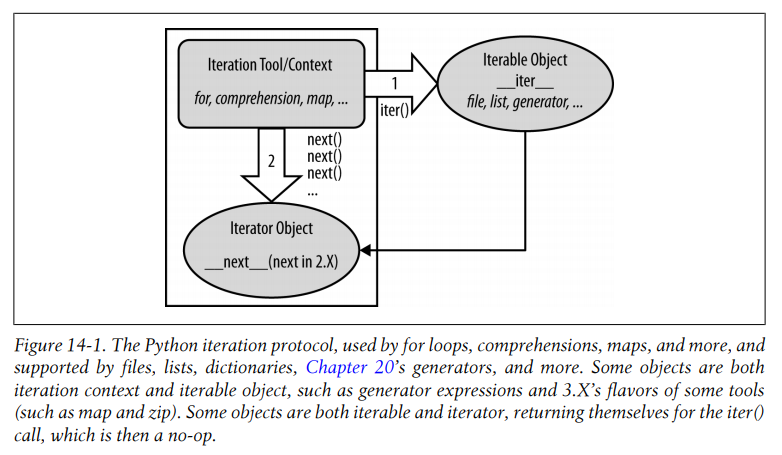

# 第3部分 语句和语法
## 第10章 Python语句简介

###  10.1 回顾Python程序结构

- 程序由模块构成。
- 模块包含语句。
- 语句包含表达式。
- 表达式建立并处理对象。

#### Python的语句
Python 3.X中所有的语句：

|   Statement   |   Role   |
| ---- | ---- |
| Assignment   |   Creating references   |
| Calls and other expressions   |   Running functions   |
| print calls   |   Printing objects   |
| if / elif / else |   Selecting actions   |
| for / else |   Iteration   |
| while / else |   General loops   |
| pass   |   Empty placeholder   |
| break   |   Loop exit   |
| continue   |   Loop continue   |
| def   |   Functions and methods   |
| return   |   Functions results   |
| yield   |   Generator   |
| global   |   Namespaces   |
| nonlocal   |   Namespaces (3.X)   |
| import   |   Module access   |
| from   |   Attribute access   |
| class   |   Building objects   |
| try / except / finally |   Catching exceptions   |
| raise   |   Triggering exceptions   |
| assert   |   Debugging checks   |
| with / as |   Context managers (3.X, 2.6+)   |
| del   |   Deleting references   |

### 10.2 Python语法模型

所有Python的复合语句（也就是语句中潜逃了语句）都使用相同的一般形式，也就是首航以冒号结尾，首行下一行嵌套的代码往往按缩进的格式书写，如下所示：

```python
Header line:
    Nested statement block
```

- **括号是可选的。**
- **一行的结束会自动终止出现在改行的语句，所以除非在一行内有多条语句，否则不需要使用分号`;`结尾。**
- **缩进的结束就是代码块的结束。**
- **不应该在同一段Python代码中混用制表符和空格。**


---


## 第11章 赋值、表达式和打印

### 11.1 赋值语句

赋值语句有一些特性需要注意：

- 赋值语句建立对象引用值：赋值语句总是建立对象的引用值，而不是赋值对象。
- 变量名在首次赋值时会被创建：Python会在首次将对象引用值赋值给变量时创建其变量名。
- 变量名在引用前必须先赋值：使用尚未进行赋值的变量名会引发错误。
- 执行隐式复制的一些操作：模块导入、函数和类的定义、for循环变量以及函数参数全都是隐式赋值运算。

#### 赋值语句的形式

Python中不同赋值语句形式如下表：


| Operation   |   Interpretation |
| ---- | ---- |
| `spam = 'Spam'` |   Basic form |
| `spam, ham = 'yum', 'YUM'` |   Tuple assignment (positional) |
| `[spam, ham] = ['yum', 'YUM']` |   List assignment (positional) |
| `a, b, c, d = 'spam'` |   Sequence assignment, generalized |
| `a, *b = 'spam'` |   Extended sequence unpacking (Python 3.X) |
| `spam = ham = 'lunch'` |   Multiple-target assignment |
| `spams += 42` |   Augmented assignment (equivalent to spams = spams + 42) |

#### 序列赋值

从技术的角度来讲，序列赋值语句实际上支持右侧任何可迭代的对象，而不仅局限与任何序列。

```python
>>> nudge = 1
>>> wink = 2
>>> A, B = nudge, wink
>>> A,B
(1, 2)
>>> [C, D] = [nudge, wink]
>>> C, D
(1, 2)
>>> nudge, wink = wink, nudge
>>> nudge, wink
(2, 1)
>>> [a, b, c] = (1, 2, 3)
>>> a, b, c
(1, 2, 3)
>>> (a, b, c) = [4, 5, 6]
>>> a, b, c
(4, 5, 6)
>>> (a, b, c) = "ABC"
>>> a, b, c
('A', 'B', 'C')
```


#### Python 3.X中的扩展序列解包

```python
>>> seq = [1, 2, 3, 4]
>>> a, b, c, d = seq
>>> print(a, b, c, d)
1 2 3 4
>>> a, b = seq
Traceback (most recent call last):
  File "<stdin>", line 1, in <module>
ValueError: too many values to unpack (expected 2)
>>> a, *b = seq
>>> a
1
>>> b
[2, 3, 4]
>>> a, *b, c = seq
>>> a
1
>>> b
[2, 3]
>>> c
4
>>> a, b, *c = seq
>>> a
1
>>> b
2
>>> c
[3, 4]
>>> a, *b = 'spam'
>>> a, *b
('s', 'p', 'a', 'm')
>>> a, b
('s', ['p', 'a', 'm'])
>>> a, *b, c = 'spam'
>>> a, b, c
('s', ['p', 'a'], 'm')
>>> a, b, c, *d = seq
>>> a, b, c, d
(1, 2, 3, [4])
>>> a, b, c, d, *e = seq
>>> a, b, c, d, e
(1, 2, 3, 4, [])
```


#### 多目标赋值语句

多目标赋值语句就是直接让所有提供的变量名都引用右侧的对象。

```python
>>> a = b = c = 'spam'
>>> a, b, c
('spam', 'spam', 'spam')
>>>
```

相当于：

```python
>>> c = 'spam'
>>> b = c
>>> a = b
>>> a, b, c
('spam', 'spam', 'spam')
```


#### 增强赋值语句
增强赋值语句：
- `x += y`
- `x -= y`
- `x *= y`
- `x /= y`
- `x %= y`
- `x &= y`
- `x |= y`
- `x ^= y`
- `x >>= y`
- `x //= y`
- `x **= y`
- `x <<= y`

```python
>>> L = [1, 2]
>>> L = L + [3]
>>> L
[1, 2, 3]
>>> L.append(4)
>>> L
[1, 2, 3, 4]
>>> L = L + [5, 6]
>>> L
[1, 2, 3, 4, 5, 6]
>>> L.extend([7, 8])
>>> L
[1, 2, 3, 4, 5, 6, 7, 8]
```

##### 增强赋值与共享引用
**注意，增强赋值会对可变对象进行原处修改。**
```python
>>> L = [1, 2]
>>> M = L
>>> L = L + [3, 4]
>>> L, M
([1, 2, 3, 4], [1, 2])
>>> L = [1, 2]
>>> M = L
>>> L += [3, 4]
>>> L, M
([1, 2, 3, 4], [1, 2, 3, 4])
```


#### 变量命名规则
Python变量命名规则：
- 语法：（下划线或字母）+（任意数量的字母、数字或下划线）
- 区分大小写
- 禁止使用保留字

##### 命名惯例
Python遵循的一些惯例：
- 以单一下划线开头的变量名（如，`_X`）不会被`from module import *`语句导入。
- 前后有下划线的变量（如，`__X__`）是系统定义的变量名，对解释器有特殊意义。
- 以双下划线开头，但没有以双下划线结尾的变量名（如，`__X`）是类的本地（“压缩”）变量。
- 通过交互模式运行时，只有单个下划线的变量名（`_name`）会保存最后表达式的结果。

### 11.2 表达式语句
表达式是值，变量，运算符和函数调用的组合。在Python中，你也可以使用表达式作为语句，即让表达式本身单独占一行。

常见Python表达式语句：

| Operation  |  Interpretation |
| ---- | ---- |
| `spam(eggs, ham)` |  Function calls |
| `spam.ham(eggs)` |  Method calls |
| `spam` |  Printing variables in the interactive interpreter |
| `print(a, b, c, sep='')` |  Printing operations in Python 3.X |
| `yield x ** 2` |  Yielding expression statements |


### 11.3 打印操作

在Python 3.X中，`print`函数可以实现打印。`print`函数是把一个或多个对象转换为其文本表达形式，然后发送给标准输出或另一个类似的文件流。

####  Python 3.X中的print函数
严格来讲，在Python 3.X中，`print`是内置函数，而不是语句。

从语法上来说，Python 3.X中的`print`函数参数格式如下：
```python
>>> help(print)
Help on built-in function print in module builtins:

print(...)
    print(value, ..., sep=' ', end='\n', file=sys.stdout, flush=False)

    Prints the values to a stream, or to sys.stdout by default.
    Optional keyword arguments:
    file:  a file-like object (stream); defaults to the current sys.stdout.
    sep:   string inserted between values, default a space.
    end:   string appended after the last value, default a newline.
    flush: whether to forcibly flush the stream.
```

##### print函数的应用

```python
>>> print()

>>> x = 'spam'
>>> y = 99
>>> z = ['eggs']
>>> print(x, y, z)
spam 99 ['eggs']
>>> print(x, y, z, sep=', ')
spam, 99, ['eggs']
>>> print(x, y, z, sep='')
spam99['eggs']
>>> print(x, y, z, end='')
spam 99 ['eggs']>>> print(x, y, z, end='');print(x, y, z)
spam 99 ['eggs']spam 99 ['eggs']
>>> print(x, y, z, end='...\n')
spam 99 ['eggs']...
>>>
```

使用`print`函数的`file`参数来直接把文本打印输出到文件或者其他可兼容的对象（这其实是流重定向的一种形式）：
```python
>>> x = 'spam'
>>> y = 99
>>> z = ['eggs']
>>> print(x, y, z, sep='...', file=open('file.txt', 'w'))
>>> print(x, y, z, sep='...')
spam...99...['eggs']
>>> print(open('file.txt').read())
spam...99...['eggs']

>>>
```


#### 打印流重定向
在Python 3.X和Python 2.X中，打印都默认发送到标准输出流；然而，还可以发送到其他的地方。

其实`print`函数只是Python的语法糖，提供了`sys.stdout`对象的简单接口，再加上了一些默认的格式设置。
```python
>>> import sys
>>> sys.stdout.write('hello world!\n')
hello world!
13
```

##### 重定向输出流
可以把`sys.stdout`重新赋值给标准输出流以外的其他文件对象或流对象，从而让`print`函数将文本传输到其他地方。
```python
>>> x = 'spam'
>>> y = 99
>>> z = ['eggs']
>>> sys.stdout = open('log.txt', 'a')  # 让sys.stdout指向一个文件对象
>>> print(x, y, z)         # 之后print将会把打印输出到文件中
>>> sys.stdout.close()     # 关闭文件
>>> sys.stdout = sys.__stdout__    # 将sys.stdout还原为其默认引用
>>> print(open('log.txt').read())   # 打印输出之前被打印进文件的内容
spam 99 ['eggs']

>>>
```

重设之后，程序中任何地方调用`print`函数都会讲文本写入log.txt文件末尾，而不是默认的标准输出流。`print`会调用`sys.stdout`的`write`方法，而不管其当时引用的是什么对象。事实上，你可以将`sys.stdout`重设为非文件对象，只要该对象实现了`write`方法，`print`函数就能调用该对象的`write`方法。

> 在Python 2.X和Python 3.X中，`sys.stdout`的默认值指向`sys`的`__stdout__`属性，从而使的标准输出流回到原始流的值。


##### 自动化流重定向
Python 3.X中，`print`函数的`file`参数允许一个`print`调用将其文本发送给一个文件的`write`方法，而不用重设`sys.stdout`。
```python
>>> x = 'spam'
>>> y = 99
>>> z = ['eggs']
>>> log = open('log.txt', 'w')
>>> print(x, y, z, file=log)
>>> log.close()
>>> print(open('log.txt').read())
spam 99 ['eggs']

>>>
```

这种用法也经常用于把错误消息打印到标注错误流`sys.stderr`：
```python
>>> print(x, y, z, file=sys.stderr)
spam 99 ['eggs']
```


**注意：`print`函数只是传送文本给`sys.stdout.write`方法，可以把`sys.stdout`赋值给一个对象，而该对象所实现的`write`方法通过任意方式处理文本，通过这个对象捕捉程序中打印的文本。例如，你可以传送打印的文字给GUI窗口，或者定义一个对象并实现其`write`方法：**
```python
class FileFaker:
	def write(self, string):
		# Do someting with printed text in string

import sys
sys.stdout = FileFaker()
print("send to FileFaker.write")
```

**在Python 3.X中，通过使用`print`的`file`参数，我们不用刻意重设`sys.stdout`，这种对象的重定向更加简单。例如：**
```python
filefaker = FileFaker()
print("send to filefaker.write", file=filefaker)
```

---


## 第12章 if测试和语法规则

### 12.1 if语句

if语句是Python中主要的逻辑选择工具。就像所有Python中的复合语句一样，if语句可以包含其他语句，包括其他if语句在内。

#### 通用格式

```python
if test_expression:
    # statements
```

两路分值：

```python
if test_expression:
    # statements
else:
    # statements
```


多路分值：

```python
if test_expression:
    # statements
elif:
    # statements
else:
    # statements
```


### 12.2 Python语法规则

Python语法规则：

- 语句是逐个运行的，除非有意进行跳转。
- 块和语句的边界会自动检测，即根据行尾和缩进判断。
- 复合语句=首行+`:`+缩进语句。
- 空白行、空格以及注释通常都会忽略。
- 文档字符串（docstring）会忽略，但会保存并由工具显示。


#### 代码块分隔符

Python不在乎你是怎么缩进代码的（使用空格或是制表符），只要缩进一致就可以了。

#### 语句的分隔符

Python的语句一般都是在其所在行的末尾结束的。不过，当语句过长，难以放在一行时，有些特殊的规则可用于使其位于多行中。

- 如果使用语法括号对，语句就可横跨多行：如果在封闭的`()`、`[]`、`{}`这类的配对中编写代码，Python就可以允许单个语句跨越多行。
- 如果语句以反斜杠结尾，就可横跨数行。
- 字符串字面量有特殊规则：三重引号字符串可以跨越多行。同时，相邻的字符串字面量是隐式连接起来的；把这个结果包含到圆括号中也可以允许字符串跨越多行。
- 可以用分号终止语句：使用分号终止语句时，可让多个非复合语句挤进一行中。


### 12.3 真值测试

在Python中：
- 任何非零数字或非空对象都为真。
- 数字零、空对象以及特殊对象None都被认为是假。
- 比较和相等测试会递归应用在数据结构中。
- 比较和相等测试会返回`True`或`False`。
- 布尔`and`和`or`运算符会返回真或假的操作对象。


Python中的3种布尔表达式运算结果：
- `X and Y`：如果X和Y都为真，则为真。
- `X or Y`：如果X或Y为真，则为真。
- `not X`：如果X为假则为真，否则为假。

`and`和`or`运算符总会返回让表达式的结果确定的那个对象，不是运算符左侧的对象，就是右侧的对象，而不会得到到简单的`True`或`False`。
```python
>>> 2 and 3, 3 and 2
(3, 2)
>>> [] and {}
[]
>>> 3 and []
[]
>>> 2 or 3, 3 or 2
(2, 3)
>>> [] or 3
3
>>> [] or {}
{}
```


### 12.4 if/else三元表达式
只有当X为真，才会执行表达式Y，否则，执行表达式Z：
```python
A = Y if X else Z
```

实例：
```python
>>> A = 't' if 'spam' else 'f'
>>> A
't'
>>> A = 't' if '' else 'f'
>>> A
'f'
```


---


## 第13章 while和for循环

### 13.1 while循环
#### 一般格式
```python
while test:            # Loop test
    statements         # Loop body
	if test: break     # Exit loop now, skip else if present
	if test: continue  # Go to top of loop now, to test1
else:
	statements         # Run if we didn't hit a 'break'
```

#### 例子
```python
>>> n = 0
>>> while n < 10:
...     print(n, end=', ')
...     n += 1
...
0, 1, 2, 3, 4, 5, 6, 7, 8, 9, >>>
```

注意，Python并没有其他语言中的所谓“do until”或“do while”语句。不过我们可以在循环体底部以一个if语句和`break`来实现类似的功能：
```python
while True:
	# ...loop body...
	if exitTest(): break
```

#### break、continue、pass和循环else语句
在Python中：
- `break`：跳过之后的循环语句，并跳出最近的所在循环。
- `continue`：跳过之后的循环语句，跳到最近的循环开头处，并直接开始下一次循环。
- `pass`：什么是都不做，只是空占位语句。
- 循环else块：只有当循环没有遇到break，正常离开时才会执行。


##### pass
`pass`语句是无运算的占位语句，当语法需要语句并且还没有任何使用的语句可写时，就可以使用它。

> Python 3.X允许在可以使用表达式的任何地方使用三个连续的点号`...`来省略代码。由于`...`什么也不做，可以当做是`pass`语句的一种替代方案。
```python
def func1():
 ... # Alternative to pass
def func2():
 ...
func1() # Does nothing if called
```
> 省略号可以和语句头（冒号）出现在同一行：
```python
def func1(): ... # Works on same line too
def func2(): ...

>>> X = ... # Alternative to None
>>> X
Ellipsis
```

##### 循环else
和循环else子句结合时，break语句通常可以忽略其他语言中所需的搜索状态标志位。


### 13.2 for循环
for循环在Python中是一个通用的序列迭代器，可以遍历任何序列对象内的元素，以及其他可迭代对象。

#### 一般格式
```python
for target in object:    # Assign object items to target
	statements
	if test: break       # Exit loop now, skip else
	if test: continue    # Go to top of loop now
else:
	statements           # If we didn't hit a 'break'
```
for循环语句也支持一个可选的else子句块，它和在while语句中一样，如果离开循环时，没有碰到break语句，就会被执行。


#### 例子

##### Python 3.X在for循环中扩展的序列赋值
实际上，由于for循环中的循环变量真的可以是任何赋值目标，所以我们也可以使用Python 3.X中的扩展序列解包赋值语法，来提取序列中的序列的元素和部分。
```python
>>> for (a, *b, c) in [(1, 2, 3, 4), (5, 6, 7, 8)]:
...     print(a, b, c)
...
1 [2, 3] 4
5 [6, 7] 8
```


##### 嵌套for循环
```python
>>> items = ['aaa', 111, (4, 5), 2.01]
>>> tests = [(4, 5), 3.14]
>>> for key in tests:
...		for item in items:
...			if item == key:
...				print(key, "was found")
...				break
...     else:
...     	print(key, "not found")
...
(4, 5) was found
3.14 not found
```


### 13.3 编写循环的技巧
一般而言，for比while容易些，执行是也较快。所以每当需要遍历序列时，都应该把for作为首选工具。

Python提供了一组内置函数，在for循环内定制迭代：
- `range`：返回一系列连续递增的整数，可作为for中的索引。
- `zip`：返回并行元素的元组的列表，可用于在for中内遍历数个序列。
- `enumerate`：生成可迭代对象中元素的值和索引。
- `map`：在Python 2.X中，内置函数`map`的作用和`zip`类似，所以它已经从Python 3.X中移除，取而代之的是`map`对象。


#### 并行遍历：zip和map
内置函数`zip`能够让我们使用for循环来并行使用多个序列。

在基本的运算中，`zip`会取得一个或多个序列为参数，将这些序列中并排的（相同索引的）元素存放在一个元组中，然后返回包含这些元组的列表。
```python
>>> L1 = list(range(1, 6))
>>> L2 = list(range(6, 11))
>>> L3 = list(range(10, 16))
>>> L1
[1, 2, 3, 4, 5]
>>> L2
[6, 7, 8, 9, 10]
>>> L3
[10, 11, 12, 13, 14, 15]
>>> zip(L1, L2)
<zip object at 0x000001584F74BCC8>
>>> list(zip(L1, L2))
[(1, 6), (2, 7), (3, 8), (4, 9), (5, 10)]
>>> list(zip(L1, L2, L3))
[(1, 6, 10), (2, 7, 11), (3, 8, 12), (4, 9, 13), (5, 10, 14)]
>>>
```


这样就可以很方便的使用for循环并行处理多个可以迭代对象：
```python
>>> for (x, y, z) in zip(L1, L2, L3):
...     print(x, y, z)
...
1 6 10
2 7 11
3 8 12
4 9 13
5 10 14
```


当参数长度不同时，`zip`会以最短序列的长度为准来截断所得到的元组。
```python
>>> S1 = 'abcd'
>>> S2 = 'efghijklmn'
>>> list(zip(S1, S2))
[('a', 'e'), ('b', 'f'), ('c', 'g'), ('d', 'h')]
```

##### map对象
和`zip`一样，`map`是Python 3.0X中的一个生成器，因此必须传递给`list`以一次性收集其结果。下面的代码根据字符串中的每个元素`map`内置的`ord`函数并收集结果：
```python
>>> list(map(ord,'spam'))
[115, 112, 97, 109]
list(map(chr,[115, 112, 97, 109]))
['s', 'p', 'a', 'm']
>>> list(map(str.upper,'spam'))
['S', 'P', 'A', 'M']
```

##### 使用zip构造字典
方法一：
```python
>>> keys = ['spam', 'eggs', 'toast']
>>> vals = [1, 3, 5]
>>> list(zip(keys, vals))
[('spam', 1), ('eggs', 3), ('toast', 5)]
>>> D = {}
>>> for (k, v) in zip(keys, vals):
...     D[k] = v
...
>>> D
{'spam': 1, 'eggs': 3, 'toast': 5}
```

方法二：
```python
>>> keys = ['spam', 'eggs', 'toast']
>>> vals = [1, 3, 5]
>>> D2 = dict(zip(keys, vals))
>>> D2
{'spam': 1, 'eggs': 3, 'toast': 5}
```

#### 产生索引和元素：`enumerate`
`enumerate`返回一个生成器对象，其中包含序列的元素和该元素的索引值配对的元组。
```python
>>> S = 'spam'
>>> >>> enumerate(S)
<enumerate object at 0x000001584F0375E8>
>>> list(enumerate(S))
[(0, 's'), (1, 'p'), (2, 'a'), (3, 'm')]
>>> for (index, item) in enumerate(S):
...     print('S[{0}] -> {1}'.format(index, item))
...
S[0] -> s
S[1] -> p
S[2] -> a
S[3] -> m
```


---


## 第14章 迭代器和解析（第一部分）
### 14.1 迭代器：初探
术语 ***可迭代对象***（iterable） 指的是支持`iter`函数调用的对象。
术语 ***迭代器***（iterator） 指的是`iter`函数所返回的一个支持`next(I)`的对象。

#### 文件迭代器
已打开的文件对象有个方法名为`readline`，可以一次从一个文件中读取一行文本，每次调用`readline`方法时，就会读取下一行；到达文件末尾时，就会返回空字符串。

```python
>>> open('file.txt','w').write('line 1\n line 2\n line 3\n line 4\n line 5\n')
39
>>> open('file.txt').read()
'line 1\n line 2\n line 3\n line 4\n line 5\n'
>>> print(open('file.txt').read())
line 1
 line 2
 line 3
 line 4
 line 5

>>>
```

```python
>>> f = open('file.txt')
>>> f.readline()
'line 1\n'
>>> f.readline()
' line 2\n'
>>> f.readline()
' line 3\n'
>>> f.readline()
' line 4\n'
>>> f.readline()
' line 5\n'
>>> f.readline()
''
```

和`readline`方法类似，文件的`__next__`方法，每次调用时就会返回文件中的下一行；当达到文件末尾时，`__next__`会引发内置的`StopIteration`异常。

```python
>>> f = open('file.txt')
>>> f.__next__()
'line 1\n'
>>> f.__next__()
' line 2\n'
>>> f.__next__()
' line 3\n'
>>> f.__next__()
' line 4\n'
>>> f.__next__()
' line 5\n'
>>> f.__next__()
Traceback (most recent call last):
  File "<stdin>", line 1, in <module>
StopIteration
>>>
```

**Python中所谓的迭代协议：在Python中，使用`__next__`方法来前进到下一个结果，并在到达一系列结果的末尾时引发`StopIteration`异常的任何对象，都被认为是 *迭代器*。**

**任何可迭代对象都能用for循环或其他迭代工具（如，for循环、列表解析、`in`成员关系测试和`map`内置函数）遍历。因为所有迭代工具都会在每次迭代中调用对象的`__next__`，并捕捉`StopIteration`异常来确定迭代结束。对于某些对象，完整的协议还包括额外的第一步：调用`iter`函数。但对于文件，这一步是不必要的。**

> 在Python 2.X中，迭代方法叫做`X.next()`而不是`X.__next__`。为了可移植性，内置函数`next(X)`在Python 3.X和Python 2.X（2.6及其以后版本）中都是可用的；并且，在Python 3.X中，内置函数`next(X)`会调用`X.__next__()`；在Python 2.X中，则会调用`X.next()`。除了方法名称之外，迭代在2.X和3.X中所有其他地方都以相同的方式工作。在Python 2.6和2.7中，简单地使用`X.next()`或`next(X)`来手动迭代；在3.X中，使用`X.__next__()`来手动迭代；在2.6以前的版本中，使用`X.next()`来手动迭代，而不要使用`next(X)`。


#### 手动迭代：iter和next
##### `next`函数
Python 3.X还提供了一个内置函数`next`，它会自动调用一个对象的`__next__`方法。给定一个可迭代对象X，调用`next(X)`等同于Python 3.X的`X.__next__()`方法，以及Python 2.X中的`X.next()`方法。
```python
>>> f = open('file.txt')
>>> next(f)
'line 1\n'
>>> next(f)
' line 2\n'
>>> next(f)
' line 3\n'
>>> next(f)
' line 4\n'
>>> next(f)
' line 5\n'
>>> next(f)
Traceback (most recent call last):
  File "<stdin>", line 1, in <module>
StopIteration
```


##### 完整的迭代协议（The full iteration protocol）
作为一种更加正式的定义，图14-1描绘了这种完整迭代协议（full iteration protocol）。这一协议被用于Python中所有迭代工具，并被各种对象类型所支持。它实际上基于2个对象，这2个对象被迭代工具用于2个不同的步骤：
1. `iter`函数会运行你所请求迭代的 ***可迭代对象***（iterable） 的`__iter__`方法。
2. 在迭代期间，实际生成值的可迭代对象返回 ***迭代器*** （iterator），这个迭代器的`__next__`方法被内置函数`next`所运行，并且，当在完成生成结果时引发`StopIteration`异常。

在大多数情况下，这些步骤由迭代工具自动编排，但它有助于理解这2个对象的角色。在某些情况下，这2个对象是相同的（即同一个对象），例如，当仅支持单个扫描（如，文件）时；并且，迭代器对象通常是临时的，由迭代工具在内部使用。

此外，一些对象既是迭代上下文工具（iteration context tool）（它们能够迭代）又是可迭代对象（它们的结果是可迭代的）——包括生成器表达式（generator expressions），以及Python 3.X中的`map`和`zip`。 正如我们将要看到的，为了避免立即在内存中构建结果列表，在Python 3.X中更多工具变为可迭代的，——包括`map`，`zip`，`range`和一些字典方法。



> **个人理解：在迭代时，内置函数`iter`会调用可迭代对象的`__iter__`方法来生成并返回一个迭代器。这个迭代器的`__next__`方法会被内置函数`next`调用；并且当迭代完成时，这个迭代器会引发`StopIteration`异常。**

> ***可迭代对象*** ：实现了迭代协议，并具有`__iter__`方法的对象就是可迭代对象。
> ***迭代器***：实现了迭代协议，并具有`__next__`方法的对象就是迭代器。
> 有一些对象，本身既是可迭代对象，又是其自身的迭代器，例如：文件，`map`和`zip`。
> 有一些对象，本身实现了迭代协议，且具有`__iter__`方法，说明它是可迭代对象，但它并不是其自身的迭代器（即没有实现`__next__`方法），例如：列表以及很多其他的内置对象。


##### `iter`函数
当for循环开始时，它首先通过将迭代器传递给内置函数`iter`来从可迭代对象中获取迭代器; `iter`返回的对象具有所需的`__next__`方法（Python 2.X中为`next`方法）。 `iter`函数在内部运行`__iter__`方法，类似于`next`函数运行`__next__`方法。

for循环在内部处理列表这类内置序列类型的过程类似于以下代码：
```python
>>> L = [1, 2, 3]
>>> I = iter(L)
>>> I.__next__()
1
>>> I.__next__()
2
>>> I.__next__()
3
>>> I.__next__()
Traceback (most recent call last):
  File "<stdin>", line 1, in <module>
StopIteration
```

**注意：但并不是所有对象都必须调用内置函数`iter`来取得迭代器，例如：文件。因为文件对象既是可迭代对象，同时也是其自身的迭代器。**
```python
>>> f = open('file.txt')
>>> >>> dir(f)        # 注意到文件既有__iter__方法，也有__next__方法
['_CHUNK_SIZE', '__class__', '__del__', '__delattr__', '__dict__', '__dir__', '__doc__', '__enter__', '__eq__', '__exit__', '__format__', '__ge__', '__getattribute__', '__getstate__', '__gt__', '__hash__', '__init__', '__iter__', '__le__', '__lt__', '__ne__', '__new__', '__next__', '__reduce__', '__reduce_ex__', '__repr__', '__setattr__', '__sizeof__', '__str__', '__subclasshook__', '_checkClosed', '_checkReadable', '_checkSeekable', '_checkWritable', '_finalizing', 'buffer', 'close', 'closed', 'detach', 'encoding', 'errors', 'fileno', 'flush', 'isatty', 'line_buffering', 'mode', 'name', 'newlines', 'read', 'readable', 'readline', 'readlines', 'seek', 'seekable', 'tell', 'truncate', 'writable', 'write', 'writelines']
>>> iter(f) is f     # 文件是其自身的迭代器
True
>>> iter(f) is f.__iter__()   # 调用iter函数所取得的迭代器和直接调用__iter__方法取得的相同
True

>>> f.__next__()     # 所以文件可以直接迭代，而不需要调用iter函数来获得迭代器
'line 1\n'
>>> f.__next__()
' line 2\n'
>>> f.__next__()
' line 3\n'
>>> f.__next__()
' line 4\n'
>>> f.__next__()
' line 5\n'
>>> f.__next__()
Traceback (most recent call last):
  File "<stdin>", line 1, in <module>
StopIteration
>>>
```

**列表以及很多其他的内置对象并不是其自身的迭代器，因为它们支持多个开放迭代，例如嵌套循环中可能存在多个迭代，所有迭代都在不同位置。对于这样的对象，我们必须调用内置函数`iter`来取得迭代器。**
```python
>>> L = [1, 2, 3]
>>> dir(L)     # 注意到list只有__iter__方法，而没有__next__方法
['__add__', '__class__', '__contains__', '__delattr__', '__delitem__', '__dir__', '__doc__', '__eq__', '__format__', '__ge__', '__getattribute__', '__getitem__', '__gt__', '__hash__', '__iadd__', '__imul__', '__init__', '__init_subclass__', '__iter__', '__le__', '__len__', '__lt__', '__mul__', '__ne__', '__new__', '__reduce__', '__reduce_ex__', '__repr__', '__reversed__', '__rmul__', '__setattr__', '__setitem__', '__sizeof__', '__str__', '__subclasshook__', 'append', 'clear', 'copy', 'count', 'extend', 'index', 'insert', 'pop', 'remove', 'reverse', 'sort']
>>> iter(L) is L   # 注意到列表并不是其自身的迭代器
False
>>> I = iter(L)    # 调用iter函数取得列表迭代器
>>> type(I)        # I为列表迭代器
<class 'list_iterator'>
>>> dir(I)     # 注意到列表迭代器既有__iter__方法，也有__next__方法
['__class__', '__delattr__', '__dir__', '__doc__', '__eq__', '__format__', '__ge__', '__getattribute__', '__gt__', '__hash__', '__init__', '__init_subclass__', '__iter__', '__le__', '__length_hint__', '__lt__', '__ne__', '__new__', '__next__', '__reduce__', '__reduce_ex__', '__repr__', '__setattr__', '__setstate__', '__sizeof__', '__str__', '__subclasshook__']
```

 列表和其他一些对象可以同时允许多个迭代器：

```python
>>> L = [1, 2, 3]
>>> Iter1 = iter(L)
>>> Iter2 = iter(L)
>>> Iter1 is Iter2          # 列表迭代器Iter1和Iter2并不是同一个对象
False
>>> Iter1.__next__()        # Iter1和Iter2可以互不影响地各自进行迭代
1
>>> Iter1.__next__()
2
>>> Iter2.__next__()
1
>>> Iter2.__next__()
2
>>> Iter2.__next__()
3
>>> Iter2.__next__()
Traceback (most recent call last):
  File "<stdin>", line 1, in <module>
StopIteration
>>> Iter1.__next__()
3
>>> Iter1.__next__()
Traceback (most recent call last):
  File "<stdin>", line 1, in <module>
StopIteration
```


##### 手动迭代

尽管Python迭代工具自动调用这些函数，我们也可以使用它们来手动地应用迭代。

如下交互展示了自动和手动迭代之间的对等性：
```python
>>> L = [1, 2, 3]
>>> for X in L:   # 自动迭代，for循环自动获得迭代器，并调用__next__，以及捕捉异常
...     print(X ** 2, end=' ')
...
1 4 9 
>>> I = iter(L)   # 手动取得列表迭代器
>>> while True:
...     try:
...             X = next(I)      # 手动调用迭代器的__next__方法；
...     except StopIteration:    # 手动捕捉异常
...             break
...     print(X ** 2, end=' ')
...
1 4 9 
>>>
```

> 从技术上来讲, for循环调用内部等价的`I.__next__`，而不是这里所使用的`next(I)`。这两者几乎没有区别。如果是手动迭代，可以使用两者中的任意一种。


#### 其他可迭代的内置类型
除了文件和像列表这样实际的序列外，其他类型也有其适用的迭代器。

在最近的Python版本中，字典是可迭代的，其具有一个迭代器，能够在迭代环境（iteration context）中自动地一次返回一个键：
```python
>>> D = dict(a=1, b=2, c=3)
>>> dir(D)        # 注意到字典具有__iter__方法，所以字典是可迭代对象
['__class__', '__contains__', '__delattr__', '__delitem__', '__dir__', '__doc__', '__eq__', '__format__', '__ge__', '__getattribute__', '__getitem__', '__gt__', '__hash__', '__init__', '__init_subclass__', '__iter__', '__le__', '__len__', '__lt__', '__ne__', '__new__', '__reduce__', '__reduce_ex__', '__repr__', '__setattr__', '__setitem__', '__sizeof__', '__str__', '__subclasshook__', 'clear', 'copy', 'fromkeys', 'get', 'items', 'keys', 'pop', 'popitem', 'setdefault', 'update', 'values']
>>> I = iter(D)
>>> next(I)
'a'
>>> next(I)
'b'
>>> next(I)
'c'
>>> next(I)
Traceback (most recent call last):
  File "<stdin>", line 1, in <module>
StopIteration
```

其导致的直接效果是，我们不在需要调用`keys`方法来遍历字典键，可以直接使用for循环来遍历字典键：
```python
>>> for key in D:
...     print(key, D[key])
...
a 1
b 2
c 3
```

除了字典，其他的Python对象类型也支持迭代协议，因此也可以在for循环中使用。例如，`shelves`（用于Python对象的一个根据键访问的文件系统）和`os.popen`（读取shell命令输出的工具）的结果也是可迭代的：
```python
>>> import os
>>> P = os.popen('dir')
>>> P.__next__()
'data.bin      datafile.txt   file.txt  pip-rddm3rpv-unpack  ssh-zkHzr3vCmVOT  test.py\n'
>>> P.__next__()
'datafile.pkl  docstrings.py  log.txt   __pycache__\t    testjson.txt      test.pyc\n'
>>> P.__next__()
Traceback (most recent call last):
  File "<stdin>", line 1, in <module>
StopIteration
```

```python
>>> P = os.popen('dir')
>>> next(P)
Traceback (most recent call last):
  File "<stdin>", line 1, in <module>
TypeError: '_wrap_close' object is not an iterator
```

> 注意：在Python 3.X中，`popen`对象自身支持`P.__next__()`方法，但不支持内置函数`next(P)`。经测试，Python 3.7中，`popen`对象依然不支持内置函数`next(P)`形式调用。


直接使用for循环迭代`popen`对象：
```python
>>> P = os.popen('ls')
>>> for i in P:print(i, end='')
...
data.bin
datafile.pkl
datafile.txt
docstrings.py
file.txt
log.txt
pip-rddm3rpv-unpack
__pycache__
ssh-zkHzr3vCmVOT
testjson.txt
test.py
test.pyc
```

迭代协议也是我们必须将某些结果包装到`list`调用中，以一次性地看到它们所有的值的原因。
```python
>>> R = range(5)
>>> R
range(0, 5)
>>> type(R)
<class 'range'>
>>> dir(R)
['__bool__', '__class__', '__contains__', '__delattr__', '__dir__', '__doc__', '__eq__', '__format__', '__ge__', '__getattribute__', '__getitem__', '__gt__', '__hash__', '__init__', '__init_subclass__', '__iter__', '__le__', '__len__', '__lt__', '__ne__', '__new__', '__reduce__', '__reduce_ex__', '__repr__', '__reversed__', '__setattr__', '__sizeof__', '__str__', '__subclasshook__', 'count', 'index', 'start', 'step', 'stop']
>>> I = iter(R)
>>> next(I)
0
>>> next(I)
1
>>> list(range(5))
[0, 1, 2, 3, 4]
```


至此，我们已经可以弄清`enumerate`函数的工作方式：
```python
>>> E = enumerate('spam')
>>> E
<enumerate object at 0x000001584F778048>
>>> dir(E)        # 注意到enumerate对象具有__iter__方法和__next__方法
['__class__', '__delattr__', '__dir__', '__doc__', '__eq__', '__format__', '__ge__', '__getattribute__', '__gt__', '__hash__', '__init__', '__init_subclass__', '__iter__', '__le__', '__lt__', '__ne__', '__new__', '__next__', '__reduce__', '__reduce_ex__', '__repr__', '__setattr__', '__sizeof__', '__str__', '__subclasshook__']
>>> iter(E) is E    # 其迭代器就是其本身
True
>>> next(E)
(0, 's')
>>> next(E)
(1, 'p')
>>> next(E)
(2, 'a')
>>> next(E)
(3, 'm')
>>> next(E)
Traceback (most recent call last):
  File "<stdin>", line 1, in <module>
StopIteration
```

### 14.2 列表解析：初探

列表解析比手动for循环语句的运行速度更快，因为它们的迭代在解释器内部是以C语言的速度执行的。

```python
>>> [i for i in range(10)]
[0, 1, 2, 3, 4, 5, 6, 7, 8, 9]
```


扩展的列表解析语法：

```python
>>> [i for i in range(10) if i % 2 == 0]
[0, 2, 4, 6, 8]
>>> [x + y for x in 'abc' for y in 'lmn']
['al', 'am', 'an', 'bl', 'bm', 'bn', 'cl', 'cm', 'cn']
```


### 14.3 其他迭代环境（Other Iteration Contexts）

实现了迭代协议的任何工具，都能够在提供了该工具的任何内置类型或用户定义的类上自动地工作。

每种从左到右扫描对象的内置工具都使用了迭代协议，包括：`for`循环语句、列表解析、`in`成员关系测试、内置函数`map`、`sorted`、`zip`、`enumerate`、`filter`、`reduce`、`sum`、`any`、`all`、`max`、`min`。

当应用于一个文件时，通过`__iter__`获得迭代器，并依次调用`__next__`，所有这些迭代工具都自动利用文件对象的迭代器逐行扫描：

```python
>>> for line in open('script2.py'): # Use file iterators
... print(line.upper(), end='')
...
IMPORT SYS
PRINT(SYS.PATH)
X = 2
PRINT(X ** 32)
>>> uppers = [line.upper() for line in open('script2.py')]
>>> uppers
['IMPORT SYS\n', 'PRINT(SYS.PATH)\n', 'X = 2\n', 'PRINT(X ** 32)\n']
```

在Python 3.X中，`map`返回一个可迭代对象，因此，我们必须将它包含到list中，来使其一次性输出所有的值：
```python
>>> map(str.upper, open('script2.py')) # map is itself an iterable in 3.X
<map object at 0x00000000029476D8>
>>> list(map(str.upper, open('script2.py')))
['IMPORT SYS\n', 'PRINT(SYS.PATH)\n', 'X = 2\n', 'PRINT(X ** 32)\n']
```

内置函数`sorted`排序可迭代对象中的各项，在Python 3.X中，`sorted`返回一个列表：
```python
>>> sorted(open('script2.py'))
['import sys\n', 'print(sys.path)\n', 'print(x ** 32)\n', 'x = 2\n']
```

内置函数`zip`组合可迭代对象中的各项，`zip`返回一个可迭代对象：
```python
>>> list(zip(open('script2.py'), open('script2.py')))
[('import sys\n', 'import sys\n'), ('print(sys.path)\n', 'print(sys.path)\n'),
('x = 2\n', 'x = 2\n'), ('print(x ** 32)\n', 'print(x ** 32)\n')]
```

`enumerate`根据相对位置来配对可迭代对象中的项，`enumerate`返回一个可迭代对象：
```python
>>> list(enumerate(open('script2.py')))
[(0, 'import sys\n'), (1, 'print(sys.path)\n'), (2, 'x = 2\n'),
(3, 'print(x ** 32)\n')]
```

`filter`选择一个函数为真的项，`filter`返回一个可迭代对象：
```python
>>> list(filter(bool, open('script2.py'))) # nonempty=True
['import sys\n', 'print(sys.path)\n', 'x = 2\n', 'print(x ** 32)\n']
```

`reduce`针对可迭代对象中的成对的项运行一个函数：
```python
>>> import functools, operator
>>> functools.reduce(operator.add, open('script2.py'))
'import sys\nprint(sys.path)\nx = 2\nprint(x ** 32)\n'
```

内置函数`sum`计算任何可迭代对象中的合：
```python
>>> sum([i for i in range(10)])
45
```

如果可迭代对象中任何项都为真，内置函数`any`返回True：
```python
>>> any([i for i in range(10)])
True
```
如果可迭代对象中所有项都为真，内置函数`all`返回True：
```python
>>> all([i for i in range(10)])
False
```

内置函数`max`和`min`分别返回可迭代对象中值最大和最小的项：
```python
>>> max([i for i in range(10)])
9
>>> min([i for i in range(10)])
0
```

除此之外，还有其他一些迭代工具，例如，内置函数`list`和`tuple`，字符串方法`join`：
```python
>>> list(open('script2.py'))
['import sys\n', 'print(sys.path)\n', 'x = 2\n', 'print(x ** 32)\n']
>>> tuple(open('script2.py'))
('import sys\n', 'print(sys.path)\n', 'x = 2\n', 'print(x ** 32)\n')
>>> '&&'.join(open('script2.py'))
'import sys\n&&print(sys.path)\n&&x = 2\n&&print(x ** 32)\n'

```

甚至一些您可能不期望的工具也属于这一类。 例如，序列赋值，成员资格测试，切片分配和列表方法`extend`也利用迭代协议进行扫描，从而自动按行读取文件：
```python
>>> a, b, c, d = open('script2.py') # Sequence assignment
>>> a, d
('import sys\n', 'print(x ** 32)\n')
>>> a, *b = open('script2.py') # 3.X extended form
>>> a, b
('import sys\n', ['print(sys.path)\n', 'x = 2\n', 'print(x ** 32)\n'])
>>> 'y = 2\n' in open('script2.py') # Membership test
False
>>> 'x = 2\n' in open('script2.py')
True
>>> L = [11, 22, 33, 44] # Slice assignment
>>> L[1:3] = open('script2.py')
>>> L
[11, 'import sys\n', 'print(sys.path)\n', 'x = 2\n', 'print(x ** 32)\n', 44]
>>> L = [11]
>>> L.extend(open('script2.py')) # list.extend method
Other Iteration Contexts | 431
>>> L
[11, 'import sys\n', 'print(sys.path)\n', 'x = 2\n', 'print(x ** 32)\n']
```

就此而言，`set`调用以及Python 3.X和2.7中较新的集合和字典解析表达式能够接受可迭代对象：
```python
>>> set(open('script2.py'))
{'print(x ** 32)\n', 'import sys\n', 'print(sys.path)\n', 'x = 2\n'}
>>> {line for line in open('script2.py')}
{'print(x ** 32)\n', 'import sys\n', 'print(sys.path)\n', 'x = 2\n'}
>>> {ix: line for ix, line in enumerate(open('script2.py'))}
{0: 'import sys\n', 1: 'print(sys.path)\n', 2: 'x = 2\n', 3: 'print(x ** 32)\n'}
```

集合和字典解析表达式同样支持列表解析中的扩展语法，包括`if`测试：
```python
>>> {line for line in open('script2.py') if line[0] == 'p'}
{'print(x ** 32)\n', 'print(sys.path)\n'}
>>> {ix: line for (ix, line) in enumerate(open('script2.py')) if line[0] == 'p'}
{1: 'print(sys.path)\n', 3: 'print(x ** 32)\n'}
```


### 14.4 Python 3.X中新出现的可迭代对象
除了与文件和字典这样的内置类型相关的迭代，字典方法`keys`、`values`和`items`都在Python 3.X中返回可迭代对象，就像内置函数`range`、`map`、`zip`和`filter`所做的那样。

#### `range`迭代器
在Python 3.X中，`range`返回一个可迭代对象：
```python
>>> R = range(10) # range returns an iterable, not a list
>>> R
range(0, 10)
>>> dir(R)     # range返回可迭代对象，但不是其自身的迭代器
['__bool__', '__class__', '__contains__', '__delattr__', '__dir__', '__doc__', '__eq__', '__format__', '__ge__', '__getattribute__', '__getitem__', '__gt__', '__hash__', '__init__', '__init_subclass__', '__iter__', '__le__', '__len__', '__lt__', '__ne__', '__new__', '__reduce__', '__reduce_ex__', '__repr__', '__reversed__', '__setattr__', '__sizeof__', '__str__', '__subclasshook__', 'count', 'index', 'start', 'step', 'stop']
>>> I = iter(R) # Make an iterator from the range iterable
>>> dir(I) 
['__class__', '__delattr__', '__dir__', '__doc__', '__eq__', '__format__', '__ge__', '__getattribute__', '__gt__', '__hash__', '__init__', '__init_subclass__', '__iter__', '__le__', '__length_hint__', '__lt__', '__ne__', '__new__', '__next__', '__reduce__', '__reduce_ex__', '__repr__', '__setattr__', '__setstate__', '__sizeof__', '__str__', '__subclasshook__']
>>> next(I) # Advance to next result
0 # What happens in for loops, comprehensions, etc.
>>> next(I)
1
>>> next(I)
2
>>> list(range(10)) # To force a list if required
[0, 1, 2, 3, 4, 5, 6, 7, 8, 9]
```

#### `map`、`zip`和`filter`迭代器
和`range`类似，在Python 3.X中，内置函数`map`、`zip`和`filter`不再像Python 2.X那样一次性生成一个结果列表，而是返回可迭代对象，以节约内存空间。和`range`不同的是，它们都是其自身的迭代器，在遍历一次后就用尽了。
```python
>>> M = map(abs, (-1, 0, 1)) # map returns an iterable, not a list
>>> M
<map object at 0x000001584F748F28>
>>> dir(M)       # map返回可迭代对象，同时也是其自身的迭代器
['__class__', '__delattr__', '__dir__', '__doc__', '__eq__', '__format__', '__ge__', '__getattribute__', '__gt__', '__hash__', '__init__', '__init_subclass__', '__iter__', '__le__', '__lt__', '__ne__', '__new__', '__next__', '__reduce__', '__reduce_ex__', '__repr__', '__setattr__', '__sizeof__', '__str__', '__subclasshook__']
>>> next(M) # Use iterator manually: exhausts results
1 # These do not support len() or indexing
>>> next(M)
0
>>> next(M)
1
>>> next(M)
StopIteration
>>> for x in M: print(x) # map iterator is now empty: one pass only
...
>>> M = map(abs, (-1, 0, 1)) # Make a new iterable/iterator to scan again
>>> for x in M: print(x) # Iteration contexts auto call next()
436 | Chapter 14: Iterations and Comprehensions
...
1
0
1
>>> list(map(abs, (-1, 0, 1))) # Can force a real list if needed
[1, 0, 1]
```

内置函数`zip`返回以同样方式工作的迭代器：
```python
>>> Z = zip((1, 2, 3), (10, 20, 30)) # zip is the same: a one-pass iterator
>>> Z
<zip object at 0x0000000002951108>
>>> list(Z)
[(1, 10), (2, 20), (3, 30)]
>>> for pair in Z: print(pair) # Exhausted after one pass
...
>>> Z = zip((1, 2, 3), (10, 20, 30))
>>> for pair in Z: print(pair) # Iterator used automatically or manually
...
(1, 10)
(2, 20)
(3, 30)
>>> Z = zip((1, 2, 3), (10, 20, 30)) # Manual iteration (iter() not needed)
>>> next(Z)
(1, 10)
>>> next(Z)
(2, 20)
```

在Python 3.X中，内置函数`filter`接受一个待处理的可迭代对象，然后返回一个可迭代对象来生成结果：
```python
>>> filter(bool, ['spam', '', 'ni'])
<filter object at 0x00000000029B7B70>
>>> list(filter(bool, ['spam', '', 'ni']))
['spam', 'ni']
```

使用列表解析的扩展语法测试真值，可以模拟以上操作：
```python
>>> [x for x in ['spam', '', 'ni'] if bool(x)]
['spam', 'ni']
>>> [x for x in ['spam', '', 'ni'] if x]
['spam', 'ni']
```


#### 多个迭代器 VS 单个迭代器

在Python 3.X中对象`range`和对象`map`、`zip`、`filter`有所不同，它自身不是自己的迭代器，即手动迭代时，我们需要使用`iter`产生一个迭代器；并且，它支持在其结果上的多个迭代器，这些迭代器会记住它们各自的位置：

```python
>>> R = range(3)
>>> dir(R)
['__bool__', '__class__', '__contains__', '__delattr__', '__dir__', '__doc__', '__eq__', '__format__', '__ge__', '__getattribute__', '__getitem__', '__gt__', '__hash__', '__init__', '__init_subclass__', '__iter__', '__le__', '__len__', '__lt__', '__ne__', '__new__', '__reduce__', '__reduce_ex__', '__repr__', '__reversed__', '__setattr__', '__sizeof__', '__str__', '__subclasshook__', 'count', 'index', 'start', 'step', 'stop']
>>> next(R)
Traceback (most recent call last):
  File "<stdin>", line 1, in <module>
TypeError: 'range' object is not an iterator
>>> I1 = iter(R)
>>> next(I1)
0
>>> next(I1)
1
>>> I2 = iter(R)
>>> next(I2)
0
>>> next(I2)
1
>>>
```

相反，在Python 3.X中`zip`、`map`和`filter`不支持相同结果上的多个活跃迭代器：

```python
>>> Z = zip((1,2,3),(10,11,12))
>>> I1 = iter(Z)
>>> I2 = iter(Z)
>>> next(I1)
(1, 10)
>>> next(I1)
(2, 11)
>>> next(I2)
(3, 12)
>>> I1 is I2            # 注意到I1和I2实际为同一个对象
True
>>> id(I1)
1478801876872
>>> id(I2)
1478801876872
```

#### 字典试图迭代器

在Python 3.X中，字典的`keys`、`values`、`items`方法返回可迭代的视图对象，它们一次产生一个结果项，而不是在内存中一次产生全部结果的列表。

```python
>>> D = dict(a=1,b=2,c=3)
>>> D
{'a': 1, 'b': 2, 'c': 3}
>>> K = D.keys()
>>> dir(K)      # K具有__iter__方法，但没有__next__方法，是一个可迭代对象，但不是迭代器
['__and__', '__class__', '__contains__', '__delattr__', '__dir__', '__doc__', '__eq__', '__format__', '__ge__', '__getattribute__', '__gt__', '__hash__', '__init__', '__init_subclass__', '__iter__', '__le__', '__len__', '__lt__', '__ne__', '__new__', '__or__', '__rand__', '__reduce__', '__reduce_ex__', '__repr__', '__ror__', '__rsub__', '__rxor__', '__setattr__', '__sizeof__', '__str__', '__sub__', '__subclasshook__', '__xor__', 'isdisjoint']
>>> next(K)      # K是一个可迭代对象，但不是迭代器
Traceback (most recent call last):
  File "<stdin>", line 1, in <module>
TypeError: 'dict_keys' object is not an iterator
>>> I = iter(K)     # 必须先获得迭代器
>>> next(I)
'a'
>>> next(I)
'b'
>>> next(I)
'c'
>>> next(I)
Traceback (most recent call last):
  File "<stdin>", line 1, in <module>
StopIteration
```

和所有迭代器一样，我们可以把一个Python 3.X中的字典视图传递给内置函数`list`，从而强制构建一个包含所有结果的列表：

```python
>>> K = D.keys()
>>> K
dict_keys(['a', 'b', 'c'])
>>> list(K)
['a', 'b', 'c']
>>> V = D.values()
>>> V
dict_values([1, 2, 3])
>>> list(V)
[1, 2, 3]
>>> items = D.items()
>>> items
dict_items([('a', 1), ('b', 2), ('c', 3)])
>>> list(items)
[('a', 1), ('b', 2), ('c', 3)]
```

此外，Python 3.X中，字典是可迭代对象，可以通过`iter`函数创建它的迭代器，它返回连续的键：

```python
>>> D = dict(a=1,b=2,c=3)
>>> dir(D)      # 注意到字典D具有__iter__方法，说明它是一个可迭代对象
['__class__', '__contains__', '__delattr__', '__delitem__', '__dir__', '__doc__', '__eq__', '__format__', '__ge__', '__getattribute__', '__getitem__', '__gt__', '__hash__', '__init__', '__init_subclass__', '__iter__', '__le__', '__len__', '__lt__', '__ne__', '__new__', '__reduce__', '__reduce_ex__', '__repr__', '__setattr__', '__setitem__', '__sizeof__', '__str__', '__subclasshook__', 'clear', 'copy', 'fromkeys', 'get', 'items', 'keys', 'pop', 'popitem', 'setdefault', 'update', 'values']
>>> I = iter(D)
>>> next(I)
'a'
>>>
>>>
>>> next(I)
'b'
>>> next(I)
'c'
>>> next(I)
Traceback (most recent call last):
  File "<stdin>", line 1, in <module>
StopIteration
>>> for key in D:print(key, end=' ')
...
a b c 
```


### 14.5 其他迭代器主题

略

---


## 第15章 文档
### 15.1 Python文档资源
Python包含了可以使文档的编写变得更简单的语法和工具。

Python文档资源：

| 形式 | 角色 |
| --- | --- |
| `# comments`  | In-file documentation |
| The `dir` function | Lists of attributes available in objects |
| Docstrings: `__doc__` | In-file documentation attached to objects |
| PyDoc: the `help` function | Interactive help for objects |
| PyDoc: HTML reports | Module documentation in a browser |
| Sphinx third-party tool | Richer documentation for larger projects |
| The standard manual set | Official language and library descriptions |
| Web resources | Online tutorials, examples, and so on |
| Published books | Commercially polished reference texts |

#### `#`注释

`#`号注释符是代码编写文档的最基本方式。Python会忽略`#`之后的所有文字。不过，这类注释只能从源代码文件中看到。要编写能够更广泛使用的注释，请使用文档字符串。

#### `dir`函数

内置函数`dir`是抓取对象内可用所有属性（如，对象的方法和属性）列表的简单方式。它能够调用任何有属性的对象。

例如：要找出标准库中`sys`模块有什么可用的属性，可将其导入，并传给`dir`：

```python
>>> import sys
>>> dir(sys)
['__breakpointhook__', '__displayhook__', '__doc__', '__excepthook__', '__interactivehook__', '__loader__', '__name__', '__package__', '__spec__', '__stderr__', '__stdin__', '__stdout__', '_clear_type_cache', '_current_frames', '_debugmallocstats', '_enablelegacywindowsfsencoding', '_framework', '_getframe', '_git', '_home', '_xoptions', 'api_version', 'argv', 'base_exec_prefix', 'base_prefix', 'breakpointhook', 'builtin_module_names', 'byteorder', 'call_tracing', 'callstats', 'copyright', 'displayhook', 'dllhandle', 'dont_write_bytecode', 'exc_info', 'excepthook', 'exec_prefix', 'executable', 'exit', 'flags', 'float_info', 'float_repr_style', 'get_asyncgen_hooks', 'get_coroutine_origin_tracking_depth', 'get_coroutine_wrapper', 'getallocatedblocks', 'getcheckinterval', 'getdefaultencoding', 'getfilesystemencodeerrors', 'getfilesystemencoding', 'getprofile', 'getrecursionlimit', 'getrefcount', 'getsizeof', 'getswitchinterval', 'gettrace', 'getwindowsversion', 'hash_info', 'hexversion', 'implementation', 'int_info', 'intern', 'is_finalizing', 'last_traceback', 'last_type', 'last_value', 'maxsize', 'maxunicode', 'meta_path', 'modules', 'path', 'path_hooks', 'path_importer_cache', 'platform', 'prefix', 'ps1', 'ps2', 'set_asyncgen_hooks', 'set_coroutine_origin_tracking_depth', 'set_coroutine_wrapper', 'setcheckinterval', 'setprofile', 'setrecursionlimit', 'setswitchinterval', 'settrace', 'stderr', 'stdin', 'stdout', 'thread_info', 'version', 'version_info', 'warnoptions', 'winver']
>>>
```


#### 文档字符串：`__doc__`

Python支持可自动附加在对象上的文档，而且在运行时还可保存查看。

从语法上来说，这类注释是写成字符串，放在模块文件、函数以及类语句的顶端。

Python会自动将这些字符串封装成文档字符串，使其成为相应对象的`__doc__`属性。


##### 用户定义的文档字符串
假设我们有一个名为"docstrings.py"模块，内容如下：
```python
"""
Module documentation
Words Go Here
"""

spam = 40

def square(x):
	"""
	function documentation
	can we have your liver then?
	"""
	return x ** 2 # square

class Employee:
	"class documentation"
	pass

print(square(4))
print(square.__doc__)
```
其中的文档字符串出现在文件开头以及函数和类的开头。在这里，文件和函数多行注释包含在三重引号字符串。

文档字符串的注释会保存在`__doc__`属性中，以供文件导入之后查看。

要显示这些文档字符串，我们只需要导入这个文件，然后打印其`__doc__`属性：
```python
>>> import docstrings
16

        function documentation
        can we have your liver then?

>>> print(docstrings.__doc__)

Module documentation
Words Go Here

>>> print(docstrings.square.__doc__)

        function documentation
        can we have your liver then?

>>> print(docstrings.Employee.__doc__)
class documentation
>>>
```


##### 内置文档字符串
Python中的内置模块和对象都使用文档字符串。在`dir`返回的属性列表前后加上文档。

例如，要查看内置模块的可读的说明时，可将其导入，然后打印其`__doc__`属性：
```python
>>> import sys
>>> print(sys.__doc__)
This module provides access to some objects used or maintained by the
interpreter and to functions that interact strongly with the interpreter.

Dynamic objects:

argv -- command line arguments; argv[0] is the script pathname if known
path -- module search path; path[0] is the script directory, else ''
modules -- dictionary of loaded modules

displayhook -- called to show results in an interactive session
excepthook -- called to handle any uncaught exception other than SystemExit
  To customize printing in an interactive session or to install a custom
  top-level exception handler, assign other functions to replace these.

stdin -- standard input file object; used by input()
stdout -- standard output file object; used by print()
stderr -- standard error object; used for error messages
  By assigning other file objects (or objects that behave like files)
  to these, it is possible to redirect all of the interpreter's I/O.

...more text omitted...
```

也可以通过文档字符串读取内置函数的说明：
```python
>>> print(str.__doc__)
str(object='') -> str
str(bytes_or_buffer[, encoding[, errors]]) -> str

Create a new string object from the given object. If encoding or
errors is specified, then the object must expose a data buffer
that will be decoded using the given encoding and error handler.
Otherwise, returns the result of object.__str__() (if defined)
or repr(object).
encoding defaults to sys.getdefaultencoding().
errors defaults to 'strict'.

```


#### PyDoc：`help`函数
标准库中的PyDoc工具能够提取文档字符串并且自动提取其结构化的信息，并将其格式化成各种类型的排列友好的报表。

有多种方式可以启动PyDoc，包括命令行脚本选项。但其中最主要的2种PyDoc接口是：
- `help`函数
- PyDoc GUI/HTML接口


`help`函数会启用PyDoc从而产生简单的文字报表：
```python
>>> import sys
>>> help(sys)
Help on built-in module sys:

NAME
    sys

MODULE REFERENCE
    https://docs.python.org/3.7/library/sys

    The following documentation is automatically generated from the Python
    source files.  It may be incomplete, incorrect or include features that
    are considered implementation detail and may vary between Python
    implementations.  When in doubt, consult the module reference at the
    location listed above.

DESCRIPTION
    This module provides access to some objects used or maintained by the
    interpreter and to functions that interact strongly with the interpreter.

    Dynamic objects:

    argv -- command line arguments; argv[0] is the script pathname if known
    path -- module search path; path[0] is the script directory, else ''
    modules -- dictionary of loaded modules
```
这个报表中的信息有些是文档字符串，有些则是PyDoc自动查看对象内部而收集的结构化信息。


`help`也能用在模块上：
```python
>>> help(docstrings)
Help on module docstrings:

NAME
    docstrings

DESCRIPTION
    Module documentation
    Words Go Here

CLASSES
    builtins.object
        Employee

    class Employee(builtins.object)
     |  class documentation
     |
     |  Data descriptors defined here:
     |
     |  __dict__
     |      dictionary for instance variables (if defined)
     |
     |  __weakref__
     |      list of weak references to the object (if defined)

FUNCTIONS
    square(x)
        function documentation
        can we have your liver then?

DATA
    spam = 40

FILE
    /tmp/docstrings.py
```

#### PyDoc：HTML报表
PyDoc也提供GUI接口，可以将其报表通过HTML网页格式来呈现，可通过任何网页浏览器来查看。


#### 标准手册集
为了获得语言以及工具集最新的完整说明，Python标准手册可以提供支持。


### 15.2 常见编写代码的陷阱
略


