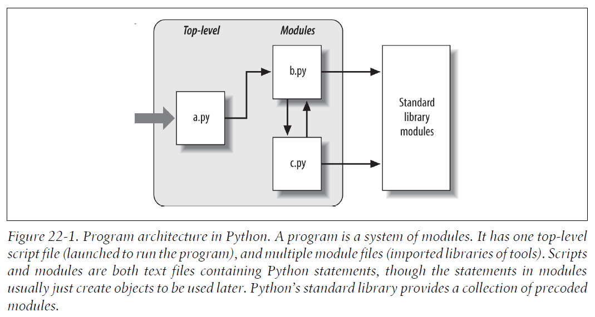

# 第5部分 模块与包

## 第22章 模块

模块是最高级别的程序组织单元，它将程序代码和数据封装起来以便重用。

每个Python源文件都是一个模块。

模块可以由`import`语句和`from`语句，以及内置函数`imp.reload`进行处理：

- `import`：使客户端（导入者）以一个整体获得一个模块。
- `from`：允许客户端从一个模块文件中获取特定的变量名。
- `imp.reload`：在不终止Python程序的情况下，提供了一种重新载入模块文件代码的方法。

### 22.1 为什么使用模块

在一个模块文件顶层定义的所有的变量名都成了被导入的模块对象的属性。也就是说，导入操作给予了对模块的全局作用域中的变量名的读取权。

在模块导入时，模块文件的全局作用域变成了模块对象的命名空间。

从抽象的视角来看，模块至少有3个角色：

- 代码重用

- 系统命名空间的划分

- 实现共享服务和数据

    

### 22.2 Python程序架构

一个程序就是一个模块的系统。它有一个顶层脚本文件（启动后运行程序）以及多个模块文件（用来导入工具库）。

***脚本*** 和 ***模块*** 都是包含了Python语句的文本文件，尽管在模块中的语句通常都是创建之后使用的对象。

Python 标准库提供了一系列的预先编写好的模块。

#### 如何组织一个程序
一般来说，一个Python程序包括了多个含有Python语句的文本文件。程序是作为一个主体的、顶层的文件来构造的。这个顶层的主体文件可能配合有多个模块文件来提供支持。

在Python中，顶层文件包含了程序的主要的控制流程。模块文件就是工具的库。

在Python中，一个文件导入了一个模块来获得这个模块定义的工具的访问权，这些工具被认作是这个模块的属性。

#### 导入和属性

下图是一个包含有三个文件的Python程序的草图。文件a是顶层文件，在运行时将会从上至下执行其中的语句；文件b和文件c是模块，通常模块中的语句并不直接运行。

导入的概念贯穿了Python，任何文件都能从任何其他文件中导入其工具。例如，模块a导入了模块b，模块b导入了模块c，模块c又导入了其他模块。这就形成了 ***导入链*** 。

#### 标准库模块
Python自带了很多实用的莫夸，成为标准链接库。这些模块包含了平台不相关的常见程序设计任务。

### 22.3 import如何工作
在Python中，***导入*** 操作其实是运行时的运算。

程序第一次`import`指定文件时，会执行3个步骤：
1. **搜索模块文件**：找到`import`语句所引用的模块文件。
2. **编译（可选）**：Python会检查文件的时间戳，如果发现字节码文件比源文件旧，会自动重新编译字节码；否则，跳过编译步骤。如果Python在搜索路径上只发现了字节码文件，而没有源文件，就会直接加载字节码文件。
3. **运行**：import操作的最后步骤是执行模块的字节码。文件中所有语句会从头至尾依次执行。

> 注意：以上3个步骤仅会在模块第一次导入时进行；在这之后，重复导入相同模块时，会跳过这3个步骤，而只提取内存中已加载的模块对象。

> 因为导入操作的最后一步（第3步）实际上是执行文件的程序代码，所以如果模块文件中任何顶层代码确实做了什么实际的工作，你就会在导入时看见其结果。

从技术上讲，Python把载入的模块存储到一个名为`sys.modules`的字典中，并在一次导入操作的开始检查该表。如果模块不存在，将会执行这3个步骤。

> 实际上,如果想要看看已经导入了哪些模块,可以导入`sys`模块，并打印`list(sys.modules.keys())`。

### 22.4 字节码文件：`__pycache__` in Python 3.2+

第五版，暂略

### 22.5 模块搜索路径

---

## 第23章 模块编码基础
### 23.1 模块的创建

### 23.2 模块的使用

### 23.3 模块的命名空间

### 23.4 重载模块

---

## 第24章 模块包
### 24.1 包导入基础

### 24.2 包导入实例

### 24.3 为什么使用包导入

### 24.4 包的相对导入

### 24.5 Python 3.3 Namespace Packages

---

## 第25章 高级模块话题
### 25.1 模块设计概念

### 25.2 在模块中隐藏数据

### 25.3 启用未来的语言特性：`__future__`

### 25.4 混合使用方式：`__name__`和`__main__`

### 25.5 实例：Dual Mode Code

### 25.6 修改模块搜索路径

### 25.7 import语句和from语句的as扩展

### 25.8 实例：模块即对象

### 25.9 用名称字符串导入模块

### 25.10 实例：过渡性模块重载

### 25.11 模块陷阱