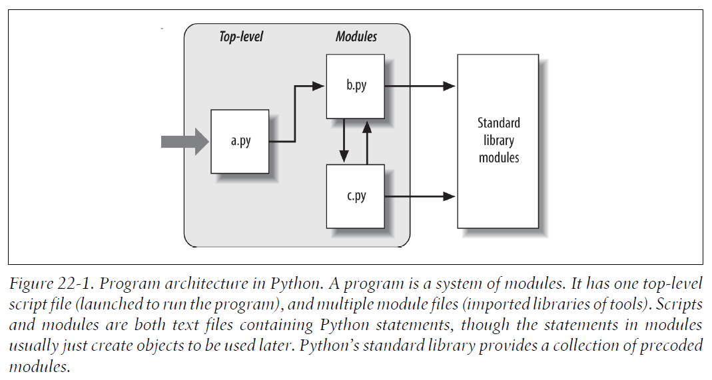

# 第5部分 模块与包

## 第22章 模块

模块是最高级别的程序组织单元，它将程序代码和数据封装起来以便重用。

每个Python源文件都是一个模块。

模块可以由`import`语句和`from`语句，以及内置函数`imp.reload`进行处理：

- `import`：使客户端（导入者）以一个整体获得一个模块。
- `from`：允许客户端从一个模块文件中获取特定的变量名。
- `imp.reload`：在不终止Python程序的情况下，提供了一种重新载入模块文件代码的方法。

### 22.1 为什么使用模块

在一个模块文件顶层定义的所有的变量名都成了被导入的模块对象的属性。也就是说，导入操作给予了对模块的全局作用域中的变量名的读取权。

在模块导入时，模块文件的全局作用域变成了模块对象的命名空间。

从抽象的视角来看，模块至少有3个角色：

- 代码重用

- 系统命名空间的划分

- 实现共享服务和数据

    

### 22.2 Python程序架构

一个程序就是一个模块的系统。它有一个顶层脚本文件（启动后运行程序）以及多个模块文件（用来导入工具库）。

***脚本*** 和 ***模块*** 都是包含了Python语句的文本文件，尽管在模块中的语句通常都是创建之后使用的对象。

Python 标准库提供了一系列的预先编写好的模块。

#### 如何组织一个程序
一般来说，一个Python程序包括了多个含有Python语句的文本文件。程序是作为一个主体的、顶层的文件来构造的。这个顶层的主体文件可能配合有多个模块文件来提供支持。

在Python中，顶层文件包含了程序的主要的控制流程。模块文件就是工具的库。

在Python中，一个文件导入了一个模块来获得这个模块定义的工具的访问权，这些工具被认作是这个模块的属性。

#### 导入和属性

下图是一个包含有三个文件的Python程序的草图。文件a是顶层文件，在运行时将会从上至下执行其中的语句；文件b和文件c是模块，通常模块中的语句并不直接运行。



导入的概念贯穿了Python，任何文件都能从任何其他文件中导入其工具。例如，模块a导入了模块b，模块b导入了模块c，模块c又导入了其他模块。这就形成了 ***导入链*** 。

#### 标准库模块
Python自带了很多实用的莫夸，成为标准链接库。这些模块包含了平台不相关的常见程序设计任务。


### 22.3 import如何工作
在Python中，***导入*** 操作其实是运行时的运算。

程序第一次`import`指定文件时，会执行3个步骤：
1. **搜索模块文件**：找到`import`语句所引用的模块文件。
2. **编译（可选）**：Python会检查文件的时间戳，如果发现字节码文件比源文件旧，会自动重新编译字节码；否则，跳过编译步骤。如果Python在搜索路径上只发现了字节码文件，而没有源文件，就会直接加载字节码文件。
3. **运行**：import操作的最后步骤是执行模块的字节码。文件中所有语句会从头至尾依次执行。

> 注意：以上3个步骤仅会在模块第一次导入时进行；在这之后，重复导入相同模块时，会跳过这3个步骤，而只提取内存中已加载的模块对象。

> 因为导入操作的最后一步（第3步）实际上是执行文件的程序代码，所以如果模块文件中任何顶层代码确实做了什么实际的工作，你就会在导入时看见其结果。

从技术上讲，Python把载入的模块存储到一个名为`sys.modules`的字典中，并在一次导入操作的开始检查该表。如果模块不存在，将会执行这3个步骤。

> 实际上,如果想要看看已经导入了哪些模块,可以导入`sys`模块，并打印`list(sys.modules.keys())`。

### 22.4 字节码文件：`__pycache__` in Python 3.2+

第五版，暂略


### 22.5 模块搜索路径

`sys.path`是Python的模块搜索路径，它由以下4个路径组件构成：
1. 程序的主目录
2. PYTHONPATH目录（如果已经设置）：如果设置了PYTHONPATH，Python会从左至右搜索PYTHONPATH环境变量中所有的目录。
3. 标准链接库目录
4. 任何`.pth`文件的内容（如果存在的话）：Python允许用户把有效的目录在后缀名为`.pth`的文本文件中一行一行地列出目录，然后依次对其中的目录进行搜索。
5. 第三方扩展的`Lib/site-packages`目录：Python会自动添加其标准库的`site-packages`子目录到模块搜索路径。

Python在程序启动时，会自动根据以上4个路径组件对`sys.path`进行配置。同时，也可以手动对`sys.path`进行调整，以修改模块搜索路径。

#### 配置搜索路径


#### 搜索路径的变动


#### `sys.path`列表
可以通过打印`sys.path`列表来查看搜索路径的实际配置。

在导入模块时，Python会由左至右搜索这列表中的每个目录。

#### 模块文件选择
记住，文件名的后缀（例如，`.py`或`.pyc`）是刻意从import语句中省略的。

Python会选择在搜索路径中第一个符合导入文件名的文件。

> 如果在相同目录中找到`b.py`和`b.so`，会发生什么事？
>
> 答：建议在同一目录中保持模块名唯一！

#### 导入钩子（import hook）和ZIP文件
使用导入钩子（import hook）刻意重新定义 Python 中 import 操作所做的事。例如，使用钩子可以在导入时自动解压ZIP文件并归档文件。

更多细节参考Python标准库中关于内置函数`__import__`的说明。

#### 优化字节码文件（Optimized byte code files）
Python 也支持优化字节码文件`.pyo`。这种文件在创建和执行时要加上`-O`命令行标志。这种字节码文件比普通的`.pyc`字节码文件运行速度稍快一点（通常快5%），但不常使用。

> Python的第三方扩展通常使用标准链接库中的`distutils`工具来自动安装，所以不需要路径设置，就能使用它们的代码。


---


## 第23章 模块编码基础
### 23.1 模块的创建

任何保存有Python源代码，且以`.py`为后缀名的文本文件，都被认为是Python模块。所以保存Python源代码到以`.py`为后缀名的文本文件就是在创建模块。

因为模块名在Python程序中会变成变量名，因此，模块的命名应遵循变量名的命名规则。


### 23.2 模块的使用
#### import语句
import语句使用一个变量名引用整个模块对象，所以必须通过模块名称来得到该模块的属性：
```python
>>> import module1               # Get module as a whole (one or more)
>>> module1.printer('Hello world!')      # Qualify to get names
Hello world!
```

#### from语句
from语句会把变量名复制到另一个作用域，所以它就可以让我们直接在脚本中使用复制后的变量名，而不需要通过模块：
```python
>>> from module1 import printer # Copy out a variable (one or more)
>>> printer('Hello world!') # No need to qualify name
Hello world!
```

#### from \* 语句
使用`*`时，会取得模块顶层所有赋了值的变量名的拷贝。
```python
>>> from module1 import * # Copy out _all_ variables
>>> printer('Hello world!')
Hello world!
```

#### import和from是赋值语句
就像`def`一样，`import`和`from`是可执行的语句，而不是编译期间的声明，而且它们可以嵌套在`if`测试中，出现在函数`def`之中等，直到Python程序执行到这些语句时才会进行解析。

和`def`一样，`import`和`from`都是隐性的赋值语句：
- `import`将整个模块对象赋值给一个变量名。
- `from`将一个或多个变量名赋值给另一个模块中同名的对象。

之前讨论过的关于赋值语句方面的内容，也适用于模块的导入。例如，以from复制的变量名会变成对共享对象的引用。思考下面的small.py模块。
```python
x = 1
y = [1, 2]
```

```python
% python
>>> from small import x, y # Copy two names out
>>> x = 42 # Changes local x only
>>> y[0] = 42 # Changes shared mutable in place
```

此处，x并不是一个共享的可变对象，但y是。导入者中的变量名y和被导入者都引用相同的列表对象，所以在其中一个地方的修改，也会影响另一个地方的这个对象。
```python
>>> import small # Get module name (from doesn't)
>>> small.x # Small's x is not my x
1
>>> small.y # But we share a changed mutable
[42, 2]
```

#### 跨文件变量名的改变
```python
% python
>>> from small import x, y # Copy two names out
>>> x = 42 # Changes my x only
```
以from复制而来的变量名和其来源的的文件之间是没有关系的。为了实际修改另一个文件中的全局变量名，必须使用import：
```python
>>> import small # Get module name
>>> small.x = 42 # Changes x in other module
```

> 注意：这与前一小节中对`y[0]`的修改是不同的。这里修改了一个对象`small`，而不是一个变量名。


#### import和from的等价性
from只是把变量名从一个模块复制到另一个模块，并不会对模块名本身进行赋值。所以我们需要在from后执行import语句，来获取模块的变量名。从概念上来讲，一个像这样的from语句：
```python
from module import name1, name2 # Copy these two names out (only)
```
与下面这些语句是等效的：
```python
import module # Fetch the module object
name1 = module.name1 # Copy names out by assignment
name2 = module.name2
del module # Get rid of the module name
```

#### from语句潜在的陷阱
`from module import *`形式会把一个命名空间融入到另一个，所以会使得模块的命名空间的分割特性失效。


### 23.3 模块的命名空间
简而言之，模块就是命名空间，而存在于模块之内的变量名就是模块对象的属性。

#### 文件生成命名空间
那么，文件是如何变为命名空间的呢？简而言之，在模块文件顶层（也就是不在函数或类的主体内）每一个赋值了的变量名都会变成该模块的属性。

- **模块语句会在首次导入时执行**。
- **顶层的赋值语句（例如，`=`和`def`）会变为模块的属性**。
- **模块的命名空间能够通过属性`__dict__`或`dir(Module)`获取**：由导入而建立的模块的命名空间是字典。可通过模块对象相关联的内置属性`__dict__`来读取，也能通过`dir`函数查看。
- **模块是一个独立的作用域（本地变量就是全局变量）**：在模块导入后，模块文件的作用域就变成了模块对象的属性的命名空间。

#### 命名空间字典：`__dict__`

第五版，暂略

#### 属性名的点号运算

在Python中，可以使用点号运算语法`object.attribute`获取任意的object的attribute属性。点号运算是一个表达式，传回和对象相匹配的属性名的值。

以下是点号运算的规则：

- 点号运算：`X.Y`是指在当前范围内搜索X，然后搜索对象X之中的属性Y。
- 多层点号运算：`X.Y.Z`指的是寻找对象`X`之中的变量名`Y`，然后再找对象`X.Y`之中的`Z`。
- 点号运算的通用性：点号运算可用于任何具有属性的对象，如模块、类、C扩展类型等。


#### 导入和作用域

导入操作不会赋予被导入文件中的代码对上层代码（进行导入操作的文件）的可见度，即，被导入文件无法看见进行导入文件内的变量名。更确切的说法：

- 函数绝对无法看见其他函数内的变量名，除非它们从物理上处于这个函数内。
- 模块程序代码绝对无法看见其他模块内的变量名，除非明确地进行导入。

例如，有一个模块`moda.py`：

```python
X = 88
def f():
    global X
    X = 99
```

有另一个模块`modb.py`：

```python
X = 11

import modea
modea.f()
print(X, modea.X)
```

执行`modb.py`时，`moda.f`修改模块`moda`中的`X`，而不是`modb`中的`X`。`moda.f`的全局作用域一定是其所在的文件，无论这个函数是由哪个文件调用的：

```python
% python modeb.py
11 99
```


#### 命名空间的嵌套

利用属性的点号运算路径，有可能深入到任意嵌套的模块中并读取模块属性。

例如，有一个模块`mod3.py`如下：

```python
X = 3
```

另一个模块`mod2.py`如下：

```python
X = 2
import mod3

print(X, end=' ') # My global X
print(mod3.X) # mod3's X
```

还有一个模块`mod1.y`如下：

```python
X = 1
import mod2

print(X, end=' ') # My global X
print(mod2.X, end=' ') # mod2's X
print(mod2.mod3.X) # Nested mod3's X
```

利用`mod2.mod3.X`变量名路径，就可以深入到所导入的`mod2`内嵌套了的`mod3`。结果就是`mod1`可以看见三个文件内的`X`，因此，可以读取这三个全局范围。

### 23.4 重载模块

`imp`模块的`reload`函数会强制已加载的模块的代码重新载入并重新执行。此文件中新的代码的赋值语句会在适当的地方修改现有的模块对象。

**为什么要这么麻烦去重载模块？`imp.reload`函数可以修改程序的一些部分，而无须停止整个程序。因此，利用`imp.reload`函数，可以立即看到对组件的修改的效果。**

#### reload基础

与`import`和`from`不同的是：

- `reload`是Python中的内置函数，而不是语句。
- 传给`reload`的必须是已经成功导入的模块对象，而不是变量名。
- `reload`在Python 3.0中位于`imp`模块之中，并且必须先导入。

当调用`reload`时，Python会重读模块文件的源代码，重新执行其顶层语句。

**`realod`会在适当的地方修改模块对象，而不会删除并重建模块对象。因此，程序中任何引用该模块对象的地方，自动会受到`reload`的影响：**

- `reload`会在模块当前命名空间内执行模块文件的新代码。
- 文件中顶层赋值语句会使得变量名换成新值。
- 重载会影响所有使用`import`读取了模块的客户端。
- 重载只会对以后使用`from`的客户端造成影响。


---


## 第24章 模块包
### 24.1 包导入基础

### 24.2 包导入实例

### 24.3 为什么使用包导入

### 24.4 包的相对导入

### 24.5 Python 3.3 Namespace Packages

---


## 第25章 高级模块话题
### 25.1 模块设计概念


### 25.2 在模块中隐藏数据


### 25.3 启用未来的语言特性：`__future__`


### 25.4 混合使用方式：`__name__`和`__main__`


### 25.5 实例：Dual Mode Code


### 25.6 修改模块搜索路径


### 25.7 import语句和from语句的as扩展


### 25.8 实例：模块即对象


### 25.9 用名称字符串导入模块


### 25.10 实例：过渡性模块重载


### 25.11 模块陷阱