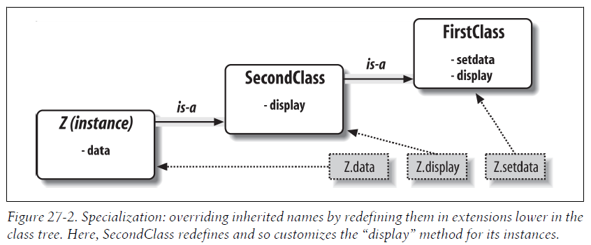

# 第6部分 类和OOP

## 第26章 OOP：The Big Picture

在Python中，使用`class`语句创建类。

在Python中，OOP完全是可选的！

### 26.1 为何使用类

类是Python的程序组成单元，就像函数和模块一样。相比函数和模块，类有三个重要的特点，使其在建立新对象时更为有用：

- **多重实例**：类基本上就是产生对象的工厂。每次调用一个类，就会产生一个有独立命名空间的新对象。每个由类产生的新对象都能读取类的属性，并获得自己的命名空间来存储数据，这些数据对于每个对象来说都不同。
- **通过继承进行定制**：类也支持OOP的继承的概念。我们可以在类的外部重新定义其属性从而扩充这个类。更通用的是，类可以建立命名空间的层次结构，而这种层次结构可以定义该结构中类创建的对象所使用的变量名。
- **运算符重载**：通过提供特定的协议方法，类可以定义对象来响应在内置类型上的几种运算。Python提供了一些可以由类使用的钩子，从而能够中断并实现任何的内置类型运算。

### 26.2 概览OOP

#### 属性继承搜索

作为动态类型脚本语言，Python把其他语言中让OOP隐藏的语法杂质和复杂性都去掉了。实际上，Python中大多数OOP的故事，都可简化成这个表达式：

```
object.attribute
```

当我们对`class`语句产生的对象使用这种方式时，这个表达式会在Python中搜索对象连接的树，来寻找`attribute`首次出现的对象。换句话说，取出属性只是简单地搜索“树”而已。我们称这种搜索程序为 ***继承*** ，因为树中位置较低的对象继承了树中位置较高的对象拥有的属性。

在Python中，我们通过代码建立连接对象树，而每次使用`object.attribute`表达式时，Python确实会在运行期间去“爬树”，来搜索属性。

下图是搜索树的一个例子：


上图中，类树的底端有2个实例`I1`和`I2`，在它们之上有个类`C1`，而顶端有2个超类`C2`和`C3`。所有这些对象都是命名空间（变量的封装），而继承就是由下而上搜索此对象树，来寻找属性名称所出现的最低的地方。

**注意：在Python对象模型中，类和通过类产生的实例是两种不同的对象类型。**

- **类** ：类是实例工厂。类的属性提供了行为（数据和函数），所有从类产生的实例都继承该类的属性。
- **实例** ：代表程序域（program's domain）中具体的项。实例属性记录数据，而每个特定对象的数据都不同。

通常，我们把树中位置较高的类称为 ***超类***  （也叫做 *基类* ） ，位置较低的类称为 ***子类*** （也叫做 *派生类* ） 。

超类提供了所有子类共享的行为。但是因为搜索是由下而上的，子类可能可能会在树中较低位置重新定义超类的变量名，从而覆盖超类定义的行为。

以上图中的类树为例：

1. 当取出`I2.w`时，会触发对类树的搜索，依次搜索连接的对象：`I2`，`C1`，`C2`，`C3`。
2. 找到首个`w`属性就会停止搜索。但如果没有找到，就会发生一个错误。
3. 此例中，搜索到`C3`才会找到`w`。也就是说，`I2.w`会解析为`C3.w`。就OOP术语而言，`I2`继承了`C3`的属性`w`。

#### 类和实例

虽然在Python模型中，类和实例是两种不同的对象类型，但放在这些树中时，不同类型的主要用途都是用来作为另一种类型的命名空间（变量的封装）。

类和实例的主要差异在于，类是一种产生实例的工厂。

从操作的角度来说，类通常都有函数，而实例有其他的基本数据项，类的函数中使用了实例中的这些数据。在OOP中，实例就像是带有“数据”的记录，而类是处理这些记录的“程序”。

#### 类方法调用

再次考虑之前类树的例子。当我们调用方法（也就是附属于类的函数属性）时会发生什么？

- **如果这个`I2.w`引用是一个函数调用，其实际含义是“调用`C3.w`函数以处理`I2`”。也就是说，Python将会自动将`I2.w()`调用映射为`C3.w(I2)`调用，传入该实例作为继承的函数的第一个参数。**
- **也就是说，Python把隐含的实例传进方法的第一个参数，习惯性将其称为`self`。**


#### 编写类树

- 每个`class`语句会生成一个新的类对象。
- 每次类调用时，就会生成一个新的实例对象。
- 实例自动连接至创建了这些实例的类。
- 类连接至其超类的方式是，将超类列在类头部的括号内。其从左至右的顺序会决定树中的次序。

例如，要创建前例中的树，我们可以运行以下代码（这里省略了`class`语句中的内容）：

```python
class C2:                   # Make class objects (ovals)
    pass 
    
class C3: 
    pass
    
class C1(C2, C3):           # Make and link class C1 to superclasses C2, C3 (in this order)
    def setname(self, who): # Assign name: C1.setname
        self.name = who     # Self is either I1 or I2
        
I1 = C1()                   # Make instance objects (rectangles)
I2 = C1()                   # Linked to their classes
I1.setname('bob')           # Sets I1.name to 'bob'
I2.setname('sue')           # Sets I2.name to 'sue'
print(I1.name)              # Prints 'bob'
```

从技术角度来讲，这个例子使用了所谓的 ***多重继承*** 。也就是说，在类树中，类有一个以上的超类。在Python中，如果`class`语句中的小括号内有一个以上的超类（像这里的`C1`）,它们由左至右的次序会决定超类搜索的顺序。

附加在实例上的属性只属于那些实例，但附加在类上的属性则由所有子类及其实例共享。

- Attributes are usually attached to classes by assignments made at the top level in
    class statement blocks, and not nested inside function def statements there.
- Attributes are usually attached to instances by assignments to the special argument
    passed to functions coded inside classes, called self. 通过传参并赋值给类中的函数的特殊参数（也就是`self`），属性通常被附加给实例。

类通过函数（在`class`语句内由`def`语句编写而成）为实例提供行为。当`def`出现在类的内部时，通常称为 ***方法*** 。方法会自动接收第一个特殊参数（通常称为`self`），这个参数提供了被处理的实例的参照值。

> 注：如果你是用过C++或Java，就知道Python的`self`相当于`this`，但是Python中的`self`必须是明确写出的，这样使属性的读取更为明显。

因为类是多个实例的工厂，每当需要取出或设置正有某个方法调用所处理的特定实例的属性时，类的方法通常都会经历这种自动传入的`self`参数。

#### 运算符重载
略


#### OOP是为了代码重用
##### 多态(polymorphism) 和 类

***多态*** 是指运算的意义取决于运算对象。多态可用于隐藏（封装）接口差异性。

##### 自定义编程

一旦习惯了使用OOP方式进行程序设计，你就会发现，当要写新程序时，大部分任务就是把已实现的超类混合起来。


---


## 第27章 类代码编写基础
### 27.1 类产生多个实例对象

***类对象*** 提供默认行为，是 **产生多个实例对象** 的工厂。

***实例对象*** 是程序处理的实际对象：各自有独立的命名空间，但是继承创建该实例的类中的变量名。

*类对象* 来自于语句，而 *实例对象* 来自于类的调用。每次调用一个类，就会得到这个类的新的实例。


#### 类对象提供默认行为
执行`class`语句，就会得到类对象。以下是Python类主要特性的要点：
- **`class`语句创建类对象并将其赋值给变量名。** 就像`def`语句一样，`class`语句是可执行的，一般是在其所在的文件第一次被导入时执行。
- **`class`语句内的赋值语句会创建类的属性。** 就像模块文件一样，`class`语句内顶层的赋值语句（但不在`def`语句中）会产生类对象的属性。`class`语句的作用域会变成类对象的属性的命名空间，就像模块的全局作用域一样。
- **类属性提供对象的状态和行为。** 类对象的属性记录状态信息和行为，可由这个类所创建的所有实例共享。位于类中的函数`def`语句会生成 **方法** ，方法将会处理实例。


#### 实例对象是具体的元素

当调用类对象时，我们得到了实例对象。以下是关于类的实例的关键点：

- **像函数那样调用类对象会创建新的实例对象。**
- **每个实例对象继承类的属性并获得了自己的命名空间。**
- **在方法内`self`属性做赋值运算会产生每个实例自己的属性。** 在类方法内，第一个参数（按惯例称为`self`）会引用正处理的实例对象。对`self`的属性做赋值运算，会创建或修改实例内的数据，而不是类的数据。

#### 第一个例子

首先，定义一个名为`FirstClass`的类：

```python
>>> class FirstClass:              # Define a class object
        def setdata(self, value):  # Define class's methods
            self.data = value      # self is the instance
        def display(self):
            print(self.data)       # self.data: per instance
```

在类的代码块中顶层的任何变量名赋值（包括`def`语句），都会变成类的属性。所以上例中的函数对象`setdata`和`display`都成为了类`FirstClass`的属性。当函数是类的属性时，通常称为 ***方法*** 。

在方法调用时，第一个参数自动接收隐含的实例对象，即调用的主体。

调用类时会创建实例对象，实例对象会连接至创建它们的类，其实质就是实例对象可读取类属性的命名空间。以下代码，建立实例`x`和`y`：

```python
>>> x = FirstClass() # Make two instances
>>> y = FirstClass() # Each is a new namespace
```

如下图所示，建立实例`x`和`y`后，实际有3个对象，即2个实例对象和1个类对象；同时也有了三个连接的命名空间：


类和实例是类树中通过继承搜索的相连的命名空间。这里的`data`属性会在实例内找到，但是`setdata`和`display`则是在它们之上的类中找到的。

**继承** 是在属性点号运算时发生的。对实例对象和类对象内的属性名称进行点号运算，Python会通过继承搜索从类取得变量名（除非该变量名位于实例对象内）。例如，实例对象`x`和`y`本身没有`setdata`属性，为了寻找这个属性，Python会进行继承搜索，取得类对象`FirstClass`的属性`setdata`：

```python
>>> x.setdata("King Arthur")   # Call methods: self is x
>>> y.setdata(3.14159)         # Runs: FirstClass.setdata(y, 3.14159)
```

在`FirstClass`的`setdata`函数中，传入的值会赋值给`self.data`。在方法中的第一个参数（按惯例称`self`）会自动引用正在处理的实例（如`x`和`y`），所以赋值语句会把值存储在实例的命名空间，而不是类的命名空间（这是图27-1中变量名`data`的创建的方式）。

因为类会产生多个实例，方法必须经过`self`参数才能获取正在处理的实例。所以，当调用类的`display`方法来打印`self.data`时，实例`x`和`y`的值都不同：

```python
>>> x.display()      # self.data differs in each instance
King Arthur
>>> y.display()      # Runs: FirstClass.display(y)
3.14159
```

我们可以在类的内部或外部修改实例属性。在类内时，通过方法内对`self`进行赋值运算；而在类外时，则可以通过对实例对象进行赋值运算：

```python
>>> x.data = "New value"   # Can get/set attributes
>>> x.display()            # Outside the class too
New value
```

通过在类方法函数外对变量名进行赋值运算，我们甚至可以在实例命名空间内创建全新的属性：

```python
>>> x.anothername = "spam"      # Can set new attributes here too!
```


### 27.2 类通过继承进行定制

在Python中，实例从类中继承，而类继承与超类。以下是属性继承机制的关键点：

- **超类列在了类开头的括号中。** 要继承另一个类的属性，把该类列在`class`语句开头的括号中就可以了。含有继承的类称为子类，而子类所继承的类就是其超类。
- **类从其超类中继承属性。** 就像实例继承其类中所定义的属性名一样，类也会继承其超类中定义的所有属性名称。当读取的属性不存在子类中时，Python会自动在搜索类树中搜索这个属性。
- **实例会继承所有可读取类的属性。** 每个实例会从创建它的类中获取变量名，此外，还有该类的超类。搜索变量名时，Python会检查实例，然后是它的类，最后是所有超类。
- **每个`object.attribute`都会开启新的独立搜索。** Python会对每个属性读取表达式进行对类树的独立搜索。这包括在`class`语句外对实例和类的引用，以及在类方法函数内对`self`实例参数属性的引用。方法中的每个`self.attr`表达式都会开启对`self`及其上层的类的`attr`属性的搜索。
- **逻辑的修改是通过创建子类，而不是修改超类。** 在树中层次较低的子类中重新定义超类的变量名，子类就可取代并定制所继承的行为。


#### 第二个例子

下例建立在上一个例子的基础之上，定义一个继承类`FirstClass`所有变量名的新类`SecondClass`，并提供一个其自己的变量名`display`，我们把这种在树中较低处发生的重新定义的、取代属性的动作称为 ***重载*** 。

```python
>>> class SecondClass(FirstClass):   # Inherits setdata
...     def display(self):           # Changes display
...         print('Current value = "%s"' % self.data)
...
```

结果就是`SecondClass`改变了方法`display`的行为，但依然会继承`FirstClass`的`setdata`方法：

```python
>>> z = SecondClass()
>>> z.setdata(42)          # Finds setdata in FirstClass
>>> z.display()            # Finds overridden method in SecondClass
Current value = "42"
```

下图描绘了上面操作涉及的命名空间：



#### 类是模块内的属性
当`class`语句执行时，这只是赋值给对象的变量，而对象可以用到任何普通表达式引用。

类是模块内的属性，如果`FirstClass`是写在模块内的，就可以将其导入：
```python
from modulename import FirstClass # Copy name into my scope
class SecondClass(FirstClass): # Use class name directly
    def display(self): ...
```
等价于：
```python
import modulename # Access the whole module
class SecondClass(modulename.FirstClass): # Qualify to reference
    def display(self): ...
```


### 27.3 类可以截获Python运算符
简而言之，运算符重载就是用类编码的对象截获（intercept）和响应对内置类型起作用的运算：加法、分片、打印和点号运算等。

以下是运算符重载的主要概念：
- **以双下划线命名的方法（如`__X__`）是特殊钩子。** Python运算符重载的实现是提供特殊命名的方法来拦截运算。Python语言替每种运算和特殊命名的方法之间，定义了固定不变的映射关系。
- **当实例出现在内置运算时，这类方法会自动调用。** 例如，如果实例对象继承了`__add__`方法，当对象出现在`+`表达式内时，该方法就会调用。该方法的返回值会变成相应表达式的结果。
- **类可覆盖多数内置类型运算。** 有几十种特殊运算符重载的方法名称，几乎可截获并实现内置类型的所有运算。它不仅包含了表达式，而且像打印和对象建立这类基本运算也包括在内。
- **运算符覆盖方法没有默认值，而且也不需要。** 如果类没有定义或继承运算符重载方法，就是说相应的运算在类实例中并不支持。例如，如果没有`__add__`，表达式`+`就会引发异常。
- **New-style classes have some defaults, but not for common operations. 新式类有一些默认值，但不是针对通用运算符。** In Python 3.X, and so-called “new style” classes in 2.X that we’ll define later, a root class named object does provide defaults for some __X__ methods, but not for many, and not for most commonly used operations.在Python 3.X中，以及在Python 2.X中也叫做新式类，一个叫做`object`的根类确实为一些`__X__`方法提供了默认值，但不并不多，尤其是不针对大多数通用的运算。
- **运算符允许类与Python的对象模型相集成。** 重载类型运算时，以类实现的用户定义对象的行为就会像内置对象一样，因此，提供了一致性，以及与预期接口的兼容性。


#### 第三个例子

在这个例子中，我们要定义`SecondClass`的子类，实现三个特殊名称的属性，让Python自动进行调用：

- 当新的实例被创建时，构造函数`__init__`会被调用。其中，`__init__`方法的参数`self`是`ThirdClass`类的新对象。
- 当一个`ThirdClass`的实例出现在表达式`+`中时，`__add__`会被调用。
- 当一个对象被打印（技术上来说，当它被内置函数`str`转换为它的打印字符串或它的Python内部等价），`__str__`会被调用。

```python
class ThirdClass(SecondClass): # Inherit from SecondClass
    def __init__(self, value): # On "ThirdClass(value)"
        self.data = value
    def __add__(self, other): # On "self + other"
        return ThirdClass(self.data + other)
    def __str__(self): # On "print(self)", "str()"
        return '[ThirdClass: %s]' % self.data
    def mul(self, other): # In-place change: named
        self.data *= other
```

```python
>>> a = ThirdClass('abc') # __init__ called
>>> a.display() # Inherited method called
Current value = "abc"
>>> print(a) # __str__: returns display string
[ThirdClass: abc]
>>> b = a + 'xyz' # __add__: makes a new instance
>>> b.display() # b has all ThirdClass methods
Current value = "abcxyz"
>>> print(b) # __str__: returns display string
[ThirdClass: abcxyz]
>>> a.mul(3) # mul: changes instance in place
>>> print(a)
[ThirdClass: abcabcabc]
```

#### 为什么要使用运算符重载

选择使用或不使用运算符重载，取决于你有多想让对象的用法和外观看起来更像内置类型。

几乎每个实际的类都会出现的一个重载方法是：`__init__`构造函数。它让类立即在其新建的实例内添加属性。


### 27.4 世界上最简单的Python类

实际上，我们建立的类中可以完全没有属性，而仅仅是空的命名空间对象：

```python
>>> class rec: pass     # Empty namespace object
```

建立这个类后，可以完全在最初的`class`语句外，通过赋值变量名给这个类增加属性：

```python
>>> rec.name = 'Bob'    # Just objects with attributes
>>> rec.age = 40
```

通过赋值语句创建这些属性后，就可以用一般的语法将它们取出。这样使用类时，类差不多就像是C语言中的`struct`：

```python
>>> print(rec.name)    # Like a C struct
Bob
```

创建`rec`类的实例`x`和`y`：

```python
>>> x = rec()    # Instances inherit class names
>>> y = rec()
```

虽然`x`和`y`本身没有它们自己的属性，是完全空的命名空间对象，但因为继承了`rec`，所以`x`和`y`会获取到`rec`类的属性：
```python
>>> x.name, y.name   # name is stored on the class only
('Bob', 'Bob')
```

如果把一个属性赋值给一个实例，就会在该对象内创建或修改该属性，而不会因属性的引用而启动继承搜索，因为属性赋值运算只会影响属性赋值所在的对象：

```python
>>> x.name = 'Sue'            # But assignment changes x only
>>> rec.name, x.name, y.name  # y依然继承类rec的属性name
('Bob', 'Sue', 'Bob')
```


事实上，命名空间对象的属性通常都是以字典的形式实现的，而类继承树只是连接至其他字典的字典而已。例如，`__dict__`属性是针对大多数基于类的对象的命名空间字典。一些类也可能在`__slots__`中定义了属性。

```python
>>> rec.__dict__
mappingproxy({'__module__': '__main__', '__dict__': <attribute '__dict__' of 'rec' objects>, '__weakref__': <attribute '__weakref__' of 'rec' objects>, '__doc__': None})
>>> rec.__dict__.keys()
dict_keys(['__module__', '__dict__', '__weakref__', '__doc__'])
```
```python
>>> x.__dict__.keys()
dict_keys(['name'])
>>> x.__dict__
{'name': 'Sue'}
```
```python
>>> y.__dict__
{}
>>> y.__dict__.keys()
dict_keys([])
```

每个实例都连接至其类以便于继承，可以通过`__class__`查看：

```python
>>> x.__class__
<class '__main__.rec'>
>>> y.__class__
<class '__main__.rec'>
```

每个类也有一个`__base__`属性，它是其超类的元组：

```python
>>> rec.__base__
<class 'object'>
```


即使是方法（通常在类中通过`def`创建），也可以完全独立地在任意类对象的外部创建，然后赋值给类作为其属性：

```python
>>> def uppername(obj):
...     return obj.name.upper() # Still needs a self argument (obj)
...
>>> rec.method = uppername # Now it's a class's method!
>>> x.method() # Run method to process x
'SUE'
>>> y.method() # Same, but pass y to self
'BOB'
>>> rec.method(x) # Can call through instance or class
'SUE'
```

当然这个函数也可以直接调用，只要我们手动传入一个带有`name`属性的对象：

```python
>>> uppername(x) # Call as a simple function
'SUE'
```


#### 类VS字典

使用元组来记录实体的属性：

```python
>>> rec = ('Bob', 40.5, ['dev', 'mgr']) # Tuple-based record
>>> print(rec[0])
Bob
```

使用字典来记录实体的属性：
```python
>>> rec = {}
>>> rec['name'] = 'Bob' # Dictionary-based record
>>> rec['age'] = 40.5 # Or {...}, dict(n=v), etc.
>>> rec['jobs'] = ['dev', 'mgr']
>>>
>>> print(rec['name'])
Bob
```

使用类来记录实体的属性：
```python
>>> class rec: pass
>>> rec.name = 'Bob' # Class-based record
>>> rec.age = 40.5
>>> rec.jobs = ['dev', 'mgr']
```

使用类的实例对象来记录实体的属性：
```python
>>> class rec: pass
>>> pers1 = rec() # Instance-based records
>>> pers1.name = 'Bob'
>>> pers1.jobs = ['dev', 'mgr']
>>> pers1.age = 40.5
>>>
>>> pers2 = rec()
>>> pers2.name = 'Sue'
>>> pers2.jobs = ['dev', 'cto']
>>>
>>> pers1.name, pers2.name
('Bob', 'Sue')
```

编写一个完整的类，来记录实体的属性，并提供对属性操作的行为：
```python
>>> class Person:
        def __init__(self, name, jobs, age=None): # class = data + logic
            self.name = name
            self.jobs = jobs
            self.age = age
        def info(self):
            return (self.name, self.jobs)

>>> rec1 = Person('Bob', ['dev', 'mgr'], 40.5) # Construction calls
>>> rec2 = Person('Sue', ['dev', 'cto'])
>>>
>>> rec1.jobs, rec2.info() # Attributes + methods
(['dev', 'mgr'], ('Sue', ['dev', 'cto']))
```

尽管像字典这样的类型使用起来十分灵活，但是类允许我们已内置类型和简单函数不能直接支持的方式为对象添加行为。尽管我们也可以把函数存储到字典中，但使用类来处理隐含的实例更加自然。


---


## 第28章 更多实例
在本章中，我们将编写两个类：
- `Person`：创建并处理关于人员的信息的一个类。
- `Manager`：一个定制的`Person`，修改了继承的行为。

在这个过程中，我们将创建2个类的实例，并测试它们的功能。最后，我们将把实例存储到一个`shelve`的面向对象数据库中，使它们持久化。通过这种方式，我们可以把这些代码用作模板，从而发展为完全用Python编写的一个完备的个人数据库。


### 28.1 步骤1：创建实例

在Python中，模块名使用小写字母开头，而类名使用一个大写字母开头，这通常是惯例。

按照惯例，我们将新的模块文件命名为`person.py`，将其中的类命名为`Person`，如下所示：

```python
# File person.py (start)
class Person: # Start a class
```

#### 编写构造函数

通过 ***实例对象属性*** 记录人员的基本信息。

实例对象属性通常通过给类方法函数中的`self`属性赋值来创建。

每次创建一个实例时，Python自动运行构造函数`__init__`。构造函数`__init__`通过其第一个参数`self`给实例对象属性赋第一个值以创建该对象实例属性。

```python
# Add record field initialization
class Person:
    def __init__(self, name, job, pay): # Constructor takes three arguments
        self.name = name # Fill out fields when created
        self.job = job # self is the new instance object
        self.pay = pay
```

虽然构造函数`__init__`的名字很怪异，但它仍然是一个常规的函数，并且支持所有的函数特性。例如，我们可以为它的参数提供默认值：
```python
# Add defaults for constructor arguments
class Person:
    def __init__(self, name, job=None, pay=0): # Normal function args
        self.name = name
        self.job = job
        self.pay = pay
```

#### 在进行中测试

用Python编程其实就是一种 ***增量原型*** ，编写一些代码，测试它，编写更多代码，再次测试，以此类推。

#### 以两种方式使用代码

使用语句块`if __name__ == '__main__':`控制测试代码的运行：

```python
# Allow this file to be imported as well as run/tested
class Person:
    def __init__(self, name, job=None, pay=0):
        self.name = name
        self.job = job
        self.pay = pay
        
if __name__ == '__main__': # When run for testing only
    # self-test code
    bob = Person('Bob Smith')
    sue = Person('Sue Jones', job='dev', pay=100000)
    print(bob.name, bob.pay)
    print(sue.name, sue.pay)
```

因为`__name__`等于`__main__`，所以把文件作为顶层脚本运行时，就能够运行语句块`if __name__ == '__main__':`内的测试代码：
```python
C:\code> person.py
Bob Smith 0
Sue Jones 100000
```

而把它作为类库导入的时候，则不会运行测试代码：

```python
C:\code> python
Python 3.3.0 (v3.3.0:bd8afb90ebf2, Sep 29 2012, 10:57:17) ...
>>> import person
>>>
```


### 28.2 步骤2：添加行为方法

#### 编写方法

把操作实例对象属性的代码移入类方法中，从而实现 ***封装*** 。

```python
# Add methods to encapsulate operations for maintainability
class Person:
    def __init__(self, name, job=None, pay=0):
        self.name = name
        self.job = job
        self.pay = pay
    def lastName(self): # Behavior methods
        return self.name.split()[-1] # self is implied subject
    def giveRaise(self, percent):
        self.pay = int(self.pay * (1 + percent)) # Must change here only

if __name__ == '__main__':
    bob = Person('Bob Smith')
    sue = Person('Sue Jones', job='dev', pay=100000)
    print(bob.name, bob.pay)
    print(sue.name, sue.pay)
    print(bob.lastName(), sue.lastName()) # Use the new methods
    sue.giveRaise(.10) # instead of hardcoding
    print(sue.pay)
```

***方法*** 只是附加给类并旨在处理那些类的实例的常规函数。实例是方法调用的主体，并且会自动传递给方法的`self`参数。

### 28.3 步骤3：运算符重载

如果类中定义了`__str__`和`__repr__`，或者从一个超类继承了这两个方法，则每次一个实例转换为其打印字符串的时候，`__str__`和`__repr__`就会自动运行，其直接的效果就是，打印一个对象会显示对象的`__str__`和`__repr__`方法所返回的内容。

这里我们重载运算符`__repr__`，以使打印类的实例时，会列出属性：

```python
# Add __repr__ overload method for printing objects
class Person:
    def __init__(self, name, job=None, pay=0):
        self.name = name
        self.job = job
        self.pay = pay
    def lastName(self):
        return self.name.split()[-1]
    def giveRaise(self, percent):
        self.pay = int(self.pay * (1 + percent))
    def __repr__(self): # Added method
        return '[Person: %s, %s]' % (self.name, self.pay) # String to print

if __name__ == '__main__':
    bob = Person('Bob Smith')
    sue = Person('Sue Jones', job='dev', pay=100000)
    print(bob)
    print(sue)
    print(bob.lastName(), sue.lastName())
    sue.giveRaise(.10)
    print(sue)
```


### 28.4 步骤4：通过子类定制行为

#### 编写子类

定义一个`Person`的子类`Manager`，并重写超类中的`giveRaise`方法。

#### 扩展方法：不好的方式

以复制粘贴超类`Person`中的代码的方式扩展子类的方法是非常不好的。因为如果一旦改变了涨工资的方式，将必须修改超类和子类两处代码。

```python
class Manager(Person):
    def giveRaise(self, percent, bonus=.10):
        self.pay = int(self.pay * (1 + percent + bonus)) # Bad: cut and paste
```

#### 扩展方法：好的方式

使用扩展参数来直接调用其超类中最初的版本是扩展方法的好方式：

```python
class Manager(Person):
    def giveRaise(self, percent, bonus=.10):
        Person.giveRaise(self, percent + bonus) # Good: augment original
```

这段代码利用了这样一个事实： **类方法总是可以在一个实例中调用（Python自动地把实例发送给方法的`self`参数），或者通过类来调用（必须手动地传递实例给类方法）。** 也就是说：

```python
instance.method(args...)
```

等价于：

```python
class.method(instance, args...)
```

通过类直接调用，有效地扰乱了继承，并且把调用沿着类树向上传递以运行一个特定的版本。

以下是实现本步骤的整个模块文件：

```python
# Add customization of one behavior in a subclass
class Person:
    def __init__(self, name, job=None, pay=0):
        self.name = name
        self.job = job
        self.pay = pay
    def lastName(self):
        return self.name.split()[-1]
    def giveRaise(self, percent):
        self.pay = int(self.pay * (1 + percent))
    def __repr__(self):
        return '[Person: %s, %s]' % (self.name, self.pay)

class Manager(Person):
    def giveRaise(self, percent, bonus=.10): # Redefine at this level
        Person.giveRaise(self, percent + bonus) # Call Person's version

if __name__ == '__main__':
    bob = Person('Bob Smith')
    sue = Person('Sue Jones', job='dev', pay=100000)
    print(bob)
    print(sue)
    print(bob.lastName(), sue.lastName())
    sue.giveRaise(.10)
    print(sue)
    tom = Manager('Tom Jones', 'mgr', 50000) # Make a Manager: __init__
    tom.giveRaise(.10) # Runs custom version
    print(tom.lastName()) # Runs inherited method
    print(tom) # Runs inherited __repr__
```

> **关于`super`**
>
> To extend inherited methods, the examples in this chapter simply call the original through the superclass name: Person.giveRaise(...). This is the traditional and simplest scheme in Python, and the one used in most of this book.
>
> Java programmers may especially be interested to know that Python also has a super built-in function that allows calling back to a superclass’s methods more generically— but it’s cumbersome to use in 2.X; differs in form between 2.X and 3.X; relies on unusual semantics in 3.X; works unevenly with Python’s operator overloading; and does not always mesh well with traditionally coded multiple inheritance, where a single superclass call won’t suffice.
>
> In its defense, the super call has a valid use case too—cooperative same-named method dispatch in multiple inheritance trees—but it relies on the “MRO” ordering of classes, which many find esoteric and artificial; unrealistically assumes universal deployment to be used reliably; does not fully support method replacement and varying argument lists; and to many observers seems an obscure solution to a use case that is rare in real Python code.
>
> Because of these downsides, this book prefers to call superclasses by explicit name instead of super, recommends the same policy for newcomers, and defers presenting super until Chapter 32. It’s usually best judged after you learn the simpler, and generally more traditional and “Pythonic” ways of achieving the same goals, especially if you’re new to OOP. Topics like MROs and cooperative multiple inheritance dispatch seem a lot to ask of beginners—and others.
>
> And to any Java programmers in the audience: I suggest resisting the temptation to use Python’s super until you’ve had a chance to study its subtle implications. Once you step up to multiple inheritance, it’s not what you think it is, and more than you probably expect. The class it invokes may not be the superclass at all, and can even vary per context. Or to paraphrase a movie line: Python’s super is like a box of chocolates—you never know what you’re going to get!

#### 多态实战

为了使得这个从继承获取的行为更为惊人，我们在文件的末尾添加了如下代码：

```python
if __name__ == '__main__':
    ...
    print('--All three--')
    for obj in (bob, sue, tom): # Process objects generically
        obj.giveRaise(.10) # Run this object's giveRaise
        print(obj) # Run the common __repr__
```

这里利用了Python中的 ***多态*** 。

#### 继承、定制和扩展

实际上，类比我们的例子所展示的更加灵活。通常，类可以 **继承** 、**定制** 或 **扩展** 超类中已有的代码。

例如，我们可以为`Manager`添加`Person`中所没有的方法`someThingElse`：

```python
class Person:
    def lastName(self): ...
    def giveRaise(self): ...
    def __repr__(self): ...
        
class Manager(Person): # Inherit
    def giveRaise(self, ...): ... # Customize
    def someThingElse(self, ...): ... # Extend
        
tom = Manager()
tom.lastName() # Inherited verbatim
tom.giveRaise() # Customized version
tom.someThingElse() # Extension here
print(tom) # Inherited overload method
```


#### OOP：大思路

在OOP中，我们通过 **定制** 来编程，而不是复制和修改已有的代码。

我们可以通过编写新的子类来裁剪或扩展之前已经做过的工作，而不是每次从头开始。

### 28.5 步骤5：自定义构造函数

在上一个例子中，我们必须为`Manager`对象提供一个`job`参数`mgr`，这有点多余。我们重新编写新的`Manager`构造函数，并把创建对象的调用修改为自动传入`mgr`作为超类构造函数的`job`参数。

```python
# File person.py
# Add customization of constructor in a subclass
class Person:
    def __init__(self, name, job=None, pay=0):
        self.name = name
        self.job = job
        self.pay = pay
    def lastName(self):
        return self.name.split()[-1]
    def giveRaise(self, percent):
        self.pay = int(self.pay * (1 + percent))
    def __repr__(self):
        return '[Person: %s, %s]' % (self.name, self.pay)
    
class Manager(Person):
    def __init__(self, name, pay): # Redefine constructor
        Person.__init__(self, name, 'mgr', pay) # Run original with 'mgr'
    def giveRaise(self, percent, bonus=.10):
        Person.giveRaise(self, percent + bonus)

if __name__ == '__main__':
    bob = Person('Bob Smith')
    sue = Person('Sue Jones', job='dev', pay=100000)
    print(bob)
    print(sue)
    print(bob.lastName(), sue.lastName())
    sue.giveRaise(.10)
    print(sue)
    tom = Manager('Tom Jones', 50000) # Job name not needed:
    tom.giveRaise(.10) # Implied/set by class
    print(tom.lastName())
    print(tom)
```


#### OOP比我们认为的要简单

Python中OOP的机制：

- 实例创建：填充实例属性。
- 行为方法：在类方法中封装逻辑。
- 运算符重载：为打印这样的内置操作提供行为。
- 定制行为：重新定义子类中的方法以使其特殊化。
- 定制构造函数：为超类步骤添加初始化逻辑。

#### 组合类的其他方式

一种常见的编码模式是把对象彼此嵌套以组成 ***复合对象*** 。

下面使用这种组合的思想来编写`Manager`扩展代码，将它嵌入一个`Person`中，而不是继承`Person`。这里使用重载`__getattr__`运算符的方法来做到这点：

```python
# File person-composite.py
# Embedding-based Manager alternative
class Person:
    ...same...
class Manager:
    def __init__(self, name, pay):
        self.person = Person(name, 'mgr', pay) # Embed a Person object
    def giveRaise(self, percent, bonus=.10):
        self.person.giveRaise(percent + bonus) # Intercept and delegate
    def __getattr__(self, attr):
        return getattr(self.person, attr) # Delegate all other attrs
    def __repr__(self):
        return str(self.person) # Must overload again (in 3.X)

if __name__ == '__main__':
    ...same...
```

此外，像下面这样的一个假设的`Department`可能聚合其他的对象，以便将它们当作一个集合对待。将这段代码添加到`person.py`文件的底部：

```python
# File person-department.py
# Aggregate embedded objects into a composite
class Person:
    ...same...
    
class Manager(Person):
    ...same...
    
class Department:
    def __init__(self, *args):
        self.members = list(args)
    def addMember(self, person):
        self.members.append(person)
    def giveRaises(self, percent):
        for person in self.members:
            person.giveRaise(percent)
    def showAll(self):
        for person in self.members:
            print(person)
            
if __name__ == '__main__':
    bob = Person('Bob Smith')
    sue = Person('Sue Jones', job='dev', pay=100000)
    tom = Manager('Tom Jones', 50000)
    development = Department(bob, sue) # Embed objects in a composite
    development.addMember(tom)
    development.giveRaises(.10) # Runs embedded objects' giveRaise
    development.showAll() # Runs embedded objects' __repr__
```


> **在Python 3.X中捕获内置属性**
>
> 高级特性，暂略

### 28.6 步骤6：使用内省工具

我们的代码仍然存在两个问题：

- 当打印`tom`时，`Manager`会把它标记为`Person`。
- 我们还无法通过`Manager`的构造函数验证`tom`工作名已经正确地设置为`mgr`，因为我们为`Person`编写的`__str__`没有打印出这个字段。

#### 特殊类属性

***内省工具*** 是特殊的属性和函数，允许我们访问对象实现的一些内部机制，并允许我们编写以通用方式处理类的代码。通常只有为程序员开发工具的人才会用到这些高级工具。

有两个钩子可以解决我们的问题：

- 内置的`instance.__class__`属性提供了一个从实例到创建它的类的链接。类则有`__name__`和`__bases__`序列，提供了超类的访问。我们使用这些来打印创建一个实例的类的名字，而不是通过硬编码来做到。
- 内置的`object.__dict__`属性提供了一个字典，带有一个“键/值”对，以便每个属性都附加到一个命名控件对象（包括模块、类和实例）。由于它是字典，因此我们可以获取键的列表、按键来索引、迭代键，等等，从而更广泛地处理所有的属性。

下面是这些工具在Python交互模式中实际使用的情形：

```python
>>> from person import Person
>>> bob = Person('Bob Smith')
>>> bob # Show bob's __repr__ (not __str__)
[Person: Bob Smith, 0]
>>> print(bob) # Ditto: print => __str__ or __repr__
[Person: Bob Smith, 0]
>>>
>>> bob.__class__ # Show bob's class and its name
<class 'person.Person'>
>>> bob.__class__.__name__
'Person'
>>>
>>> list(bob.__dict__.keys()) # Attributes are really dict keys
['pay', 'job', 'name'] # Use list to force list in 3.X
>>>
>>> for key in bob.__dict__:
        print(key, '=>', bob.__dict__[key]) # Index manually
pay => 0
job => None
name => Bob Smith
>>> for key in bob.__dict__:
        print(key, '=>', getattr(bob, key)) # obj.attr, but attr is a var
pay => 0
job => None
name => Bob Smith
```

> 如果一个实例的类定义了`__slots__`，而实例可能没有存储在`__dict__`字典中，但实例的一些属性也是可以访问的。这是新式类（以及Python 3.X中所有类）的一项可选的和相对不太明确的功能，即，把属性存储在数组中。

#### 一种通用显示工具

在下面的模块`classtools.py`中，类`AttrDisplay`将对任何实例有效，不管实例的属性集合是什么。这使得类`AttrDisplay`变成了一个公用的工具。通过继承，它可以混合到想到使用它显示格式的任何类中。

```python
# File classtools.py (new)
"Assorted class utilities and tools"
class AttrDisplay:
    """
    Provides an inheritable display overload method that shows
    instances with their class names and a name=value pair for
    each attribute stored on the instance itself (but not attrs
    inherited from its classes). Can be mixed into any class,
    and will work on any instance.
    """
    def gatherAttrs(self):
        attrs = []
        for key in sorted(self.__dict__):
        attrs.append('%s=%s' % (key, getattr(self, key)))
        return ', '.join(attrs)
    def __repr__(self):
        return '[%s: %s]' % (self.__class__.__name__, self.gatherAttrs())

if __name__ == '__main__':
    class TopTest(AttrDisplay):
        count = 0
        def __init__(self):
            self.attr1 = TopTest.count
            self.attr2 = TopTest.count+1
            TopTest.count += 2

    class SubTest(TopTest):
        pass

X, Y = TopTest(), SubTest() # Make two instances
print(X) # Show all instance attrs
print(Y) # Show lowest class name
```

直接运行模块`classtools.py`，这个模块的自测试代码会创建2个实例并打印它们。这里定义的`__str__`显示了实例的类，及其所有的属性名和值，并按照属性名排序：

```python
C:\code> classtools.py
[TopTest: attr1=0, attr2=1]
[SubTest: attr1=2, attr2=3]
```

#### 实例VS类属性

可以用`__class__`连接爬升到实例的类，然后使用`__dict__`去获取类属性，然后迭代类的`__bases__`属性爬升到更高的超类。有必要的话还可以重复此过程。

```python
>>> list(bob.__dict__.keys()) # 3.X keys is a view, not a list
['name', 'job', 'pay']
>>> dir(bob) # 3.X includes class type methods
['__class__', '__delattr__', '__dict__', '__dir__', '__doc__', '__eq__',
'__format__', '__ge__', '__getattribute__', '__gt__', '__hash__', '__init__',
...more omitted: 31 attrs...
'__setattr__', '__sizeof__', '__str__', '__subclasshook__', '__weakref__',
'giveRaise', 'job', 'lastName', 'name', 'pay']
```

#### 工具类的命名考虑

为了减少名称冲突的机会，Python程序员常常对于不想做其他用途的方法添加一个 **单下划线** 的前缀，在这个例子中就是`_gatherAttrs`。

另一种更好的，但不太常用的方法是，在方法名前面使用 **两个下划线** 的前缀，在这个例子中就是`__gatherAttrs`。Python自动扩展这样的名称，以包含类的名称，从而使它们变得真正唯一。这一功能叫做 **伪私有类属性** 。

#### 类的最终形式

新的打印重载方法将会由`Person`的实例继承，`Manager`的实例也会继承`Person`的`__str__`。

```python
# File classtools.py (new)
...as listed earlier...
# File person.py (final)
"""
Record and process information about people.
Run this file directly to test its classes.
"""
from classtools import AttrDisplay # Use generic display tool

class Person(AttrDisplay): # Mix in a repr at this level
    """
    Create and process person records
    """
    def __init__(self, name, job=None, pay=0):
        self.name = name
        self.job = job
        self.pay = pay

    def lastName(self): # Assumes last is last
        return self.name.split()[-1]
    
    def giveRaise(self, percent): # Percent must be 0..1
        self.pay = int(self.pay * (1 + percent))
        
class Manager(Person):
    """
    A customized Person with special requirements
    """
    def __init__(self, name, pay):
        Person.__init__(self, name, 'mgr', pay) # Job name is implied
    def giveRaise(self, percent, bonus=.10):
        Person.giveRaise(self, percent + bonus)
        
if __name__ == '__main__':
    bob = Person('Bob Smith')
    sue = Person('Sue Jones', job='dev', pay=100000)
    print(bob)
    print(sue)
    print(bob.lastName(), sue.lastName())
    sue.giveRaise(.10)
    print(sue)
    tom = Manager('Tom Jones', 50000)
    tom.giveRaise(.10)
    print(tom.lastName())
    print(tom)
```

由于`AttrDisplay`直接从`self`实例中提取了类名，所以每个对象都显示其最近的（最低的）类的名称：`tom`现在显示为`Manager`，而不是`Person`。并且我们最终验证了其`job`也已经由`Manager`的构造函数正确地填充为`mgr`：

```python
C:\code> person.py
[Person: job=None, name=Bob Smith, pay=0]
[Person: job=dev, name=Sue Jones, pay=100000]
Smith Jones
[Person: job=dev, name=Sue Jones, pay=110000]
Jones
[Manager: job=mgr, name=Tom Jones, pay=60000]
```


### 28.7 步骤7（最后一步）：把对象存储到数据库中

在最后一步，让我们把对象持久化。

#### Pickle和Shelve

对象持久化通过3个标准的库模块来实现，这3个模块在Python中都可用：

- `pickle`：任意Python对象的字节串之间的序列化。
- `dbm`（在Python 2.X中叫做`anydbm`）：实现一个可通过键访问的文件系统，以存储字符串。
- `shelve`：使用另两个模块按照键把Python对象存储到一个文件中。

##### `pickle`模块

`pickle`模块是一种非常通用的对象序列化和反序列化工具：能够将内存中几乎任何的Python对象转换为字节串。这个自己串可以在随后用来在内存中重新构建最初的对象。

##### `shelve`模块

`shelve`使用`pickle`把一个对象转换为`pickle`化的字符串，并将其存储在一个`dbm`文件中的键之下；之后载入的时候，`shelve`通过键获取`pickle`化的字符串，并用`pickle`在内存中重新创建最初的对象。

对于脚本来说，一个`shelve`的`pickle`化的对象看上去就像是字典，它们之间唯一的区别就是：必须先 **打开** `shelve`并且在修改之后，必须 **关闭** 它。`shelve`自动吧字典操作映射到存储在文件中的对象。

最终的效果就是，一个`shelve`提供了一个简单的数据库来按照键存储和获取本地的Python对象，并由此使它们跨程序运行而保持持久化。

#### 在shelve数据库中存储对象

```python
# File makedb.py: store Person objects on a shelve database
from person import Person, Manager # Load our classes
bob = Person('Bob Smith') # Re-create objects to be stored
sue = Person('Sue Jones', job='dev', pay=100000)
tom = Manager('Tom Jones', 50000)

import shelve
db = shelve.open('persondb') # Filename where objects are stored
for obj in (bob, sue, tom): # Use object's name attr as key
    db[obj.name] = obj # Store object on shelve by key
db.close() # Close after making changes
```

#### 交互地探索`shelve`

此时，当前的目录下会有一个或多个文件名以`persondb`开头的文件。我们的数据库存储在3个文件中：

```python
>>> import glob
>>> glob.glob('persondb*')
['persondb.bak', 'persondb.dat', 'persondb.dir']
```

如果愿意，可以查看`shelve`的文件，但是它们是二进制文件，并且大多数内容对于`shelve`模块以外的环境没有太多意义。
```python
>>> print(open('persondb.dir').read())
'Sue Jones', (512, 92)
'Tom Jones', (1024, 91)
'Bob Smith', (0, 80)
>>> print(open('persondb.dat','rb').read())
b'\x80\x03cperson\nPerson\nq\x00)\x81q\x01}q\x02(X\x03\x00\x00\x00jobq\x03NX\x03\x00
...more omitted...
```

由于`shelve`是包含了对象的对象，所以我们可以用常规的Python语法和开发模式来处理它：
```python
>>> import shelve
>>> db = shelve.open('persondb')        # Reopen the shelve
>>> len(db)                             # Three 'records' stored
3
>>> list(db.keys())                     # keys is the index
['Sue Jones', 'Tom Jones', 'Bob Smith'] # list() to make a list in 3.X
>>> bob = db['Bob Smith']               # Fetch bob by key
>>> bob                                 # Runs __repr__ from AttrDisplay
[Person: job=None, name=Bob Smith, pay=0]
>>> bob.lastName()                      # Runs lastName from Person
'Smith'
>>> for key in db:                      # Iterate, fetch, print
print(key, '=>', db[key])
Sue Jones => [Person: job=dev, name=Sue Jones, pay=100000]
Tom Jones => [Manager: job=mgr, name=Tom Jones, pay=50000]
Bob Smith => [Person: job=None, name=Bob Smith, pay=0]
>>> for key in sorted(db):
print(key, '=>', db[key])               # Iterate by sorted keys
Bob Smith => [Person: job=None, name=Bob Smith, pay=0]
Sue Jones => [Person: job=dev, name=Sue Jones, pay=100000]
Tom Jones => [Manager: job=mgr, name=Tom Jones, pay=50000]
```

注意，为了载入和使用存储的对象，我们不必先导入`Person`或`Manager`类。因为Python对一个类实例进行`pickle`操作会记录其`self`实例属性，以及创建实例的类的名字和位置。当随后从`shelve`中获取`bob`并对其`unpickle`的时候，Python将自动地重新导入该类并且将`bob`连接到它。

**只有在创建新势力的时候，才必须提前导入类。在处理已有实例的时候，则不必提前导入类。**

#### 更新`shelve`中的对象

如下的文件`updatedb.py`打印出数据库，并且每次把我们所存储的对象之一增加一次。

```python
# File updatedb.py: update Person object on database
import shelve
db = shelve.open('persondb')      # Reopen shelve with same filename

for key in sorted(db):            # Iterate to display database objects
    print(key, '\t=>', db[key])       # Prints with custom format

sue = db['Sue Jones']             # Index by key to fetch
sue.giveRaise(.10)                # Update in memory using class's method
db['Sue Jones'] = sue             # Assign to key to update in shelve
db.close()                        # Close after making changes
```

运行这段脚本几次以看到对象的变化：
```python
C:\code> updatedb.py
Bob Smith => [Person: job=None, name=Bob Smith, pay=0]
Sue Jones => [Person: job=dev, name=Sue Jones, pay=100000]
Tom Jones => [Manager: job=mgr, name=Tom Jones, pay=50000]
C:\code> updatedb.py
Bob Smith => [Person: job=None, name=Bob Smith, pay=0]
Sue Jones => [Person: job=dev, name=Sue Jones, pay=110000]
Tom Jones => [Manager: job=mgr, name=Tom Jones, pay=50000]
C:\code> updatedb.py
Bob Smith => [Person: job=None, name=Bob Smith, pay=0]
Sue Jones => [Person: job=dev, name=Sue Jones, pay=121000]
Tom Jones => [Manager: job=mgr, name=Tom Jones, pay=50000]
C:\code> updatedb.py
Bob Smith => [Person: job=None, name=Bob Smith, pay=0]
Sue Jones => [Person: job=dev, name=Sue Jones, pay=133100]
Tom Jones => [Manager: job=mgr, name=Tom Jones, pay=50000]
```

再一次，我们可以在交互模式中验证脚本的作用：
```python
C:\code> python
>>> import shelve
>>> db = shelve.open('persondb') # Reopen database
>>> rec = db['Sue Jones'] # Fetch object by key
>>> rec
[Person: job=dev, name=Sue Jones, pay=146410]
>>> rec.lastName()
'Jones'
>>> rec.pay
146410
```


### 28.8 未来的方向
略


---


## 第29章 类编码细节
### 29.1 `class`语句

和C++或Java不同，Python的`class`语句并不是声明。

就像`def`一样，`class`语句是对象的创建者并且是一个隐含的赋值运算：执行时，它会创建类对象，然后把其引用值存储在前面所使用的变量名。

就像`def`一样，`class`语句也是真正的可执行代码。直到Python抵达并运行定义的`class`语句前，你的类都不存在。

#### 一般形式

`class`是复合语句，其主体一般出现在缩进的语句块中。以下是`class`语句的一般形式：

```python
class name(superclass,...):  # Assign to name
    attr = value             # Shared class data
    def method(self,...):    # Methods
        self.attr = value    # Per-instance data
```

在`class`语句内，任何赋值语句都会产生类属性和特殊命名的方法重载运算符。例如，名为`__init__`的函数会在实例对象构造时调用（如果定义过的话）。

#### 例子

类几乎就是命名空间，因此，类就像模块和函数：

- 就像函数一样，`class`语句是本地作用域，由内嵌的赋值语句建立的变量名，就存在于这个本地作用域内。
- 就像模块内的变量名，在`class`语句内赋值的变量名就变成类对象的属性；而内嵌的`def`则会创建类对象的方法。

类和它们的不同之处在于，类的命名空间是Python继承的基础。在类或实例对象中找不到的所引用的属性，就会从继承树中的其他类获取。

例如，把简单的非函数的对象赋值给类属性，就会产生 ***数据属性*** ，由所有实例共享：

```python
>>> class SharedData:
        spam = 42         # Generates a class data attribute
>>> x = SharedData()      # Make two instances
>>> y = SharedData()
>>> x.spam, y.spam        # They inherit and share 'spam' (a.k.a. SharedData.spam)
(42, 42)
```

我们可以通过类名称修改类属性，或者通过实例或类引用类属性：

```python
>>> SharedData.spam = 99
>>> x.spam, y.spam, SharedData.spam
(99, 99, 99)
```

> 这与C++的静态数据成员的概念有些类似：也就是存储在类中的成员，与实例不相关。

通过实例而不是类来给变量名`spam`赋值，就会在该实例内创建或修改变量名，而不是在共享的类中：

```python
>>> x.spam = 88
>>> x.spam, y.spam, SharedData.spam
(88, 99, 99)
```

下面的例子，我们把相同的变量名存储在类对象（由类中的`data`赋值运算所创建）和实例对象中（由`__init__`中的`self.data`赋值运算所创建）：

```python
class MixedNames:                           # Define class
    data = 'spam'                           # Assign class attr
    def __init__(self, value):              # Assign method name
        self.data = value                   # Assign instance attr
    def display(self):
        print(self.data, MixedNames.data)   # Instance attr, class attr
```

结果就是`data`存在于2个地方：在实例对象内，以及在实例继承变量名的类中。
```python
>>> x = MixedNames(1)         # Make two instance objects
>>> y = MixedNames(2)         # Each has its own data
>>> x.display(); y.display()  # self.data differs, MixedNames.data is the same
1 spam
2 spam
```

利用这些技术把属性存储在不同对象内，我们可以决定属性的可见范围。附加在类上时，变量名是共享的；附加在实例上时，变量名是属于每个实例的数据，而不是共享的行为或数据。

### 29.2 方法

方法位于`class`语句的主体内，是由`def`语句建立的函数对象。从抽象的视角来看，方法替实例对象提供了要继承的行为。

方法和函数的唯一区别就是：方法的第一个参数（按惯例被称为`self`）总是接收调用方法的实例对象。如下所示：

```python
instance.method(args...)
```

Python会自动将以上形式的 *实例方法调用* 翻译成以下形式的 *类方法函数调用* ：

```python
class.method(instance, args...)
```

事实上，这两种调用形式在Python中都有效。

#### 例子

```python
class NextClass:                # Define class
    def printer(self, text):    # Define method
        self.message = text     # Change instance
        print(self.message)     # Access instance
```

```python
>>> x = NextClass()             # Make instance
>>> x.printer('instance call')  # Call its method
instance call
>>> x.message                   # Instance changed
'instance call'
```

方法能通过实例或类本身两种方法其中的任意一种进行调用。例如，可以通过类的名称调用`printer`，只要明确地传递了一个实例给`self`参数：

```python
>>> NextClass.printer(x, 'class call')   # Direct class call
class call
>>> x.message                            # Instance changed again
'class call'
```

实际上，在默认情况下，如果尝试不带任何实例调用方法时，就会引发错误：

```python
>>> NextClass.printer('bad call')
TypeError: unbound method printer() must be called with NextClass instance...
```

#### 调用超类构造函数

在构造时，Python会找出并且只调用一个`__init__`方法，所以，如果要保证子类的构造函数也会执行超类构造时的逻辑，一般都必须通过类明确地调用超类的`__init__`方法。

```python
class Super:
    def __init__(self, x):
    ...default code...

class Sub(Super):
    def __init__(self, x, y):
    Super.__init__(self, x)     # Run superclass __init__
    ...custom code...           # Do my init actions

I = Sub(1, 2)
```

#### 其他方法调用的可能性

***静态方法*** 可让你编写不预期第一参数为实例对象的方法。

***类方法*** 当调用的时候接受一个类而不是一个实例，并且它可以用来管理基于每个类的数据。

> Python 也有一个内置函数 `super` ，该函数允许更通用地回调一个超类的方法。

### 29.3 继承

`class`语句作为命名空间工具是Python变量名继承的基础。

在Python中，每当使用`object.attr`形式的表达式对对象进行点号运算时，就会发生继承，而且涉及了搜索属性定义树（一或多个命名空间）。

#### 属性树的构造

下图总结了命名空间树构造以及填入变量名的方式。通常来说：

- 实例属性是由对方法内`self`属性进行赋值运算而生成的。
- 类属性是通过`class`语句内的语句（赋值语句）而生成的。
- 超类的连接是通过`class`语句首行的括号内列出类而生成的。


#### 继承方法的专有化
重新定义继承变量名的概念引出了各种专有化技术。例如，子类可以完全取代继承的属性，提供超类可以找到的属性，并且通过已覆盖的方法回调超类来扩展超类的方法。下面是如何进行扩展的例子：
```python
>>> class Super:
        def method(self):
            print('in Super.method')
>>> class Sub(Super):
        def method(self):                   # Override method
            print('starting Sub.method')    # Add actions here
            Super.method(self)              # Run default action
            print('ending Sub.method')
```

`Sub`在重新`Super`的方法时，又回调了`Super`中的方法，换句话说，`Sub.method`只是扩展了`Super.method`的行为，而不要完全取代了它：
```python
>>> x = Super()        # Make a Super instance
>>> x.method()         # Runs Super.method
in Super.method
>>> x = Sub()          # Make a Sub instance
>>> x.method()         # Runs Sub.method, calls Super.method
starting Sub.method
in Super.method
ending Sub.method
```

#### 类接口技术
扩展只是一种与超类接口的方式。下面所展示的`specialize.py`文件定义了多个类，示范了一些常用技巧：
- `Super`：定义一个`method`函数以及在子类中期待一个动作的`delegate`。
- `Inheritor`：没有提供任何新的变量名，因此会获得`Super`中定义的一切内容。
- `Replacer`：用自己的版本覆盖`Super`的`method`。
- `Extender`：覆盖并回调默认`method`，从而定制`Super`的`method`。
- `Provider`：实现`Super`的`delegate`方法预期的`action`方法。

```python
class Super:
    def method(self):
        print('in Super.method')                 # Default behavior
    def delegate(self):
        self.action()                            # Expected to be defined

class Inheritor(Super):                          # Inherit method verbatim
    pass

class Replacer(Super):                           # Replace method completely
    def method(self):
        print('in Replacer.method')

class Extender(Super):                           # Extend method behavior
    def method(self):
        print('starting Extender.method')
        Super.method(self)
        print('ending Extender.method')

class Provider(Super):                           # Fill in a required method
    def action(self):
        print('in Provider.action')

if __name__ == '__main__':
    for klass in (Inheritor, Replacer, Extender):
        print('\n' + klass.__name__ + '...')
        klass().method()
    print('\nProvider...')
    x = Provider()
    x.delegate()
```

以下是执行这个文件时的结果：
```python
% python specialize.py
Inheritor...
in Super.method
Replacer...
in Replacer.method
Extender...
starting Extender.method
in Super.method
ending Extender.method
Provider...
in Provider.action
```


#### 抽象超类
***抽象超类*** 是指类的部分行为默认是由其子类所提供的。


##### Python 3.X和2.6+ 中的抽象超类

在Python 3.X和Python 2.6+中，抽象超类需要由子类填充的方法，可以使用特殊的类语法来实现。

在Python 3.X，我们在一个`class`头部使用一个关键字参数，以及特殊的`@`装饰器语法：

```python
from abc import ABCMeta, abstractmethod
class Super(metaclass=ABCMeta):
    @abstractmethod
    def method(self, ...):
        pass
```

具有这样抽象方法的类不能产生实例，除非在类树的较低层级定义了该方法。例如，在Python 3.X中，与前一小节的例子等价的特殊语法如下：

```python
>>> from abc import ABCMeta, abstractmethod
>>>
>>> class Super(metaclass=ABCMeta):
        def delegate(self):
            self.action()
        @abstractmethod
        def action(self):
            pass
>>> X = Super()
TypeError: Can't instantiate abstract class Super with abstract methods action
>>> class Sub(Super): pass
>>> X = Sub()
TypeError: Can't instantiate abstract class Sub with abstract methods action
>>> class Sub(Super):
def action(self): print('spam')
>>> X = Sub()
>>> X.delegate()
spam
```

按照这种方式编写代码，带有一个抽象方法的类是不能继承的（即，我们不能通过它来创建实例），除非其所有的抽象方法都已经在子类中定义了。

### 29.4 命名空间：结论

#### 简单变量名

无点号的简单变量名遵循函数LEGB作用域法则。

- 赋值语句（`X = value`）：
- 引用（`X`）：

#### 属性名称

点号的属性名指的是特定对象的属性，并且遵循模块和类的规则。就类和实例对象而言，引用规则增加了继承搜索这个流程。

- 赋值语句（`object.X = value`）：
- 引用（object.X）：

#### Python命名空间的“禅”


### 29.5 回顾文档字符串


### 29.6 类VS模块


---


## 第30章 运算符重载


---


## 第31章 类的设计


---


## 第32章 类的高级话题

