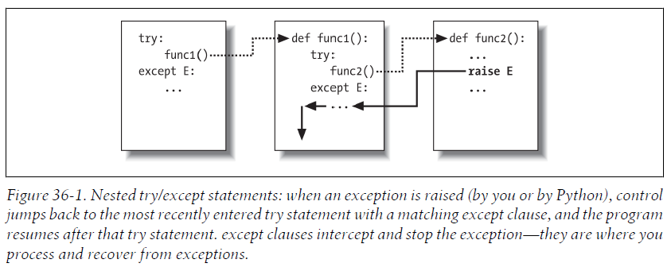
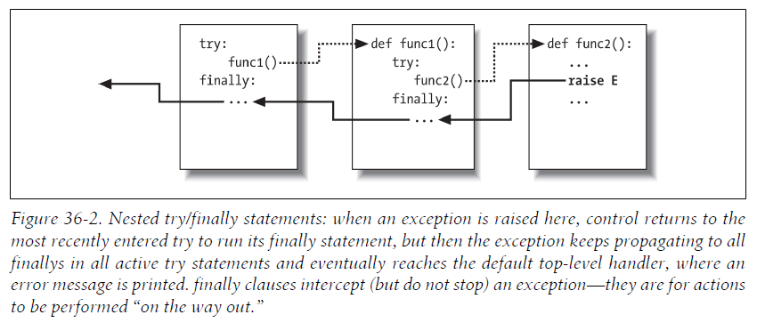

# 第7部分 异常和工具

## 第33章 异常基础

在Python中，异常会根据错误自动地被触发，也能由代码触发和截获。异常由4个语句处理：

- `try`/`except`：捕捉由Python或你引发的异常并恢复；
- `try`/`finally`：无论异常是否发生，执行清理行为；
- `raise`：手动在代码中触发异常；
- `assert`：有条件地在程序代码中触发异常；
- `with`/`as`：在Python 2.6及后续版本中实现的上下文管理器。

### 33.1 为什么使用异常

借助异常，可以在一个步骤内跳至异常处理器，终止开始的所有函数调用而进入异常管理器。在异常处理器中编写代码，来响应在适当时候引发的异常。

异常处理器（`try`语句）作为标记，当程序前进到某处代码时，产生异常，因而会使Python立即跳到那个标识，而放弃留下该标识之后所调用的任何激活的函数。

#### 异常的角色

在Python中，异常通常可以用于很多用途，其中最常见的几种角色：

- 错误处理
- 事件通知：异常也可用于发出有效状态的信号，而不需在程序传递结果标志位，或者刻意对其进行测试。例如，搜索的程序可能在失败时引发异常，而不是返回一个整数结果代码。
- 特殊情况处理：有时，发生了某种很罕见的情况，很难调整代码去处理。通常会在异常处理器中处理这些罕见的情况。
- 终止行为：`try`/`finally`语句可确保无论程序是否有异常，一定会进行需要的结束操作。
- 非常规控制流程：因为异常可以看做是一种高级的“goto”，它可以作为实现非常规的控制流程的基础。Python中没有“goto”语句，但是，异常有时候可以充当类似的角色。

### 33.2 异常处理：简明扼要

#### 默认异常处理器

```python
>>> def fetcher(obj, index):
        return obj[index]
>>> x = 'spam'
>>> fetcher(x, 3) # Like x[3]
'm'
>>> fetcher(x, 4) # Default handler - shell interface
Traceback (most recent call last):
File "<stdin>", line 1, in <module>
File "<stdin>", line 2, in fetcher
IndexError: string index out of range
```

因为我们的代码没有刻意捕捉这个`IndexError`异常，所以它将会一直向上传递到程序顶层，并启用默认的异常处理器：打印标准出错消息，并立刻终止程序。这些消息包括引发的异常和堆栈跟踪：也就是异常发生时激活的程序行和函数清单。

#### 捕获异常

如果你不想要默认的异常行为，就需要把调用包装在`try`语句内，自行捕捉异常。

```python
>>> def catcher():
        try:
            fetcher(x, 4)
        except IndexError:
            print('got exception')
        print('continuing')
>>> catcher()
got exception
continuing
>>>
```

现在，当`try`代码块执行时触发异常，Python会自动跳至异常处理器（指出引发异常名称的`except`分句下面的代码）。在异常捕获和处理后，程序在捕捉了整个`try`语句后继续执行。

#### 引发异常

我们可以人为手动引发异常，直接执行`raise`语句：

```python
>>> raise IndexError
Traceback (most recent call last):
File "<stdin>", line 1, in <module>
IndexError
```

同样的，手动引发的异常也可以捕获或忽略：

```python
>>> try:
        raise IndexError # Trigger exception manually
    except IndexError:
        print('got exception')

got exception
```

`assert`语句也可以用来有条件的引发异常：

```python
>>> assert False, 'Nobody expects the Spanish Inquisition!'
Traceback (most recent call last):
File "<stdin>", line 1, in <module>
AssertionError: Nobody expects the Spanish Inquisition!
```


#### 用户自定义的异常

用户自定义的异常能够通过类编写，它继承自一个内置的异常类`Exception`。基于类的异常允许脚本建立异常类型、继承行为以及附加状态信息。

```python
>>> class AlreadyGotOne(Exception): pass # User-defined exception
>>> def grail():
...     raise AlreadyGotOne()            # Raise an instance
>>> try:
...     grail()
... except AlreadyGotOne:                # Catch class name
...     print('got exception')
...
got exception
>>>
```


#### 终止行为

`try`/`finally`的组合，可以定义一定会在最后执行时的收尾行为，无论`try`代码块中是否发生了异常：

```python
>>> def after():
        try:
            fetcher(x, 4)
        finally:
            print('after fetch')
        print('after try?')
>>> after()
after fetch
Traceback (most recent call last):
File "<stdin>", line 1, in <module>
File "<stdin>", line 3, in after
File "<stdin>", line 2, in fetcher
IndexError: string index out of range
>>>
```

在使用某些类型的对象的时候，Python 2.6以上和Python 3.X提供了上下文管理器`with`/`as`语句来确保终止行为的发生，以作为一种`try`/`finally`的替代方法。

```python
>>> with open('lumberjack.txt', 'w') as file: # Always close file on exit
        file.write('The larch!\n')
```

**注意：这只在处理实现了上下文管理器协议的对象类型的时候才适用。因此`try`/`finally`是一种更加通用的终止结构。**


---


## 第34章 异常编码细节

### 34.1 try/except/else语句

在Python 2.5之后，`try`/`except`/`else`和`try`/`finally`语句可以混合在一个`try`语句中。

`try`是复合语句，它的最完整的形式如下所示：

```python
try:
    statements               # Run this main action first
except name1:
    statements               # Run if name1 is raised during try block
except (name2, name3):
    statements               # Run if any of these exceptions occur
except name4 as var:
    statements               # Run if name4 is raised, assign instance raised to var
except:
    statements               # Run for all other exceptions raised
else:
    statements               # Run if no exception was raised during try block
```

在这个语句中，`try`首行底下的代码块代表此语句的主要动作：试着执行的程序代码。`except`子句定义`try`代码块内引发的异常的处理器。而`else`子句（如果编写了的话）则是提供没发生异常时要执行的代码。

#### try语句分句

编写`try`语句时，有一些分句可以在`try`语句代码块后出现。

从语法上来讲，`except`分句数目没有限制，但是应该只有一个`else`。

下表列出了所有可能的分句形式：

|   Clause form   |   Interpretation   |
| ---- | ---- |
|    `except:`    |    Catch all (or all other) exception types.      |
|    `except name:`    |    Catch a specific exception only.      |
|    `except name as value:`    |    Catch the listed exception and assign its instance.      |
|    `except (name1, name2):`    |    Catch any of the listed exceptions.      |
|    `except (name1, name2) as value:`    |    Catch any listed exception and assign its instance.      |
|    `else:`    |    Run if no exceptions are raised in the try block.      |
|    `finally:`    |    Always perform this block on exit.      |

以下是多个`except`分句的例子：

```python
try:
    action()
except NameError:
    ...
except IndexError:
    ...
except KeyError:
    ...
except (AttributeError, TypeError, SyntaxError):
    ...
else:
    ...
```

在这个例子中，如果`action`函数执行时引发了异常，Python会搜索第一个与异常名称相符的`except`。Python会从头到尾以及由左至右查看`except`子句，然后执行第一个项目的`except`下的语句。如果没有符合的，异常会向这个`try`以外传递。注意：在本例中，只有当`action`中没有发生异常时，`else`才会执行；如果发生了异常，但没有相符的`except`时，则不会执行。

空的`except:`子句可以捕获任何异常：

```python
try:
    action()
except:
    ...        # Catch all possible exceptions
```

Python 3.0引入了一个替代方法，捕获名为`Exception`的异常几乎与一个空的`except`具有相同的效果，除了与系统退出相关的异常：

```python
try:
    action()
except Exception:
    ...           # Catch all possible exceptions, except exits
```


#### try/else 分句

`else`子句让我们可以在不设置和检查布尔标志的情况下，知道`try`语句块中是否发生了异常。

```python
try:
    ...run code...
except IndexError:
    ...handle exception...
else:
    ...no exception occurred...
```

#### 例子：默认行为

如果没有手动捕捉异常，异常就会向上传递到Python进程的顶层，并执行Python默认异常处理逻辑，即终止执行中的程序，并打印标准出错消息。

```python
# bad.py

def gobad(x, y):
    return x / y
    
def gosouth(x):
    print(gobad(x, 0))
    
gosouth(1)
```

```bash
% python bad.py
Traceback (most recent call last):
File "bad.py", line 7, in <module>
gosouth(1)
File "bad.py", line 5, in gosouth
print(gobad(x, 0))
File "bad.py", line 2, in gobad
return x / y
ZeroDivisionError: division by zero
```


#### 例子：捕捉内置异常

```python
# kaboom.py

def kaboom(x, y):
    print(x + y)               # Trigger TypeError
try:
    kaboom([0, 1, 2], 'spam')
except TypeError:              # Catch and recover here
    print('Hello world!')
print('resuming here')         # Continue here if exception or not
```

```bash
% python kaboom.py
Hello world!
resuming here
Keep in mind that once
```

### 34.2 try / finally 语句

如果在`try`中包含了`finally`子句，Python一定会执行`finally`代码块中的语句，无论`try`代码块执行时是否发生了异常。其一般形式如下所示：

```python
try:
    statements # Run this action first
finally:
    statements # Always run this code on the way out
```

在该语句中，Python首先尝试执行`try`语句块中的代码，然后接下来的执行情况取决于`try`中是否发生异常：

- 如果`try`代码块运行时没有异常发生，Python会跳至执行`finally`代码块，然后在整个`try`语句后继续执行下去。
- 如果`try`代码块运行是有异常发生，Python依然会回来运行`finally`代码块，但是接着会把异常向上传递到较高的`try`语句或顶层默认处理器。

#### 例子：利用try/finally编写终止行为

在下面例子的这段代码中，带有`finally`分句的`try`中包装了一个文件处理函数的调用，以确保无论函数是否触发异常，该文件总是会关闭：

```python
class MyError(Exception): pass

def stuff(file):
    raise MyError()
    
file = open('data', 'w') # Open an output file (this can fail too)
try:
    stuff(file)          # Raises exception
finally:
    file.close()         # Always close file to flush output buffers
print('not reached')     # Continue here only if no exception
```


### 34.3 统一 try / except / finally 语句

在Python 2.5及其以后的版本，我们可以在同一个`try`语句中混合`finally` 、 `except` 以及 `else`子句。也就是下面形式的语句：

```python
try:                # Merged form
    main-action
except Exception1:
    handler1
except Exception2:  # Catch exceptions
    handler2
    ...
else:               # No-exception handler
    else-block
finally:            # The finally encloses all else
    finally-block
```

**这个语句的执行情况如下：**

1. `try`语句块中的main-action代码会先执行；
2. 如果`try`语句块中的代码引发异常，那么所有`except`代码块都会逐一测试，寻找与抛出的异常相符的语句。
3. 如果`try`语句块中的代码没有引发异常，将会执行`else`语句块中的else-block。
4. 无论是main-action代码是在没有引发异常的情况下执行完毕，还是main-action代码引发的异常都已处理后，`finally`语句块中的finally-block就会执行。事实上，即使在`except`或`else`代码块内引发了新的异常，`finally`内的finally-block依然会执行。
5. 就像往常一样，`finally`子句并不会终止异常：当finally-block执行时，如果异常还没有被处理，就会在finally-block执行完后继续传递，而控制权会跳至程序的其他地方（到另一个`try`，或者默认的顶层处理器）；当finally-block执行时，异常已经被捕获并处理，程序就会在整个`try`语句之后继续顺序执行。

####  统一 try 语句语法

当使用统一的`try`语句语法时，`try`语句必须有一个`except`或一个`finally`，并且其部分的顺序必须如下所示：

1. `try`
2. `except`
3. `else`
4. `finally`

其中，`else`和`finally`是可选的，可能会有0个或多个`except`，但是，如果出现一个`else`的话，必须有至少一个`except`。

#### 合并 try 的例子

以下示范了合并的`try`语句的执行情况。下面的文件`mergedexc.py`编写了4种常见场景，通过`print`语句来说明其意义：

```python
# File mergedexc.py (Python 3.X + 2.X)

sep = '-' * 45 + '\n'

print(sep + 'EXCEPTION RAISED AND CAUGHT')
try:
    x = 'spam'[99]
except IndexError:
    print('except run')
finally:
    print('finally run')
print('after run')

print(sep + 'NO EXCEPTION RAISED')
try:
    x = 'spam'[3]
except IndexError:
    print('except run')
finally:
    print('finally run')
print('after run')

print(sep + 'NO EXCEPTION RAISED, WITH ELSE')
try:
    x = 'spam'[3]
except IndexError:
    print('except run')
else:
    print('else run')
finally:
    print('finally run')
print('after run')

print(sep + 'EXCEPTION RAISED BUT NOT CAUGHT')
try:
    x = 1 / 0
except IndexError:
    print('except run')
finally:
    print('finally run')
print('after run')
```

根据程序的输出，我们可以知道每种场景下，每个子句的执行顺序：

```bash
c:\code> py −3 mergedexc.py
---------------------------------------------
EXCEPTION RAISED AND CAUGHT
except run
finally run
after run
---------------------------------------------
NO EXCEPTION RAISED
finally run
after run
---------------------------------------------
NO EXCEPTION RAISED, WITH ELSE
else run
finally run
after run
---------------------------------------------
EXCEPTION RAISED BUT NOT CAUGHT
finally run
Traceback (most recent call last):
File "mergedexc.py", line 39, in <module>
x = 1 / 0
ZeroDivisionError: division by zero
```


### 34.4 `raise`语句

要显式地触发异常，可以使用`raise`语句，其一般形式相当简单。`raise`语句的组成是：`raise`关键字，后面跟着可选的要引发的类或者类的一个实例。

```python
raise instance    # Raise instance of class
raise class       # Make and raise instance of class: makes an instance implicitly
raise             # Reraise the most recent exception
```

在Python 2.6以后版本和3.X中，异常总是类的实例。因此以下直接提供一个实例的形式最常见：
```python
raise instance    # Raise instance of class
```

我们可以提前创建异常类的实例，然后使用`raise`引发它们。如下例中，2个`raise`语句都引发了`IndexError`：
```python
exc = IndexError() # Create instance ahead of time
raise exc

excs = [IndexError, TypeError]
raise excs[0]
```

如果我们传入一个类，Python会隐式地创建该类的实例。所以，以下两种新式是等价的，都会创建异常类的一个实例：
```python
raise IndexError       # Make and raise instance of class: makes an instance implicitly
raise IndexError() 
```

如果只使用一个`raise`，则会重新引发最近引发的异常。它通常用于异常处理器中，以传播已经捕获的异常。
```python
raise             # Reraise the most recent exception
```

如果一个`try`包含了一个名为`except name as X:`子句，变量X将会分配给引发中所提供的实例：

```python
try:
    ...
except IndexError as X: # X assigned the raised instance object
    ...
```

`as`在`try`处理中是可选的，如果忽略它，该实例直接不会分配给一个名称，但是，包含它将使得处理器能够访问实例中的数据以及异常类中的方法。这种模式对于我们用类编写的用户自定义的异常也同样有效：

```python
class MyExc(Exception): pass
...
raise MyExc('spam') # Exception class with constructor args
...
try:
    ...
except MyExc as X: # Instance attributes available in handler
    print(X.args)
```

**一旦异常在程序中某处由一条`except`子句捕获，它就死掉了（不会被传递到另一个`try`），除非由另一个`raise`语句或错误重新引发它。**


#### try/except 变量和作用域

Python 3.X 将异常引用变量名作为`except`语句块的本地变量名，即该变量在退出`except`语句块后将不可用。这很像是Python 3.X的解析表达式（comprehension expression）中的临时循环变量。

```python
c:\code> py −3
>>> try:
... 1 / 0
... except Exception, X:
SyntaxError: invalid syntax

>>> try:
... 1 / 0
... except Exception as X:          # 3.X localizes 'as' names to except block
... print(X)
...
division by zero
>>> X
NameError: name 'X' is not defined
```

但和循环变量不同的是，在Python 3.X中，这个变量在退出`except`语句块之后将被删除。

```python
>>> X = 99                          # 定义X
>>> try:
... 1 / 0
... except Exception as X:          # 3.X localizes _and_ removes on exit!
... print(X)
...
division by zero
>>> X                               # 变量名X已经被删除了
NameError: name 'X' is not defined

>>> X = 99
>>> {X for X in 'spam'}             # 2.X/3.X localizes only: not removed
{'s', 'a', 'p', 'm'}
>>> X
99
```

正因为如此，你应该在`try`语句的`except`子句中使用唯一的变量名，即使它们是作用域内的本地化变量。

如果你确实需要在退出`except`语句后引用异常实例，直接将它赋值给另一个不会自动被删除的变量：

```python
>>> try:
...     1 / 0
... except Exception as X:            # Python removes this reference
...     print(X)
...     Saveit = X                    # Assign exc to retain exc if needed
...
division by zero
>>> X
NameError: name 'X' is not defined
>>> Saveit
ZeroDivisionError('division by zero',)
```


#### 利用`raise` 传递异常

`raise`语句不包括异常名称或额外异常实例时，就是重新引发当前异常。如果需要捕获和处理一个异常，又想重新引发它，并将其传递给更高层的处理器，一般就使用这种形式：

```python
>>> try:
...     raise IndexError('spam')    # Exceptions remember arguments
... except IndexError:
...     print('propagating')
...     raise                       # Reraise most recent exception
...
propagating
Traceback (most recent call last):
File "<stdin>", line 2, in <module>
IndexError: spam
```


#### Python 3.X 异常链：raise from

Python 3.X允许`raise`语句拥有一个可选的`from`子句：

```python
raise newexception from otherexception
```

当使用`from`的时候，第二个表达式指定了另一个异常类或实例，它会附加到引发异常的`__cause__`属性。如果引发的异常没有捕获，Python把异常也作为标准出错消息的一部分打印出来：

```python
>>> try:
...     1/0
... except Exception as E:
...     raise TypeError('Bad') from E
...
Traceback (most recent call last):
  File "<stdin>", line 2, in <module>
ZeroDivisionError: division by zero

The above exception was the direct cause of the following exception:

Traceback (most recent call last):
  File "<stdin>", line 4, in <module>
TypeError: Bad
>>>
```

当在一个异常处理器内部引发一个异常的时候，隐式地遵从类似的过程：前一个异常附加到新的异常的`__context__`属性，并且如果该异常未捕获的话，再次显示在标准错误消息中：

```python
>>> try:
...     1 / 0
... except:
...     badname # Implicitly chained exceptions
...
Traceback (most recent call last):
File "<stdin>", line 2, in <module>
ZeroDivisionError: division by zero

During handling of the above exception, another exception occurred:

Traceback (most recent call last):
File "<stdin>", line 4, in <module>
NameError: name 'badname' is not defined
```

在这两种情况下，因为最初附加到新异常对象的异常对象可能本身已经附加了造成异常的原因，所以因果链（causality chain）可能是任意长的，并在错误消息中全部被显示出来。也就是说，错误消息可能会给出两个以上的异常。当一个异常触发另一个异常时，在显式和隐式的上下文中的效果都允许程序员知道所有涉及的异常：

```python
>>> try:
...     try:
...         raise IndexError()
...     except Exception as E:
...         raise TypeError() from E
... except Exception as E:
...     raise SyntaxError() from E
...
Traceback (most recent call last):
File "<stdin>", line 3, in <module>
IndexError

The above exception was the direct cause of the following exception:

Traceback (most recent call last):
File "<stdin>", line 5, in <module>
TypeError

The above exception was the direct cause of the following exception:

Traceback (most recent call last):
File "<stdin>", line 7, in <module>
SyntaxError: None
```

类似地，即使是隐式地被触发，下面代码也将显示3个异常：

```python
try:
    try:
        1 / 0
    except:
        badname
except:
    open('nonesuch')
```

实际上，Python 3.3增加了一种新的语法形式，以阻止异常链，即，在`raise from`语句中使用`None`作为异常的变量名：

```python
raise newexception from None
```

这允许禁用之前介绍的异常链上下文（context）。

### 34.5 `assert`语句

`assert`语句可视为条件式的`raise`语句。该语句形式为：

```python
assert test, data      # The data part is optional
```

执行起来就像下面的代码：

```python
if __debug__:
    if not test:
        raise AssertionError(data)
```

换句话说，如果test测试为假，Python就会引发异常`AssertionError`，且将data作为该异常的额外数据。

#### 例子：收集约束条件（但不是错误）

`assert`语句通常是用于验证开发期间程序的状况。显示时，其出错消息正文会自动包括源代码行的信息，以及列在`assert`语句中的值。考虑文件`asserter.py`：

```python
# asserter.py

def f(x):
    assert x < 0, 'x must be negative'
    return x ** 2
% python
>>> import asserter
>>> asserter.f(1)
Traceback (most recent call last):
  File "<stdin>", line 1, in <module>
  File ".\asserter.py", line 2, in f
    assert x < 0, 'x must be negative'
AssertionError: x must be negative
```

**注意：`assert`几乎都是用来收集用户定义的约束条件，而不是捕捉内在的程序设计错误。**

`assert`语句的常见用法之一是，在实现抽象超类时，使用`assert`让未定义方法的调用失败并打印消息。

### 34.6 `with`/`as`上下文管理器（context manager）

Python 2.6和Python 3.0引入了一种与异常相关的新语句：`with`语句，及其可选的`as`子句。

这个语句的设计是为了和上下文管理器（context manager）对象一起工作。

简而言之，`with`/`as`语句的设计作为`try`/`finally`用法模式的替代方案。用于定义必须执行的终止或“清理”行为，而无论处理步骤中是否发生异常。并且，支持更丰富的基于对象的协议，可以为代码块定义进入和离开动作。

#### 基本使用

`with`语句的基本格式如下：

```
with expression [as variable]:
    with-block
```

其中，这里的`expression`要返回一个支持上下文管理协议的对象。如果可选的`as`子句存在的话，此对象也可返回一个值，赋给变量名`variable`。

**注意：`variable`并非必须被赋值为`expression`的结果；`expression`的结果是支持上下文协议的对象，而`variable`可以被赋值为打算在`with`语句块内使用的其他东西。然后，`expression`返回的对象可在with-block语句块开始前运行启动代码（startup code），并在with-block语句块结束后运行终止代码（termination code），而不论`with`语句块是否引发了异常。**

有些内置的Python对象已经得到强化，支持了上下文管理协议，因此可直接用于`with`语句。例如，文件对象有上下文管理器，在`with`语句块结束后可自动关闭文件，不论是否有异常被引发。

```python
with open(r'C:\misc\data') as myfile:    # open返回简单文件对象，赋值给变量名myfile
    for line in myfile:
        print(line)
        ...more code here...
```

以上代码实现了和下面使用`try`/`finally`语句类似的效果：

```python
myfile = open(r'C:\misc\data')
try:
    for line in myfile:
        print(line)
        ...more code here...
finally:
    myfile.close()
```

同时，多线程模块`threading`所定义的锁和条件变量同步对象也支持上下文管理协议，也可以和`with`语句一起使用：

```python
import threading
lock = threading.Lock()            
with lock:     # with语句确保锁会在代码块执行前自动获得，并在代码块完成后释放，而不管是否引发了异常
    # critical section of code
    ...access shared resources...
```

`decimal`模块也使用上下文管理器来简化存储和保存当前小数配置环境：

```python
import decimal
with decimal.localcontext() as ctx: # 在with语句块结束后自动恢复到语句开始前的状态
    ctx.prec = 2
    x = decimal.Decimal('1.00') / decimal.Decimal('3.00')
```


#### 上下文管理协议 （The Context Management Protocol）

要实现上下文管理器，以使用特殊的方法来接入`with`语句，需要实现特殊的运算符重载方法`__enter__`和`__exit__`。

`with`语句的实际工作方式如下：

1. 计算表达式，所得到的对象称为环境管理器，它必须有`__enter__`和`__exit__`方法。

2. 环境管理器的`__enter__`方法会被调用。如果`as`子句存在，其返回值会赋值给`as`子句中的变量，否则，直接丢弃。

3. 代码块中嵌套的代码会执行。

4. 如果`with`代码块引发异常，`__exit__(type, value, traceback)`方法会被调用（带有异常细节）。这三个值与`sys.exc_info`返回的值相同。如果此方法返回值为假，则异常会重新引发；否则，异常被终止。正常情况下，异常应该被重新引发，这样的话才能传递到`with`语句之外。

5. 如果`with`代码块没有引发异常，`__exit__`方法依然会被调用，其`type`，`value`和`traceback`参数都会以`None`传递。

   

下面定义一个上下文管理器对象，跟踪器所用的任意一个`with`语句内`with`代码块的进入和退出：

```python
# withas.py

class TraceBlock:
    def message(self, arg):
        print('running ' + arg)
    def __enter__(self):
        print('starting with block')
        return self    # 返回self作为赋值给as变量的对象，但视情况而定，也可以返回其他对象；
    def __exit__(self, exc_type, exc_value, exc_tb):
        if exc_type is None:
            print('exited normally\n')
        else:
            print('raise an exception! ' + str(exc_type))
            return False  # 返回False，或删除此return语句都能起到传播异常的效果,因为默认的函数返回值是None

if __name__ == '__main__':
    with TraceBlock() as action:
        action.message('test 1')
        print('reached')
        
    with TraceBlock() as action:
        action.message('test 2')
        raise TypeError
        print('not reached')
```

运行时，环境管理器会以`__enter__`和`__exit__`跟踪`with`语句代码块的进入和离开。

```bash
c:\code> py −3 withas.py
starting with block
running test 1
reached
exited normally

starting with block
running test 2
raise an exception! <class 'TypeError'>
Traceback (most recent call last):
File "withas.py", line 22, in <module>
raise TypeError
TypeError
```


#### Multiple Context Managers in 3.1, 2.7, and Later

Python 2.7和3.1引入了一个`with`的扩展。在Python 2.7和3.1，及其以后的Python版本，`with`语句可以指定多个（有时也叫“嵌套的”）上下文管理器。

例如，下例中，当语句块推出的时候，两个文件的退出操作都会自动运行，而不管异常输出什么：

```python
with open('data') as fin, open('res', 'w') as fout:
    for line in fin:
        if 'some key' in line:
            fout.write(line)
```

可以列出任意数量的上下文管理器项，并且多个项目和嵌套的`with`语句一样地工作。其形式如下：

```python
with A() as a, B() as b:
    ...statements...

```

以上形式等价于 Python 3.0和2.6以下版本中的以下形式：

```python
with A() as a:
    with B() as b:
        ...statements...
```

下面使用这一扩展来实现两个文件的同行扫描：

```python
>>> with open('script1.py') as f1, open('script2.py') as f2:
...     for pair in zip(f1, f2):
...         print(pair)
...
('# A first Python script\n', 'import sys\n')
('import sys # Load a library module\n', 'print(sys.path)\n')
('print(sys.platform)\n', 'x = 2\n')
('print(2 ** 32) # Raise 2 to a power\n', 'print(x ** 32)\n')
```

你也可以使用`if`语句替换`print`，并用`enumerate`得到行数，来对文本文件进行一行一行的比较：

```python
with open('script1.py') as f1, open('script2.py') as f2:
    for (linenum, (line1, line2)) in enumerate(zip(f1, f2)):
        if line1 != line2:
            print('%s\n%r\n%r' % (linenum, line1, line2))
```


---


## 第35章 异常对象

基于类的异常有如下特定：

- 提供类型分类，对今后的修改有更好的支持。
- 它们附加了状态信息。
- 它们支持继承。

### 35.1 异常

#### 基于类的异常

类异常是由超类关系进行匹配的。当`try`语句的`except`子句列出了一个超类时，就可以了捕捉该超类的实例，以及类树中所有较低位置的子类的实例。

结果就是，类异常支持异常层次的结构：超类变成分类的名称，而子类变成这个分类中特定种类的异常。

#### 编写异常类

下列`classexc.py`文件中，我们定义一个名为`General`的超类，以及两个子类`Specific1`和`Specific2`。这个例子说明异常分类的概念：`General`是分类的名称，而子类`Specific1`和`Specific2`是这个分类中特定种类的异常。捕捉`General`的处理器也会捕捉其任何子类。

```python
# classexc.py

class General(Exception): pass
class Specific1(General): pass
class Specific2(General): pass

def raiser0():
    X = General() # Raise superclass instance
    raise X
    
def raiser1():
    X = Specific1() # Raise subclass instance
    raise X
    
def raiser2():
    X = Specific2() # Raise different subclass instance
    raise X
    
for func in (raiser0, raiser1, raiser2):
    try:
        func()
    except General: # Match General or any subclass of it
        import sys
        print('caught: %s' % sys.exc_info()[0])
```

```
C:\code> python classexc.py
caught: <class '__main__.General'>
caught: <class '__main__.Specific1'>
caught: <class '__main__.Specific2'>
```

**实现基于类的异常时，需要注意以下细节：**

- **Exception超类：** 自定义异常必须直接地或间接地派生自内置异常超类`BaseException`。大多数自定义异常类都继承自内置异常超类`BaseException`的子类`Exception`，以支持针对常规异常类型的全捕获处理器，即在一个处理器中指定它就会捕获大多数程序应该捕获的所有异常。
- **引发实例：** 在类异常模式中，我们总是引发和捕获一个类实例对象。异常实例可以在该`raise`之前创建，也可以在`raise`语句中创建。
- **捕获分类：** 捕获异常分类的名称也会捕获这个分类中特定种类的异常。
- **异常细节：** `sys.exc_info`调用是抓取最近引发的异常的常用方式。简而言之，对基于类的异常而言，其结果中的第一个元素就是引发异常类，而第二个实际引发的实例。


### 35.2 为什么使用异常层次架构？

假设用Python编写了一个数值计算库。当编写库时，有两件事会让代码中的数值出错：除数为0，以及数值溢出。最佳的作法是将类库的异常定义到类树中，有个共同的超类来包含整个类型。

```python
# mathlib.py

class NumErr(Exception): pass
class Divzero(NumErr): pass
class Oflow(NumErr): pass

def func():
    ...
    raise DivZero()
    
...and so on...
```

这样的话，你的库用户只需列出共同的超类（也就是分类），来捕捉库的所有异常：

```python
# client.py
import mathlib
try:
    mathlib.func(...)
except mathlib.NumErr:
    ...report and recover...
```


### 35.3 内置异常类

在Python 3.X中，所有内置异常都是预定义的类，可以作为内置变量名，也可以作为`builtin`模块中的内置名称使用。

此外，为了支持各种捕捉模式，Python 把内置异常组织成层次：

- `BaseException`：异常的顶级根类。**这个类不能当作是由用户定义的类直接继承！** 它提供了子类所继承的默认的打印和状态保持行为。
- `Exception`： 与应用相关的异常的顶层根超类。这是`BaseException`的一个直接子类，并且是所有其他内置异常的超类，除了系统退出事件类之外（`SystemExit`、`KeyboardInterrupt`和`GeneratorExit`）。几乎所有用户定义的类都应该继承自这个类，而不是`BaseException`。
- `ArithmeticError`： 所有数值错误的超类，并且是`Exception`的一个子类。
- `OverflowError`： 识别特定的数值错误的子类。

#### 默认打印和状态

内置异常提供了默认打印显示和状态保持。除非你重新定义类继承自它们的构造函数，传递给这些类的任何构造函数参数都会保存在实例的`args`元组属性中，并且当打印该实例的时候自动显示。

当打印异常实例时，传递给异常类的参数就会显示在错误消息中：

```python
>>> raise IndexError                # Same as IndexError(): no arguments
Traceback (most recent call last):
File "<stdin>", line 1, in <module>
IndexError

>>> raise IndexError('spam')         # Constructor argument attached, printed
Traceback (most recent call last):
File "<stdin>", line 1, in <module>
IndexError: spam
    
>>> I = IndexError('spam')           # Available in object attribute
>>> I.args
('spam',)
>>> print(I)                         # Displays args when printed manually
spam
```

对于用户定义的异常也是如此，因为它们继承了内置异常超类：

```python
>>> class E(Exception): pass
...
>>> raise E
Traceback (most recent call last):
File "<stdin>", line 1, in <module>
__main__.E

>>> raise E('spam')
Traceback (most recent call last):
File "<stdin>", line 1, in <module>
__main__.E: spam
    
>>> I = E('spam')
>>> I.args
('spam',)
>>> print(I)
spam
```

```python
>>> try:
...     raise E('spam')
... except E as X:
...     print(X)          # Displays and saves constructor arguments
...     print(X.args)
...     print(repr(X))
...
spam
('spam',)
E('spam',)
```

```python
>>> try:                  # Multiple arguments save/display a tuple
...     raise E('spam', 'eggs', 'ham')
... except E as X:
...     print('%s %s' % (X, X.args))
...
('spam', 'eggs', 'ham') ('spam', 'eggs', 'ham')
```


### 35.4 自定义打印显示

要提供一个更加定制的显示，我们可以在类中定义`__repr__`和`__str__`中的任何一个，来返回想要为异常显示的字符串。

```python
>>> class MyBad(Exception):
...     def __str__(self):
...         return 'Always look on the bright side of life...'
...
>>> try:
...     raise MyBad()
... except MyBad as X:
...     print(X)
...
Always look on the bright side of life...
>>> raise MyBad()
Traceback (most recent call last):
File "<stdin>", line 1, in <module>
__main__.MyBad: Always look on the bright side of life...
```


### 35.5 自定义数据和行为

尽管默认的构造函数对于很多情况都适用，但为了满足更多的定制需求，我们可以提供一个自己的构造函数。

#### 提供异常细节

例如，解析数据文件的一个程序可能通过引发一个异常实例来表示一个格式化错误，而该实例用关于错误的额外细节类填充：

```python
>>> class FormatError(Exception):
        def __init__(self, line, file):
            self.line = line
            self.file = file
>>> def parser():
        raise FormatError(42, file='spam.txt') # When error found
>>> try:
...     parser()
... except FormatError as X:
...     print('Error at: %s %s' % (X.file, X.line))
...
Error at: spam.txt 42
```

#### 提供异常方法

除了支持特定于应用程序的状态信息，还可以定义在处理器中调用的方法。

例如，如下的代码添加了一个方法，它使用异常状态信息把错误记录到一个文件中：

```python
from __future__ import print_function # 2.X compatibility
class FormatError(Exception):
    logfile = 'formaterror.txt'
    def __init__(self, line, file):
        self.line = line
        self.file = file
    def logerror(self):
        log = open(self.logfile, 'a')
        print('Error at:', self.file, self.line, file=log)
        
def parser():
    raise FormatError(40, 'spam.txt')
    
if __name__ == '__main__':
    try:
        parser()
    except FormatError as exc:
        exc.logerror()
```

运行的时候，这段脚本把出错消息写入一个文件中，以响应异常处理器中的方法调用：

```python
c:\code> del formaterror.txt
c:\code> py −3 excparse.py
c:\code> py −2 excparse.py
c:\code> type formaterror.txt
Error at: spam.txt 40
Error at: spam.txt 40
```


---


## 第36章 异常的设计

### 36.1 嵌套异常处理器

技术上来讲，从语法和代码运行时的控制流程来看，`try`语句是可以嵌套的。

嵌套的`try`/`except`语句：当异常引发时（由你或由Python引起），控制权会跳回具有相符的`except`子句、最近进入的`try`语句，而程序会在`try`语句后继续执行下去。`except`子句会拦截并停止异常，这里就是你处理异常并从中恢复的地方。



嵌套的`try`/`finally`：当异常在这里引发时，控制权会回到最近进入的`try`去执行其`finally`语句，异常会持续传播到所有激活状态下`try`语句的`finally`，直到最终抵达默认顶层处理器，在那里打印出错消息。`finally`子句会拦截（但不会停止）异常：只是定义了离开前要执行的动作而已。



换句话说，引发异常时，程序去向何处完全取决于异常在何处发生：这是脚本运行是控制流程的函数，而不仅仅是其语法。异常的传递，基本上就是回到处理先前进入但尚未离开的`try`。只要控制权碰到相符的`except`子句，传递就会停止，而通过`finally`子句时就不会。

#### 例子：控制流程嵌套

下例中可以看到，由于内层的`try`语句已经有`except`子句将异常捕获，所以没有传递至外层的`try`语句中：

```python
def action2():
    print(1 + [])             # Generate TypeError

def action1():
    try:
        action2()
    except TypeError:         # Most recent matching try
        print('inner try')

try:
    action1()
except TypeError:             # Here, only if action1 re-raises
    print('outer try')
```


```
% python nestexc.py
inner try
```


#### 例子：语法嵌套化

```python
try:
    try:
        action2()
    except TypeError:        # Most recent matching try
        print('inner try')
except TypeError:            # Here, only if nested handler re-raises
    print('outer try')
```

```python
>>> try:
...     try:
...         raise IndexError
...     finally:
...         print('spam')
... finally:
...     print('SPAM')
...
spam
SPAM
Traceback (most recent call last):
File "<stdin>", line 3, in <module>
IndexError
```

有关语法嵌套更有用的例子，可以考虑下面的文件`except-finally.py`：

```python
# except-finally.py

def raise1(): raise IndexError
def noraise(): return
def raise2(): raise SyntaxError
    
for func in (raise1, noraise, raise2):
    print('<%s>' % func.__name__)
    try:
        try:
            func()
        except IndexError:
            print('caught IndexError')
    finally:
        print('finally run')
    print('...')
```

```
% python except-finally.py
<raise1>
caught IndexError
finally run
...
<noraise>
finally run
...
<raise2>
finally run
Traceback (most recent call last):
  File "except-finally.py", line 9, in <module>
    func()
  File "except-finally.py", line 3, in raise2
    def raise2(): raise SyntaxError
SyntaxError: None
```


### 36.2 异常的习惯用法

#### Breaking Out of Multiple Nested Loops: “go to”

```python
>>> class Exitloop(Exception): pass
...
>>> try:
...     while True:
...         while True:
...             for i in range(10):
...                 if i > 3: raise Exitloop # break exits just one level
...                 print('loop3: %s' % i)
...             print('loop2')
...         print('loop1')
... except Exitloop:
...     print('continuing') # Or just pass, to move on
...
loop3: 0
loop3: 1
loop3: 2
loop3: 3
continuing
>>> i
4
```


#### 异常不总是错误

在Python中，所有错误都是异常，但不是所有异常都是错误。Python有一些类似信号的内置异常代表警告，而不是错误。

#### 函数信号条件和`raise`

用户定义的异常也用来引发函数信号，而不是返回调用者状态标志。

```python
class Found(Exception): pass

def searcher():
    if ...success...:
        raise Found()  # Raise exceptions instead of returning flags
    else:
        return
        
try:
    searcher()
except Found:              # Exception if item was found
    ...success...
else:                      # else returned: not found
    ...failure...
```


```python
class Failure(Exception): pass

def searcher():
    if ...success...:
        return ...founditem...
    else:
        raise Failure()
            
try:
    item = searcher()
except Failure:
    ...not found...
else:
    ...use item here...
```


#### 关闭文件和服务器连接

```python
myfile = open(r'C:\code\textdata', 'w')
try:
    ...process myfile...
finally:
    myfile.close()
```

```python
with open(r'C:\code\textdata', 'w') as myfile:
    ...process myfile...
```


#### 在`try`外进行调试

可以利用异常处理器，取代Python的默认顶层异常处理行为。在顶层代码中的外层`try`中包装整个程序（或对它调用），就可以捕捉任何程序执行时会发生的异常，因此可破坏默认的程序终止行为。

```python
try:
    ...run program...
except: # All uncaught exceptions come here
    import sys
    print('uncaught!', sys.exc_info()[0], sys.exc_info()[1])
```

#### 运行进程中的测试

```python
import sys
log = open('testlog', 'a')
from testapi import moreTests, runNextTest, testName
def testdriver():
    while moreTests():
        try:
            runNextTest()
        except:
            print('FAILED', testName(), sys.exc_info()[:2], file=log)
        else:
            print('PASSED', testName(), file=log)
testdriver()
```

#### 关于`sys.exc_info`

当使用空的`except`子句来捕获每个异常以确定引发了什么的时候，`sys.exc_info`函数允许一个异常处理器获取对最近引发的异常的访问。

如果没有处理器正在处理，就返回包括了3个`None`的元组；如果有处理器正在处理异常，就会返回：

- type：正在处理的异常的异常类型；
- value：引发的异常类实例；
- traceback：是一个`traceback`对象，代表异常最初发生时所调用的堆栈。

```python
>>> try:
...     raise KeyboardInterrupt
... except:
...     import sys
...     print(sys.exc_info())
...
(<class 'KeyboardInterrupt'>, KeyboardInterrupt(), <traceback object at 0x7f3b93a86788>)
```

#### 显示错误和Tracebacks

`sys.exc_info`返回结果中的异常追踪对象`traceback`可被标准库模块`traceback`用来手动地生成标准错误消息和栈显示：

```python
# badly.py

import traceback

def inverse(x):
    return 1 / x

try:
    inverse(0)
except Exception:
    traceback.print_exc(file=open('badly.exc', 'w'))
print('Bye')
```

```
c:\code> python badly.py
Bye
c:\code> type badly.exc
Traceback (most recent call last):
File "badly.py", line 7, in <module>
inverse(0)
File "badly.py", line 4, in inverse
return 1 / x
ZeroDivisionError: division by zero
```


### 36.3 异常设计建议和陷阱

#### 什么应该被包装

#### 避免使用空`except`和`Exception`

#### 使用基于类的异常分类

### 36.4 核心语言总结

#### Python工具集

一般而言，Python提供了一个有层次的工具集：

- 内置工具：像字符串、列表以及字典这些内置类型。
- Python扩展：就更重要的任务来说，你可以编写自己的函数、模块以及类，来扩展Python。
- 已编译的扩展：Python也可以使用C或C++这样的外部语言所编写的模块进行扩展。

#### 大型项目的开发工具

- PyDoc和文档字符串
- PyChecker和PyLint
- PyUnit（unittest）
- doctest
- IDE
- 配置工具
  - `profile`模块
- 调试器
- 发布工具：`py2exe`，`PyInstaller`，eggs打包

